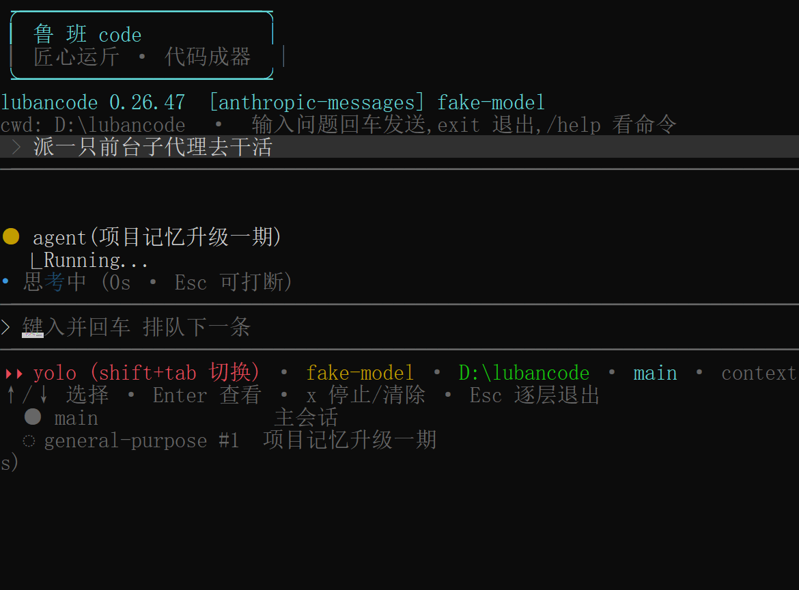
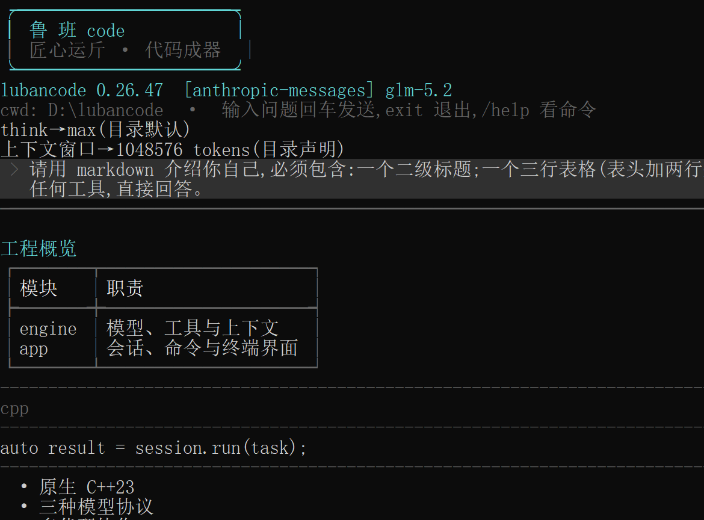

<p align="center">
  
</p>

<h1 align="center">LubanCode</h1>

<p align="center"><strong>C++23 写成的轻量本地 Agent Harness。读代码，改文件，跑命令，派子代理；模型与端点都由你选。</strong></p>

<p align="center">
  <strong>简体中文</strong> · <a href="README.en.md">English</a>
</p>

<p align="center">
  <a href="https://github.com/relic-yuexi/LubanCode/actions/workflows/ci.yml?query=branch%3Amain+event%3Apush"></a>
  
  <a href="LICENSE"></a>
  
</p>

LubanCode 把模型接到本地工具上。模型判断下一步，程序负责读写文件、执行命令、申请权限、调度子代理。每轮结束，会话、工具调用与 token 用量各自落盘，往后还能续接和核查。

模型由你来选。LubanCode 原生接 Anthropic Messages、OpenAI Responses、OpenAI-compatible Chat Completions、Gemini Generate Content 四种协议。内置目录收了 68 家 Provider 预设，自建 vLLM 与兼容端点也能接。

鲁班造物，先正绳墨，再下斧凿。LubanCode 也守这条规矩：先看清，再动手；改了什么，明明白白摆给你看。

**[三分钟跑完第一场任务](docs/getting-started/quickstart.md)** · **[看 C++ 取舍与同类对照](docs/getting-started/why-lubancode.md)**

> 源码版本只认 [`src/app/version.hpp`](src/app/version.hpp)。主分支代码改动会在 Windows、Ubuntu、macOS 三路编译并跑全量测试；结果以页首 CI badge 为准。

## 真机界面

下面两张图由 Windows Release 二进制接本地测试 Provider 实机截取。没有设计稿，也没放真密钥。

<p align="center">
  
</p>
<p align="center"><sub>主代理工作时仍可输入下一条；子代理、队列与状态栏同屏。</sub></p>

<p align="center">
  
</p>
<p align="center"><sub>Markdown 标题、表格与代码块直接画在终端里。</sub></p>

## 一场任务怎么跑

你在仓库里唤起 `lubancode`，交代一件事。它先读项目指令，再把上下文与工具交给模型。模型要查，Harness 就查；要改，Harness 先过权限门；要跑测试，Harness 管住进程、超时与取消。回合结束，消息、工具、usage、轨迹各自落账，往后能续、能查、能导出。

```text
你的任务 -> 项目指令 -> 模型 -> 工具/子代理/Workflow -> 验证 -> 会话与轨迹
```

日常可拿它修 bug、补测试、审 diff。要接自己的前端，可用 app-server；要编排固定流程，可用强类型 Workflow；要研究 Agent 运行过程，可导出轨迹，也可给自建模型做兼容诊断。

## 轻在哪儿

LubanCode 功能不少，安装和运行却尽量少背东西。Release 用原生程序，不要求 Node.js 或 Python。包里另带一只 `rg`，文件搜索开箱就能用。

普通交互会话按需启动外部组件。LSP 第一次调用时才拉起，闲久了会自行退出；MCP、插件等工具太多时，先留索引，模型搜到再挂进请求。Gateway 与渠道进程也不会因读到配置便暗自启动，只有显式命令才会拉起。

输出重定向或接进管道时，终端界面会收起原地重画，退成 plain 文本。轻量在这里指依赖少、闲时少起进程、能力按需装入。仓库尚未做四款 CLI 的同机启动与内存测试，README 不报未经测量的快慢。

## 终端也能说中文

让模型用中文回答不难。难的是程序自己也别满屏英文。LubanCode 把菜单、帮助、审批、常用状态与错误文案接进 i18n。它会认系统语言，内置简体中文与英文；会话里敲 `/language`，当场便能切。还嫌不够，就往 `~/.lubancode/languages/` 放一份 JSON，添一门语言不用改源码，也不用重编。

这套 i18n 只管界面，不偷改系统提示、工具描述或模型回复。中文表覆盖全量键；英文表覆盖核心键，漏下的文案会回退中文。语言包也准许只翻一部分，余下照同一条链回退。细节见[界面多语言](docs/development/i18n.md)。

## 为什么偏用 C++

选 C++，先看 LubanCode 天天碰什么：终端、HTTP 流、子进程、信号、超时、取消。Windows 还要处理 Job Object 与 UTF-16 路径，Linux 和 macOS 则要管 `fork/exec`、进程组与 `poll`。这些都由一只原生进程接住，上层只看统一结果。

Release 不要求 Node.js 或 Python。包里带着 `rg`、官方 Skills、文档与许可证，解开就能跑。要接现成 C/C++ 库，还可走 C ABI 插件，省去一层 JavaScript 服务或 RPC。

HTTP 流、子进程、终端帧与取消令牌都有明确寿命。长任务中途停下，程序要收好进程，也要写完已经确认的记录。这件事比一句“跑得快”难得多。

C++ 也有成本。编译慢，跨平台细节多，内存安全要靠规矩、测试与审查守。写一枚小扩展，TypeScript 往往省事。LubanCode 用 C++，主要为了直接管理系统资源，并让 CLI、app-server、Workflow 与轨迹记录共用一套宿主代码。详见[为什么是 LubanCode](docs/getting-started/why-lubancode.md)。

## 和 Claude Code、Codex CLI、Pi 差在哪

四款工具都能读代码、改文件、跑命令。差别主要在模型来源、扩展方式、安全边界和产品形态。

| 工具 | 主要路线 | 更适合谁 |
| --- | --- | --- |
| **Claude Code** | Claude 产品体系与多端协同。终端、IDE、桌面、Web、远程、团队能力一路贯通。 | 已在 Claude 生态里，要成熟产品面与跨端工作流。 |
| **Codex CLI** | OpenAI Codex 的本地终端体验、沙箱与审批，也能接入 Codex 桌面、IDE、云端诸面。 | 用 ChatGPT / OpenAI 模型，重视原生沙箱与 OpenAI 全套体验。 |
| **Pi** | 一颗很小的核心，加 TypeScript extensions、skills、prompts、themes 与 packages。 | 想拿 TypeScript 快速改 Harness，自己拼出工作台。 |
| **LubanCode** | Provider 中立的 C++ 执行骨架，以及可回放、可核验的本地账。CLI、Workflow、app-server、轨迹与插件共用一套运行合同。 | 要接多协议或自建端点，研究 Agent Harness，或把原生执行与留账握在自己手里。 |

Claude Code 与 Codex CLI 各有完整产品生态。Pi 用 TypeScript 写扩展，改起来更快。LubanCode 把多协议、自建端点、Workflow、轨迹与本地配置诊断放得更靠前。模型可以换，配置来源可以查，工具调用也能顺着源码与本地记录往下追。

还有一处小差别：LubanCode 自带界面 i18n，能跟系统语言，也能用 `/language` 即时切换。模型会不会说中文，与 CLI 自己有没有中文菜单、审批和报错，是两回事。本次查阅的 Claude Code CLI 参考、Codex CLI 配置参考与 Pi TUI 文档，都没有列出同类界面语言开关；这只说明公开设置里未见，不等于断言它们永远只支持英语。

对照口径截至 2026-09-04，取自 [Claude Code 官方概览](https://code.claude.com/docs/en/overview)、[Claude Code CLI reference](https://code.claude.com/docs/en/cli-reference)、[Codex CLI 官方文档](https://learn.chatgpt.com/docs/codex/cli)、[Codex CLI 配置参考](https://learn.chatgpt.com/docs/config-file/config-reference)与 [Pi TUI 文档](https://github.com/earendil-works/pi/blob/main/packages/coding-agent/docs/tui.md)。细表、边界与选择建议见[完整对照](docs/getting-started/why-lubancode.md)。

## 力气花在哪儿

- **一副能干活的终端。** 模型跑着，你照样输入；消息排队，子代理在望；Markdown、LaTeX、diff 与完整工具输出都看得见。
- **法与魂分开。** `system_prompt.md` 管行为，`SOUL.md` 管口吻。换风格不必拆工作流的规矩。
- **仓库级记忆。** 主工作树与 linked worktree 同一身份，教过的东西带得走；召回与写入都走 `/memory`。
- **不止一份对话记录。** session 记对话，trajectory 记运行事实，usage 分 token，artifact 收大块内容。
- **不止一条扩展路。** Skills、Workflow、MCP、LSP、Lua、进程插件与 C ABI 插件，各有各的边界。

## 一眼看懂

| | 能力 |
| --- | --- |
| **模型接入** | Anthropic / Responses / Chat Completions / Gemini 四协议；68 家 Provider 目录；多路连接随时切换并记住上次选择。 |
| **代码工具** | 读、写、容错编辑、搜索文件；前台或后台跑命令；改动先看 diff，再落盘。 |
| **语义与外接工具** | LSP 定义、引用、符号、诊断；MCP stdio；联网搜索与网页抓取。 |
| **代理工作流** | 子代理、三档角色模型、Plan 模式、待办清单、`ask_user`、`AGENTS.md`、隔离 worktree 与项目级权限。 |
| **终端体验** | 分段 Markdown 渲染、动态工作状态、常驻消息队列、智能粘贴折叠、逐键编辑、折叠与聚焦、五档审批。 |
| **提示词与记忆** | `system_prompt.md` 管行为，`SOUL.md` 管口吻；主工作树与 linked worktree 共用项目记忆。 |
| **上下文与存档** | session 记对话，trajectory 记运行事实，usage 分 token，artifact 收大块内容；支持压缩、恢复与 Markdown 导出。 |
| **界面语言** | 跟随系统；内置简体中文与英文；`/language` 即时切换；外部 JSON 语言包可添新语言。 |
| **扩展与定制** | Skills、Workflow、MCP、LSP、Lua、进程插件、C ABI 插件、hooks、主题与 SOUL。 |

## 安装

### Windows：一行安装

PowerShell 5.1 及以上可直接拉取最新 Release：

```powershell
irm https://raw.githubusercontent.com/relic-yuexi/LubanCode/main/scripts/install.ps1 | iex
```

程序会装到 `%LOCALAPPDATA%\Programs\lubancode`，并写入当前用户 PATH。官方 `skills/` 与 `docs/` 跟程序一同安装、一道升级。无需管理员权限。重复执行便是覆盖升级。

手工安装也成。到 [Releases](https://github.com/relic-yuexi/LubanCode/releases) 下载 `lubancode-vX.Y.Z-windows-x64.zip`，解压后运行：

```powershell
powershell -ExecutionPolicy Bypass -File .\install.ps1
```

卸载时运行包里的 `uninstall.ps1`。

### Linux / macOS

从 [Releases](https://github.com/relic-yuexi/LubanCode/releases) 下载对应压缩包，解开，进入目录：

```bash
./install.sh
```

若 `~/.local/bin` 已在 PATH，脚本便装到那里；否则转去 `/usr/local/bin`，需要时会提示 `sudo`。官方 `skills/` 与 `docs/` 会成对落在同一 `share/lubancode/` 资源根下。

| 平台 | 发行包 |
| --- | --- |
| Windows x64 | `lubancode-vX.Y.Z-windows-x64.zip` |
| Linux x64 | `lubancode-vX.Y.Z-linux-x64.tar.gz` |
| macOS arm64 | `lubancode-vX.Y.Z-macos-arm64.tar.gz` |

### 从源码构建

需要 CMake 3.21 以上，以及支持 C++23 的编译器。依赖先走 vcpkg manifest；找不到 vcpkg，CMake 会改用 FetchContent。

Windows：

```powershell
cmake --preset release
cmake --build --preset release
.\build\release\Release\lubancode.exe --version
```

Linux / macOS：

```bash
cmake -B build -G Ninja -DCMAKE_BUILD_TYPE=Release
cmake --build build
ctest --test-dir build --output-on-failure
./build/lubancode --version
```

Debian / Ubuntu 缺编译环境时，先装：

```bash
sudo apt-get install -y build-essential cmake ninja-build libssl-dev
```

## 快速上手

第一次运行，不带参数即可。还没配模型时，开局给两条路：当场添加 Provider，或先跳过、径直进主界面。跳过不会写一份假连接；稍后敲 `/provider` 或 `/provider add` 再配也成。

```text
$ lubancode
开始使用 lubancode

还没有可用的模型连接。
现在可以添加 Provider，也可以先进入主界面。

> 添加 Provider  - 从服务商目录选择，填好密钥后立即使用
  暂时跳过      - 稍后用 /provider 或 /provider add 配置
```

往后可这样用：

```bash
# 交互会话
lubancode

# 单发任务，工具照常可用
lubancode "先读项目，再找出最该修的三个问题"

# 接管本目录最近一场会话
lubancode --continue

# 管道模式
git diff --cached | lubancode "替我审一遍这份改动"
```

若你管着多家模型服务，直接敲 `/provider add`。68 家预设会自动进搜索页；键入厂家名，选中，再填 Key。地址、协议、默认模型和推理参数由目录带上。全手填仍留在最后一项。手写配置也照旧可用：

```json
{
  "active_provider": "work",
  "providers": [
    {
      "name": "work",
      "wire": "responses",
      "base_url": "https://your-provider.example/v1",
      "key_env": "WORK_MODEL_API_KEY",
      "model": "your-model",
      "context_window": "256k"
    }
  ]
}
```

把它存到 `~/.lubancode/config.json`，再设好 `WORK_MODEL_API_KEY`。`/provider switch work` 成功后也会自动写入 `active_provider`，下次启动仍走这一路。完整字段、优先级与厂商参数透传，见 [配置手册](docs/reference/configuration.md)。

## 项目指令

进入仓库，敲一声 `/init`。LubanCode 会在 Git 根生成 `AGENTS.md`，填入项目布局、构建测试与改动规矩。已有文件便只读不改。文件写成后，当前会话立刻重载，主代理、子代理一并照办。

启动时，LubanCode 从 Git 根一路走到当前目录。每层先看 `AGENTS.override.md`，再看 `AGENTS.md`；近处内容排在后头，能压过远处。空文件跳过；"分隔 + 来源标题 + 正文"合计封顶 32 KiB（外层约 100 bytes 的固定包装另计）。写文件时按目标文件的祖先链重新解析，嵌套 `AGENTS.md` 自动生效；`/instructions` 逐份亮账。细则见 [项目指令](docs/features/project-instructions/README.md)。

## 常用命令

| 命令 | 用处 |
| --- | --- |
| `/provider` | 从厂家目录添加、更新目录、列出、切换、删除模型服务。 |
| `/init` | 生成并载入项目级 `AGENTS.md`。 |
| `/model` · `/think` | 切模型与推理强度；`/model roles` 看三档路由，`/model <role> <id>` 直接改某一档。 |
| `/doctor` | 诊断本地兼容端：`effort` 发极小探针看档位实发值与 usage 拆账，`cache` 读服务端指标、对账固定前缀命中率。 |
| `/context` · `/compact` | 看上下文占用（最近一次主请求的占用，不含子代理累计），手工压缩历史。 |
| `/skills` · `/skill` | 使用 Agent Skills；扫描 `.agents/skills`，安装默认落 `~/.lubancode/skills`。 |
| `/mcp` · `/lsp` · `/plugins` | 看外接工具与语言服务器状态。 |
| `/tools` · `/todos` | 看工具挂载状态与待办清单。 |
| `/plan` | 进只读规划档，先查清、列计划，再审后执行。 |
| `/trace` | 翻工具生命周期账；文件改错后可由 `undo_file_edit` 按凭据撤回。 |
| `/goal` · `/loop` | 管持久目标与定时循环；两项均由 feature gate 控制。 |
| `/memory` | 管本场项目记忆、同步召回与后台写入。 |
| `/sessions` · `/resume` · `/export` | 全屏会话台账：搜索、筛选、排序、三种查看态，重放历史续聊或导出。 |
| `/archive` · `/delete` | 归档或永久删除当前会话；顶层另有 `lubancode archive/unarchive/delete <id>`。 |
| `/worktree new\|list\|exit` | 在隔离工作树里干活。 |
| `/soul` · `/prompt` | 调风格，或替换系统提示人格段。 |
| `/language` · `/image` | 切界面语言，附本地图片。 |
| `/help` | 在程序里看完整命令表。 |

几个键也常用：

- `Shift+Tab`：按 `default → accept_edits → yolo → auto → dont_ask` 循环审批档。中文状态栏依次显示“默认模式 / 接受编辑 / YOLO / 自动模式 / 不询问”；每次切档会在状态栏上方显示约 6 秒黄色说明。`DontAsk` 是“原本会询问的动作直接拒绝”，不是 YOLO。
- `Ctrl+O`：工具输出在紧凑与详细之间切换。
- `Ctrl+E`：聚焦查看当前工具条目全文。
- `Shift+Enter`：输入框里换行。
- 粘贴内容：1000 字符内直接显示；超过后折成 `[粘贴内容 N 字符]`，提交时展开原文。
- `Esc`：打断当前轮，或退出聚焦画面。

模型作答时可直接键入下一条并回车。消息会留在输入框上方，当前回合收尾后依次发送。

## 扩展

LubanCode 留了四扇门：

1. **Skills**：一份标准 `SKILL.md`；可放 `.agents/skills` 跨客户端共享，也可放 `.lubancode/skills`。
2. **MCP / LSP**：在配置里挂 stdio 服务与语言服务器。
3. **Lua 插件**：一个 `.lua` 文件就是一件工具，适合轻量扩展。
4. **C ABI 插件**：原生动态库同进程加载（`.dll` / `.so` / `.dylib`），适合原生能力与已有 C/C++ 库。

写法、目录、示例与安全边界，见 [扩展指南](docs/features/extensions/README.md)。

## 文档

| 文档 | 讲什么 |
| --- | --- |
| [文档首页](docs/README.md) | 阅读路线、版本状态、各页入口。 |
| [三分钟上手](docs/getting-started/quickstart.md) | 安装、接模型、下任务、验结果。 |
| [为什么是 LubanCode](docs/getting-started/why-lubancode.md) | C++ 取舍，与 Claude Code、Codex CLI、Pi 的完整对照。 |
| [配置手册](docs/reference/configuration.md) | 配置优先级、项目记忆、providers、hooks、MCP、搜索、LSP、models.json。 |
| [Provider 目录](docs/features/providers/catalog.md) | 常见厂家预设、在线更新、缓存、Schema 与安全边界。 |
| [项目记忆设计](docs/architecture/memory/design.md) | 目录、召回、后台更新、安全边界与后续路数。 |
| [扩展指南](docs/features/extensions/README.md) | Skills、Lua、C ABI 插件、MCP 与 LSP。 |
| [架构说明](docs/architecture/README.md) | 分层、请求链、双后端、工具与平台边界。 |
| [终端交互](docs/features/terminal/README.md) | 工作动画、消息队列、`ask_user`、确认与编辑匹配。 |
| [项目指令](docs/features/project-instructions/README.md) | `/init`、`AGENTS.md` 层级、覆盖与大小边界。 |
| [提示词模块](src/prompts/README.md) | 内置 prompt 如何拆分、嵌入与覆盖。 |

## CI 与发布

代码改动 push 或提交 pull request 后，会在下列环境编译、测试：

- Windows + MSVC
- Ubuntu + GCC
- macOS + Clang

推送 `v*` 标签会触发发布流水线。三平台分别打包，随后自动创建 GitHub Release、生成发布说明并上传产物：

```bash
version=vX.Y.Z
git tag -a "$version" -m "$version"
git push origin "$version"
```

## 许可

LubanCode 采用 [Apache License 2.0](LICENSE)。你可以使用、修改与分发代码，也可以把它用于商业项目；分发时须遵守许可证中的署名、改动说明与专利条款。
