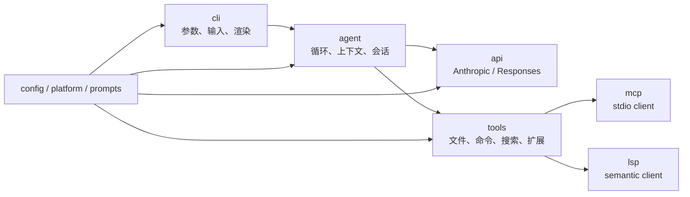
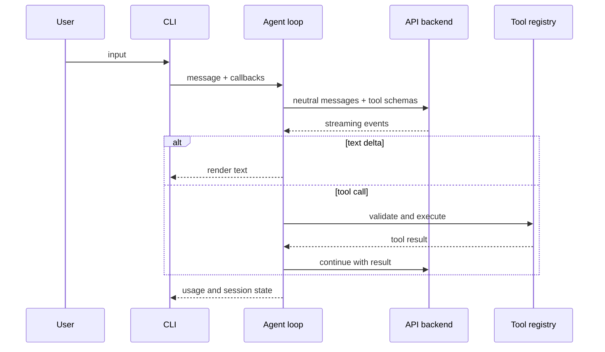

# LubanCode 架构

[文档首页](README.md) · [配置手册](configuration.md) · [扩展指南](extensions.md) · [中文 README](../README.md) · [English README](../README.en.md)

LubanCode 是一支 C++23 命令行程序。上层管交互，中层管代理循环，下层管协议、工具与平台。依赖只往下走，不能倒灌。

> 本页对应 `v0.23.1`。Windows/MSVC、Ubuntu/GCC、macOS/Clang 都在 CI 中编译并跑测试。

## 分层



| 层 | 目录 | 责任 |
| --- | --- | --- |
| CLI | `src/cli/` | 参数、输入编辑器、流式渲染、Markdown、diff、主题、i18n、slash 命令。 |
| Agent | `src/agent/` | 对话循环、工具回填、上下文压缩、会话存档、系统提示拼装。 |
| API | `src/api/` | 中立消息类型、SSE 分帧、Anthropic 与 Responses 两套后端。 |
| Tools | `src/tools/` | 文件、命令、搜索、子代理、Skill、插件、MCP/LSP 适配。 |
| MCP | `src/mcp/` | JSON-RPC、stdio 传输、工具发现与调用。 |
| LSP | `src/lsp/` | JSON-RPC、文档同步、语义查询、懒启动与闲置回收。 |
| Config | `src/config/` | 配置读取、分层合并、模型目录、prompt 与技能脚手架。 |
| Platform | `src/platform/` | 进程、终端、路径、编码；Windows 与 POSIX 分开实现。 |
| Prompts | `src/prompts/` | 内置人格、工作方式、工具方针与协议段。 |

上层认得下层，下层不认得上层。`tools` 不知道 `agent` 存在，`api` 不知道 `cli` 存在。这样换协议不必重写界面，添工具也不必去碰请求客户端。

## 一轮请求怎么走



API 后端只把协议事件翻成中立事件。工具只收 JSON 参数，吐统一结果。CLI 靠回调画屏，不插手模型协议。

## 双后端

LubanCode 同时支持 Anthropic Messages 与 OpenAI Responses。两套协议语义不同，代码分目录放：

```text
src/api/
  backend.hpp            中立后端接口
  types.hpp              Message / ContentBlock / ToolCall / StreamEvent
  sse_framing.*          通用 SSE 分帧
  anthropic/             Messages 请求、事件与客户端
  responses/             Responses 请求、事件与客户端
```

分两层处理流式响应：

1. **分帧**只管 `event:`、`data:` 与断行，不懂厂商字段。
2. **语义解析**各写各的，把原始 JSON 翻成 `StreamEvent`。

Agent 只认中立类型。`wire` 切换时，重建后端即可。provider 的 `extra_body` 与 `extra_headers` 在内置请求拼完后再合并，给厂商私有字段留出口。

## 工具系统

`Tool` 接口约定几件事：名称、说明、JSON Schema、是否确认、是否延迟挂载，以及执行函数。`ToolRegistry` 管注册与查找。

工具分三层：

- **核心工具**：读写、编辑、命令、搜索等，启动即在。
- **条件工具**：MCP、LSP、web search，配了才注册。
- **外挂工具**：Skill、Lua、DLL。数量多时可延迟挂载，先靠 `tool_search` 找。

所有写盘与命令动作都走确认体系。`confirm` 每次问，`auto` 放安全动作，`yolo` 全放。项目级 `settings.local.json` 再叠黑白名单。

## 进程与平台

Windows 与 POSIX 共用 `process.hpp`，各自实现：

- 一次性命令：合并 stdout/stderr，限时，超量截断，退出时收整棵进程树。
- 后台命令：立即返回 PID 与日志路径，跨工具调用存活，会话退出时清理。
- 长命子进程：MCP/LSP 共用双向管道与读线程。

Windows 用 `CreateProcessW`、Job Object 与宽字符路径。POSIX 用 `fork/exec`、进程组、`poll` 与信号。平台判断收在 `src/platform/`，业务层不散落系统调用。

## Prompt 与运行时覆盖

`src/prompts/` 的 Markdown 在构建时嵌进可执行文件。首次启动又会播种到 `~/.lubancode/prompts/`：

```text
core/        身份、工作方式、答话风格
features/    文件、命令、Skill、MCP、LSP 等工具方针
platforms/   Anthropic / Responses 协议段
```

运行时逐模块判断：用户文件非空便优先，否则退回嵌入版。`system_prompt.md` 替换人格段；`SOUL.md` 只叠风格。两者不该混作一件事。

## 配置边界

配置按字段合并：

```text
LUBANCODE_* 环境变量
    > 项目 .lubancode/config.json
    > 用户 ~/.lubancode/config.json
    > ANTHROPIC_* / OPENAI_* 兼容变量
    > 内置默认值
```

对象段如 `hooks`、`mcpServers`、`search`、`lsp` 走整段回退，不做深合并。这样来源说得清，`lubancode --config` 也能逐项报来路。

## 错误与线程

- 网络错、参数错、工具失败等预期分支用 `std::expected` 往上传。
- 异常留给程序自身失约，不拿它传业务错误。
- 子进程读线程都要 join 或有清楚的进程寿命状态；不能让线程在静态对象析构后再碰锁。
- 输出进 JSON 或会话前先保证 UTF-8 合法，Windows 代码页字节另走转换。

## 测试与交付

单元与集成测试由 doctest 汇成 `lubancode_tests`，CTest 负责调用。平台专属夹具覆盖进程、socket、DLL 与真控制台路径。

CI 有三条腿：MSVC、GCC、Clang。Release 工作流不用本机构建物，收到 `v*` 标签后从干净 runner 重编，再打 Windows、Linux、macOS 三份包。

## 历史

早期按 M0 到 M9 推进：骨架、双协议、代理循环、工具、TUI、配置、上下文、MCP/LSP、插件。此后按功能提交，版本由 tag 划线。细脉络看 `git log --oneline`，对外变化看 GitHub Releases。
