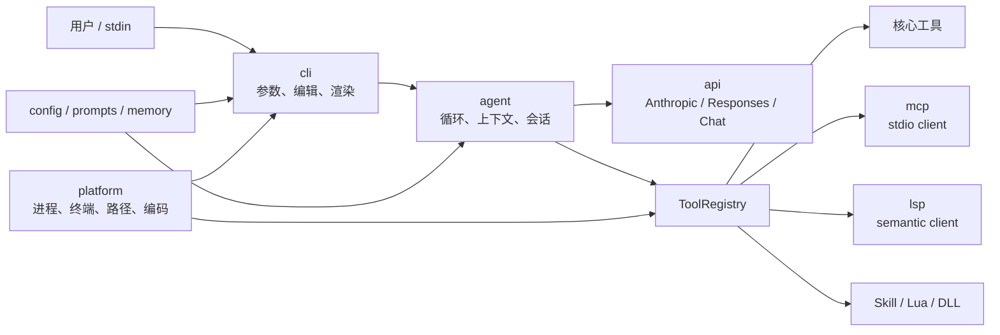
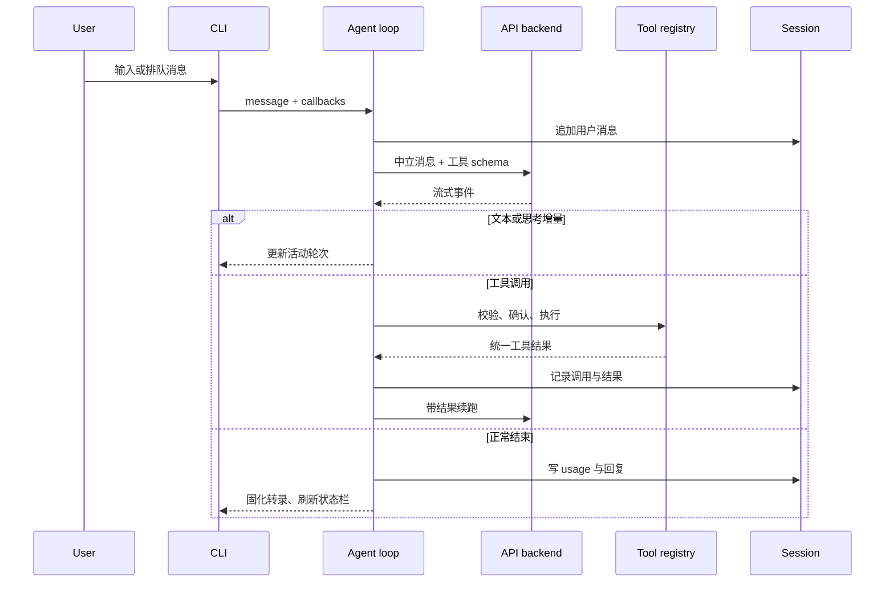

# LubanCode 架构

[文档首页](README.md) · [功能总览](feature-reference.md) · [工具手册](tools.md) · [会话与上下文](sessions-and-context.md) · [配置手册](configuration.md)

LubanCode 是一支 C++23 命令行程序。上层接人，下层接系统。中间摆一副代理循环，把模型、工具、会话串起来。

> 本页对应 `v0.24.0`。Windows/MSVC、Ubuntu/GCC、macOS/Clang 都在 CI 中编译并跑测试。当前测试基线为 1151 个用例、5239 条断言。

## 1. 总图



依赖只往下走。`api` 不认得 `cli`，`tools` 也不认得 `agent`。协议换了，界面不用重写。工具添了，请求客户端也不必动。

## 2. 源码分层

| 层 | 目录 | 管什么 | 不管什么 |
| --- | --- | --- | --- |
| CLI | `src/cli/` | 参数、输入编辑器、流式渲染、Markdown、公式、diff、主题、i18n、slash 命令 | 厂商协议与工具实现 |
| Agent | `src/agent/` | 对话循环、工具回填、上下文压缩、会话存档、系统提示拼装 | 终端绘图与网络细节 |
| API | `src/api/` | 中立消息、SSE 分帧、三套协议后端 | 项目文件与终端状态 |
| Tools | `src/tools/` | 文件、命令、搜索、网页、子代理、Skill、插件适配 | 对话历史编排 |
| MCP | `src/mcp/` | JSON-RPC、stdio 传输、工具发现与调用 | MCP 服务业务逻辑 |
| LSP | `src/lsp/` | 文档同步、语义查询、懒启动与闲置回收 | 语言服务器实现 |
| Config | `src/config/` | 分层配置、模型目录、项目指令与 prompt 脚手架 | 请求执行 |
| Memory | `src/memory/` | 项目记忆检索、写入、整理 | 通用会话历史 |
| Platform | `src/platform/` | 进程、终端、路径、编码、动态库 | 产品流程 |
| Prompts | `src/prompts/` | 内置人格、工作规矩、工具方针、协议段 | 用户项目指令 |

测试按同样边界放在 `tests/`。共享夹具管临时目录、伪服务器与进程。平台专属用例另开文件，免得一堆 `#ifdef` 横在正文里。

## 3. 启动阶段

启动并非只读一份配置。程序依次收拢几路材料：

1. 解析命令行参数，定下工作目录、非交互输入与确认模式。
2. 读取用户配置、项目配置和环境变量，按字段选出最终值。
3. 加载 provider 目录与模型 variant，建好协议后端。
4. 从发行包、用户目录、项目目录合并 Skill；再拼内置模块、用户 prompt、`SOUL.md`、项目指令与 Skill 摘要。
5. 注册核心工具，再按配置接 MCP、LSP、网页搜索与插件。
6. 打开或恢复会话，算出上下文预算。
7. 判断终端能力。真 TTY 进入全交互界面，管道和重定向走朴素文本。

其中任一步失败，都尽量报清来源与路径。配置坏了，不该含糊成“请求失败”；MCP 起不来，也不该拖垮文件工具。

## 4. 一轮请求



一轮里可以调用多次工具。模型发来工具请求，Agent 执行、回填，再问模型。直到模型给出最终文本，或遇上中断、超限、不可恢复错误。

CLI 只接事件。它不解析厂商 SSE，也不拼工具回执。这样交互界面可独立演进。

## 5. 三种模型协议

LubanCode 支持三套 wire protocol：

| `wire` | 后端 | 常见服务 |
| --- | --- | --- |
| `anthropic` | Anthropic Messages | Claude 及兼容网关 |
| `responses` | OpenAI Responses | OpenAI 新接口及兼容服务 |
| `chat` | Chat Completions | OpenAI 兼容服务与多数国产模型网关 |

目录如下：

```text
src/api/
  backend.hpp            中立后端接口
  types.hpp              Message / ContentBlock / ToolCall / StreamEvent
  sse_framing.*          通用 SSE 分帧
  anthropic/             Messages 请求、事件与客户端
  chat/                  Chat Completions 请求、事件与客户端
  responses/             Responses 请求、事件与客户端
```

流式响应分两层拆：

1. SSE 分帧只认 `event:`、`data:`、空行和断包。
2. 协议解析各走各路，把厂商 JSON 翻成统一 `StreamEvent`。

中立事件包括文本增量、思考增量、工具调用、usage、结束和错误。Agent 只认这些事件。切换 `wire` 时，重建后端便成。

provider 的 `extra_body` 先并入请求，模型 variant 的 `extra_body` 后压上。`extra_headers` 也在出网前合并。厂商私有字段由配置带入，无须在后端里写一长串特判。

模型目录从 `catalog/providers.json` 来。构建时嵌一份，离线也能选。运行时又可下载新版，拿 ETag 做条件请求，验过 schema 和大小才原子替换缓存。详情见 [Provider 目录](provider-catalog.md)。

## 6. 工具注册与执行

`Tool` 对外给出名称、说明、JSON Schema、确认要求与执行函数。`ToolRegistry` 管登记、查找和调用。

工具分四路：

| 类别 | 何时出现 | 例子 |
| --- | --- | --- |
| 核心工具 | 启动即注册 | `read_file`、`write_file`、`edit_file`、`search`、`run_command`、`web_fetch` |
| 条件工具 | 配置满足才注册 | `web_search`、`lsp`、`memory_save` |
| 主代理工具 | 只给主代理 | `agent`、`todo_write`、交互式 `ask_user` |
| 动态工具 | 扩展启动后发现 | MCP、Lua、原生插件工具 |

工具多时，不把所有 schema 一股脑塞给模型。延迟工具先藏在目录里，只露出 `tool_search`。模型搜到名字后，工具才挂进当前请求。这样省 token，也免模型在几十个相似工具里乱撞。

每次调用都走同一条路：

1. 按 JSON Schema 检查参数。
2. 算确认策略与项目黑白名单。
3. 需要时停下来问用户。
4. 执行工具，收集文本、结构化数据或图片。
5. 截断过大的结果，写入转录，再回填模型。

`confirm` 每逢有副作用便问。`auto` 放行明确安全的动作。`yolo` 全放。项目里的 `settings.local.json` 还能细分命令和工具规则。详见 [工具手册](tools.md) 与 [配置手册](configuration.md)。

## 7. Prompt 拼装

`src/prompts/` 下的 Markdown 随构建嵌进程序。首次启动又会播种到 `~/.lubancode/prompts/`：

```text
core/        身份、工作方式、答话风格
features/    文件、命令、Skill、MCP、LSP 等工具方针
platforms/   Anthropic / Responses / Chat 协议段
```

运行时逐模块取值：用户文件非空，便用用户版；文件缺失或为空，退回嵌入版。

提示词大致按这层次拼：

```text
内置身份与工作规矩
  + 当前协议提示
  + 已启用功能提示
  + 用户 system_prompt.md（可替换身份段）
  + SOUL.md（追加口吻与偏好）
  + 从根目录到 cwd 的 AGENTS 指令
  + Skill 摘要与运行环境
```

`system_prompt.md` 管底稿。`SOUL.md` 只添风格。`AGENTS.md` 管项目规矩。三样各有职分，不宜搅成一锅。项目指令细节见 [项目指令](project-instructions.md)。

## 8. 配置合并

配置按字段挑选，优先级如下：

```text
LUBANCODE_* 环境变量
    > 项目 .lubancode/config.json
    > 用户 ~/.lubancode/config.json
    > ANTHROPIC_* / OPENAI_* 兼容变量
    > 内置默认值
```

标量逐项覆盖。对象段如 `hooks`、`mcpServers`、`search`、`lsp` 走整段回退，不做深合并。这样一查就知哪层说了算。`lubancode --config` 会列出最终值与来源。

密钥不写进 provider 目录。配置只记环境变量名，例如 `api_key_env: "OPENAI_API_KEY"`。真正密钥临出网才从环境读取。

## 9. 会话与上下文

会话落成 JSONL。每条消息、工具调用、工具结果和 usage 各占一行。追加写简单，半途崩了也容易救。

恢复会话时，程序按工作目录筛选。`/sessions` 看列表，`/resume` 接着聊，`/export` 导出 Markdown，`/title` 改题目。

上下文由系统提示、会话消息、工具 schema 与预留输出额度共同占用。达到阈值后，Agent 压缩较早消息，保留近处对话和必要工具结果。`/compact` 可手动收束，`/context` 可看预算。

缓存命中 token 由服务端 usage 返回。它表示本次输入里，有多少前缀复用了 provider 缓存；不是 LubanCode 猜出来的数。不同厂商未必都报。详见 [会话与上下文](sessions-and-context.md)。

## 10. 项目记忆

项目记忆与会话不是一回事。会话记“这回说过什么”，记忆记“这个仓库长期要守什么”。

记忆默认关闭。打开后，程序按当前问题做词法检索，把少量相关条目塞进系统上下文。模型可调用 `memory_save` 写下稳定事实；用户也能用 `/memory` 查看、删除和重建索引。写盘走后台队列和原子替换，避免半截文件。

现阶段已落地的是显式写入、同步检索与维护命令。自动抽取、空闲合并、跨项目记忆仍在规划里。详见 [项目记忆](memory-system-design.md)。

## 11. 终端并发模型

模型跑着时，输入框仍能收字。UI 线程读键、排版、刷新；代理工作在后台推进，再把事件送回界面。用户提交的新消息先排队，当前轮次收尾后自动发出。

活动轮次不会反复改写已固化历史。文本、思考、工具调用、工具结果先聚成一份活动快照；轮次结束，再一次落进转录。`Ctrl+O` 在精简与详情间切换时，界面拿快照重放，免得切一次就丢一段。

Markdown 与公式都在终端侧渲染：

- 行内 `$...$` 尽量换成数学斜体、上下标与常用 Unicode 符号。
- 块级 `$$...$$` 交给盒式排版器，画分式、根式、上下标、括号和矩阵。
- 解析不了就原样退回，不吞公式。

完整键位、降级路径与公式能力见 [终端界面](terminal-ui.md)。

## 12. 进程与平台

Windows 与 POSIX 共用 `process.hpp`，各自落地：

- 一次性命令合并 stdout/stderr，限时，超量截断，退出时收整棵进程树。
- 后台命令立即返回 PID 与日志路径，跨工具调用存活，会话退出时清理。
- MCP/LSP 这类长命子进程共用双向管道与读线程。

Windows 用 `CreateProcessW`、Job Object 与宽字符路径。POSIX 用 `fork/exec`、进程组、`poll` 与信号。业务层不散落系统调用。

输出进 JSON 或会话前，先保证 UTF-8 合法。Windows 代码页字节另走转换。路径一律经 `std::filesystem`，不手拼斜杠。

## 13. 错误与寿命

- 网络错、参数错、工具失败等预期分支用 `std::expected` 往上传。
- 异常只留给程序自身失约，不拿来传普通业务错误。
- 子进程读线程必须 join，或由清楚的寿命对象托住。
- 会话、记忆、provider 缓存都先写临时文件，再原子替换关键文件。
- MCP/LSP/插件各自隔开故障边界。一个扩展坏了，不该拖垮整轮会话。

## 14. 扩展入口

添能力时，先选最窄的门：

| 想做什么 | 入口 | 是否需要重编 LubanCode |
| --- | --- | --- |
| 教模型一套工作法 | Skill | 否 |
| 接外部工具服务 | MCP | 否 |
| 接编辑器语义能力 | LSP | 否 |
| 写轻量本地工具 | Lua 插件 | 否 |
| 接高性能原生库 | C ABI 插件 | 插件要编，主程序不用 |
| 在工具前后跑脚本 | Hooks | 否 |
| 添核心协议或共享工具 | C++ 模块 | 是 |

各入口的结构、命名、信任边界与排错方法见 [扩展指南](extensions.md)。

## 15. 测试与交付

doctest 把单元和集成用例汇成 `lubancode_tests`，CTest 负责调用。重点覆盖：

- 三套协议的请求、SSE 与工具调用。
- 配置优先级、provider 目录与 prompt 覆盖。
- 文件、命令、搜索、MCP、LSP、插件和 Skill。
- 上下文压缩、会话恢复、记忆索引。
- 输入编辑、Markdown、盒式公式、diff 与转录生命周期。
- Windows/POSIX 进程、socket、动态库与真控制台路径。

CI 有三条腿：MSVC、GCC、Clang。Release 工作流收到 `v*` 标签后，从干净 runner 重编，再打 Windows、Linux、macOS 三份包。本机构建物不会混进去。发行包带可执行文件、双语 README、`docs/`、安装脚本与官方 `skills/`。

版本检查另走 `src/config/update_checker.*`。`/update` 使用会话网络超时，`--check-update` 使用内置默认超时；两者只读 GitHub `releases/latest`，限制响应为 1 MiB，再按 SemVer 比较。它们不覆盖运行中的程序。安装脚本负责替换程序与官方 Skill 资源。

## 16. 改代码时怎么落位

动手前问三句：

1. 这是协议事实，还是产品行为？协议事实放 `api`，产品行为放 `agent`。
2. 这是界面状态，还是会话状态？界面状态放 `cli`，可恢复内容交给 session。
3. 这是跨平台能力，还是系统调用？前者留共享接口，后者沉到 `platform`。

添新工具，要补 schema、确认策略、错误路径与转录测试。添新配置，要补默认值、来源标记、`--config` 输出和文档。添新协议事件，要先翻成中立类型，别让厂商字段一路爬到 UI。

历史沿 `git log --oneline` 看。用户可见变化沿 GitHub Releases 看。两条线一内一外，各记各的账。
