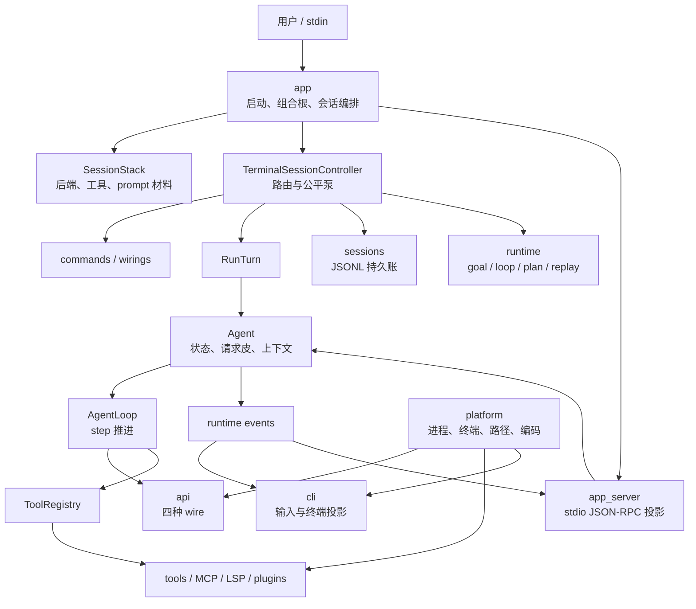
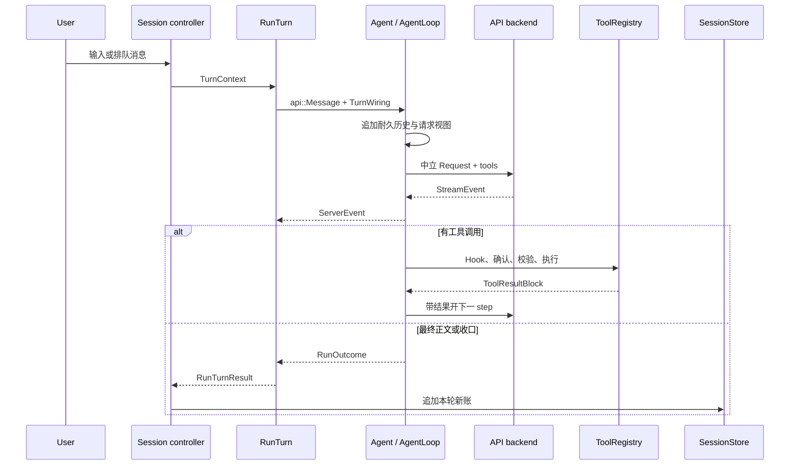

# LubanCode 架构

[文档首页](../README.md) · [会话编排](session-orchestration.md) · [Query 数据流](query-data-flow.md) · [Workflow 运行时](workflow-runtime.md) · [工具手册](../reference/tools.md) · [配置手册](../reference/configuration.md)

LubanCode 是一支 C++23 命令行程序。入口收参数，组合根装部件，会话层排活，Agent 推模型 step，工具层办本机差事，协议层翻各家 JSON。这里看全局；会话怎样拆，另见[会话编排](session-orchestration.md)。版本号只认 `src/app/version.hpp`，测试口径看[测试指南](../development/testing.md)。

## 1. 总图



这张图画运行职责，不硬装成目录依赖图。仓内有些适配器横跨目录，真正编译边界看 CMake target：

```text
lubancode
  -> lubancode_app
     -> lubancode_core
        -> lubancode_runtime
           -> lubancode_engine
```

`lubancode_engine` 收协议、Agent、工具、配置、会话存储与底层集成；`lubancode_runtime` 收运行期状态机；`lubancode_core` 收可复用终端投影与 workflow；`lubancode_app` 收启动、app-server、会话装配与命令。`main.cpp` 只进 `app::RunCli`。

## 2. 源码地图

目录与 target 是两张地图，不必一一对应。目录按职责分，target 按编译依赖收束。

| 目录 | 管什么 | 不管什么 |
| --- | --- | --- |
| `src/app/` | CLI 应用编排、组合根、会话控制器、单发模式、回合宿主、命令 handler、子系统接线 | wire JSON 与终端排版算法 |
| `src/app_server/` | stdio framing、JSON-RPC schema、连接、交互请求与事件出箱 | Agent 领域状态 |
| `src/agent/` | `AgentProfile`、`Agent`、step 循环、上下文、prompt 拼装、压缩、artifact 与前缀账 | 终端会话泵与 JSONL 存储 |
| `src/runtime/` | 中立事件/命令合同、会话/turn 真值、goal、loop、plan、预算、重试与 replay | 终端画法与 wire JSON |
| `src/sessions/` | JSONL 会话、catalog、生命周期与 goal 事件 | 模型请求推进 |
| `src/workflow/` | workflow 定义、解析、校验、journal、runtime、planner 与宿主 executor | 交互会话所有权 |
| `src/cli/` | 输入编辑、终端端口、转录投影、Markdown、公式、diff、主题与 i18n | 会话业务策略与 wire 解析 |
| `src/api/` | 中立消息、请求档案、SSE 分帧、HTTP 流与四套 wire adapter | 工具权限与项目文件 |
| `src/tools/` | 文件、命令、搜索、网页、子代理、Skill、插件与工具注册表 | turn/step 编排 |
| `src/config/` | 分层配置、provider/model 目录、项目指令、prompt 文件与更新检查 | 请求发送 |
| `src/memory/` | 项目记忆检索、候选、队列与写盘 | 通用聊天历史 |
| `src/hooks/` | Hook 装载、信任、协议、分派与 detached 执行 | Hook 脚本业务 |
| `src/peers/` | 会话名册、信箱、跨进程收发 | 收信后何时开模型 turn |
| `src/mcp/` / `src/lsp/` | 外部工具与语言服务器传输、发现、调用 | 对端服务实现 |
| `src/ptc/` | typed stub、runner、RPC、能力画像与基准 | 普通 JSON 工具协议 |
| `src/skills/` | 工作流录制与 Skill 草拟 | 通用工具执行 |
| `src/platform/` | 进程、终端、路径、编码、网络代理与动态库 | 产品流程 |
| `src/prompts/` | 内置人格、功能、工具、模式与 wire 提示 | 用户项目指令 |

测试沿同一职责落在 `tests/`。会话拆分另有 `tests/unit/app/test_command_registry.cpp` 与 `test_session_wirings.cpp` 钉注册表和接线器。

## 3. 启动与组合根

交互路径这样起：

```text
main
-> app::RunCli
-> app::BuildSessionStack
-> app::RunInteractiveSession
-> TerminalSessionController::Run
```

`RunCli` 读参数、配置、provider 目录和启动档位，再选 app-server、单发或交互模式。交互模式先让 `BuildSessionStack` 装好几样长寿件：

- 生效配置、Skill 与 prompt 材料；
- `RebuildableBackend` 与模型路由；
- 主/子工具表、MCP、LSP、插件与延迟工具过滤器；
- worktree、artifact store 与上下文追踪器。

控制器只借这些件，不再自己造第二套。单测若直接进 `RunInteractiveSession`，函数也会调用同一只 `BuildSessionStack` 兜底。

控制器构造与运行又分两半：`interactive_session_assembly.cpp` 接线、恢复、拆线，`interactive_session.cpp` 读输入、分派、泵活、开 turn。类声明藏在 `interactive_session_controller.hpp`，对外只露 `RunInteractiveSession`。

## 4. 会话编排

普通正文、peer 来信与后台结果最后都汇进 `RunSessionTurn`。来源参数分清用户轮和外来轮，公共骨架只留一份。它组 `TurnContext`，再交给 `RunTurn`：

```text
ProcessLine
-> RunSessionTurn(source)
-> RunTurn(TurnContext)
-> Agent::Run(message, TurnWiring)
-> AgentLoop::Run(Agent&, ...)
```

`RunTurn` 是宿主边界。它接终端、审批、Hook、事件 sink、ESC、排队消息与落盘材料。`Agent` 持状态：请求档案、系统提示、上下文、工具可见性和环境接线。`AgentLoop` 只借 `Agent&` 推 step。

slash 命令先经 `ParseSlashCommand`，再查 `SlashCommandTable()`。表里记枚举、名字、handler 和 console/idle 元数据；各域 handler 住 `src/app/commands/`。控制器只解析、查表、分派。

goal、loop、plan、peer、录制各有一只 `*SessionWiring`。状态跟接线器走，会话级配置、存档和模型路由只借不占。公平仲裁仍留控制器，免得两只接线器各抢一把泵。细账见[会话编排](session-orchestration.md)。

## 5. 一轮请求



一次 turn 可以发多次模型请求。每发一次，算一枚 step。模型叫工具，Agent 执行、回填、再发；不等用户再按回车。终端和 app-server 都吃中立事件，不解析厂商 SSE。

## 6. 四种模型协议

| `wire` 规范名 | 后端 | 旧别名或常见用途 |
| --- | --- | --- |
| `anthropic-messages` | Anthropic Messages | 兼容旧名 `anthropic` |
| `openai-responses` | OpenAI Responses | 兼容旧名 `responses` |
| `openai-chat-completions` | Chat Completions | 兼容 `chat_completions`、`chat` |
| `google-generate-content` | Gemini Generate Content | Gemini 原生 `streamGenerateContent` |

目录如下：

```text
src/api/
  backend.hpp             中立后端接口
  types.hpp               Message / ContentBlock / StreamEvent
  reasoning.hpp           中立推理档案
  sse_framing.*           通用 SSE 分帧
  http_stream_transport.* 四家共用传输骨架
  anthropic/              Messages adapter
  chat/                   Chat Completions adapter
  responses/              Responses adapter
  gemini/                 Generate Content adapter
```

SSE 分帧只认帧；各 adapter 再把厂商 JSON 翻成统一事件。切 `wire` 时，`RebuildableBackend` 换掉内层 client，外头握着的 `Backend&` 不失效。

请求策略如今归 `AgentProfile`。`model`、`reasoning`、模型指令、魂和延迟工具索引都在 Agent 拼请求时落位，也进前缀指纹。后端层只管传输，不再叠五层包装器临发前改请求。

provider 的 `extra_body` 先并入请求，模型 variant 的覆盖后压上。`extra_headers` 也在出网前合并。推理档位走各 wire 正式字段，不混进任意扩展口。模型目录详情见 [Provider 目录](../features/providers/catalog.md)。

## 7. 工具注册与执行

`ToolRuntime` 装主、子两张 `ToolRegistry`。核心工具起手挂载；MCP、LSP、web、memory、Lua、DLL 和子代理按配置接入。工具多时，延迟工具先藏在 registry，只露 `tool_search`。模型搜中名字后，下一枚 step 重建工具定义，新工具便进请求。

每次调用都过同一条路：

1. 按 schema 验参数。
2. 跑 Hook 与 Plan 模式闸。
3. 算权限和确认。
4. 执行工具，收文本、结构化数据或图片。
5. 清洗、限长、落事件账，再回填模型。

goal 与 loop 的窄工具也住 registry，却只在对应执行 turn 放行。普通用户 turn 看不见。

## 8. Prompt 与请求皮

`src/prompts/` 下的 Markdown 随构建嵌进程序。用户目录有同名非空文件时，用用户版；没有或为空，退回嵌入版。

```text
core/        身份、工作方式、答话风格
features/    文件、命令、Skill、MCP、LSP 等功能段
tools/       各工具说明
platforms/   Anthropic / Responses / Chat 提示段
modes/       Default / Plan 宿主指令
```

Gemini 眼下不另挂 platform 提示段；wire adapter 仍是独立实现。基础 system prompt 收人格、环境、项目指令、功能段、wire 段与模式段。真发请求前，Agent 再按固定次序添延迟工具索引、模型指令和魂。

`system_prompt.md` 管底稿，`SOUL.md` 添口吻，`AGENTS.md` 管项目规矩。项目记忆不改 system；它只随本轮 user 请求视图进入，耐久历史不收。细节见 [Query 数据流](query-data-flow.md) 与[项目指令](../features/project-instructions/README.md)。

## 9. 配置、会话与上下文

配置优先级如下：

```text
LUBANCODE_* 环境变量
    > 项目 .lubancode/config.json
    > 用户 ~/.lubancode/config.json
    > 兼容环境变量
    > 内置默认值
```

会话写 JSONL。消息、工具、usage、模式、goal、loop、plan 与 compact 各按事件落账。`SessionRuntime` 管会话级真值与事件接线，`SessionStore` 管持久文件，`agent::ContextManager` 管模型眼下要看的两本历史。

上下文吃 system、消息、工具 schema 与输出预留。压力到了，先做结构压缩，再做语义 compact，最后才让 hard trim 兜底。`/compact` 可手动收束，`/context` 可查预算。详见[会话与上下文](../features/sessions/README.md)。

## 10. 终端与 app-server

终端前端把输入和转录分开。模型跑着时，监听线程仍收按键与排队消息；`RunTurn` 把 Agent 事件扇出，`TerminalTurnSink` 与各 presenter 再投成终端画面。`TerminalPort` 收住 stdout/stderr，业务 handler 不四下直写。

app-server 走同一套中立事件和交互合同。它从 stdio 收 JSON-RPC，请求审批时登记 future，前端回包后再唤醒执行线程。协议 stdout 与日志分开，免得一行调试字打坏 framing。详情见 [app-server](../features/app-server/README.md)。

再往外一道缝是聊天平台：QQ、微信、飞书这类渠道的常驻接入（ChannelPlugin 与 Channel Bridge）合同已冻结在 [channels/](channels/README.md)，实现批次见该目录的阶段索引。渠道与 app-server 共用 `SessionRuntime` 与 `EventSink`，谁也不包谁。

## 11. 进程、错误与寿命

- 预期错误用 `std::expected` 往上传；异常留给程序失约。
- Windows 与 POSIX 共用接口，各自在 `src/platform/` 落系统调用。
- 子进程读线程须 join，或由清楚的寿命对象托住。
- 会话、记忆与 provider 缓存先写临时文件，再原子替换关键文件。
- MCP、LSP、插件、peer 与后台代理各守故障边界。
- Agent 借 backend/registry，须先于 `SessionStack` 里这些所有者析构。

## 12. 改代码时怎么落位

动手前问这几句：

1. 厂商字段怎么翻？放 `api/<wire>/`。
2. step 怎么推、history 怎么守？放 `agent/`。
3. goal、loop、plan、预算或回放状态机怎么算？放 `runtime/`。
4. 会话怎样装、命令怎样接、turn 怎样投到终端？放 `app/`。
5. 只改终端输入或画法？放 `cli/`。
6. 要跨重启保存？先定 `sessions/` 事件，再从 app 接线。
7. 要碰系统调用？接口留共享层，平台实现沉 `platform/`。

添命令，补注册表行、域 handler 和命令表测试。添会话子系统，先立 `Host` 借用口，再把状态、泵、恢复与拆线收进自己的 wiring。添协议事件，先翻成中立类型，别让厂商字段爬进 Agent 或 UI。

## 13. 测试与交付

doctest 与 CTest 覆盖四家请求/SSE、Agent 工具循环、命令注册表、会话接线器、持久账、终端投影和平台路径。CI 跑 MSVC、GCC、Clang。提交前照[测试指南](../development/testing.md)选最窄用例，再跑：

```powershell
bash scripts/check_docs.sh
git diff --check
```

历史沿 `git log --oneline` 看，用户变化沿 CHANGELOG 和 Releases 看。两本账各守各的口。
