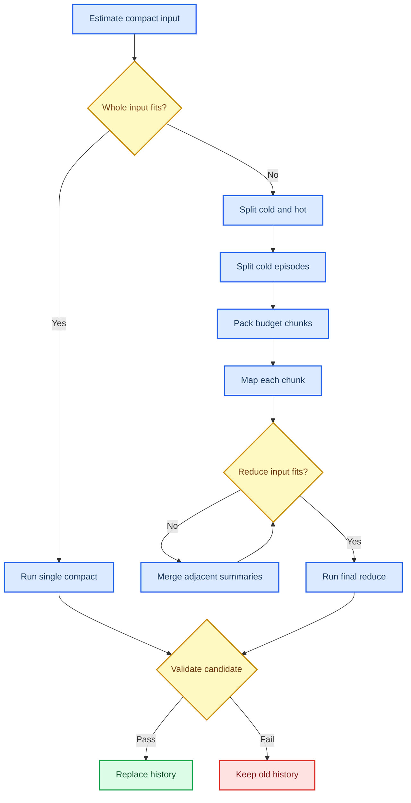

# Context 压缩算法深挖

_面向技术面试与源码走查：从 prompt 稳定性、冷热区、程序筛选、分块 map/reduce，一直讲到验收、回放与失败降级。_

---

[上下文、长文本与记忆深挖](../memory/context.md) · [上下文压缩机制](../../features/context/compaction.md) · [Agent Loop、重试与恢复深挖](../agent-loop/reliability.md) · [Query 数据流](../query-data-flow.md)

## 📋 先立六条边界

第一，compact 不改主会话 system prompt。它另起一枚模型请求，用专门的 compact system instruction。成功后只换 history。

第二，compact 不直接删 session JSONL。旧消息仍在，只追加一枚 `compact_v2` 事件。resume 按事件重放，才得出模型当时看见的短 history。

第三，程序先筛，LLM 后总结。去重、冷热区、artifact、episode 边界、事件号、待办验收都由宿主掌住。

第四，最新用户轮整轮保留。工具 use/result 不从腰上劈开。

第五，摘要是候选，不是事实。短、坏 JSON、漏待办，统统拒收。history 一字不动。

第六，compact 不是万能吞吐器。单个最新 turn 已大过压缩模型窗口时，没有冷区可切，只能明确失败。

可把全链记成一句：

```text
源头限流 -> 程序性收短 -> 冷区局部摘要 -> 全局分层 compact -> 验收替换 -> hard trim 兜底
```

## 🧠 两只 system prompt

### 主会话 system

`AgentLoop` 持有 `system_prompt_`。每枚普通 step 都写：

```cpp
request.system = system_prompt_;
```

compact 过程中，它不参与总结，也不会交给摘要模型改写。`ReplaceHistory` 只替换 `history_` 与 `request_history_`，不会动 `system_prompt_`。

这条“不变”有范围。正常 turn 内与一次 compact 前后，主 system 保持原样。若用户切 worktree、cwd、模型，或项目指令重建，应用可显式 `SetSystemPrompt`。那是配置与环境变了，不是 compact 改 prompt。

### compact system

摘要请求另造 `api::Request`：

```cpp
request.model = compact_model;
request.system = compact_instruction;
request.messages = history_or_summaries;
```

单次 compact 指令要求六栏 Markdown：

1. `## 任务目标`
2. `## 已证实的事实`
3. `## 关键决策`
4. `## 涉及文件与符号`
5. `## 关键命令与结果`
6. `## 未完成事项`

末尾还要一枚 JSON manifest：

```json
{
  "goal": "当前任务目标一句话",
  "constraints": ["用户明示的约束或禁止"],
  "open_items": ["未完成事项"],
  "next_action": "下一步该做的具体动作"
}
```

用户传了 `/compact 重点说明`，指令再添 `## 重点保留`。活动 todo 里 `pending` / `in_progress` 的原文也会钉进指令，要求只许改空白，不许改写或漏掉。

### 为什么分两只 system

若把“请总结历史”塞进主 system，往后每一步都带着它。模型可能把正常任务当压缩任务，prompt cache 前缀也跟着抖。

分开后，责任很清楚：主 system 管代理身份、规则与工具边界；compact system 只管这一枚后台摘要请求。

## 📚 四本账与五级视图

### 四本账

| 账 | 内容 | compact 是否改 |
| --- | --- | --- |
| `history_` | 模型下一步要看的活历史 | L3 成功后替换 |
| `request_history_` | 活历史加本 turn 临时上下文 | 随 history 重建，再补临时上下文 |
| session JSONL | 完整消息与事件流水 | 不删旧行，只添 compact marker |
| artifact store | 超长工具结果原文 | 不删，摘要后仍可追回 |

project memory 不在这四本里。它跨会话存稳定事实，每条新用户消息到来时另行召回。compact 不拿它当旧对话一起总结。

### L0 到 L4

| 层 | 手段 | 是否调模型 | 是否改 history | 原文在哪 |
| --- | --- | --- | --- | --- |
| L0 | 原样、分页、按需加载 | 否 | 否 | history/session |
| L1 | 结构去重、版本标记、artifact 预览 | 否 | 否 | history/session/artifact |
| L2 | 点名 artifact 的按需 microcompact | 是 | 否，只往尾部添工具结果 | session/artifact |
| L3 | 全局 semantic compact | 是 | 是 | session |
| L4 | sticky hard trim | 否 | 否，只改请求视图 | session/history |

L1 只改请求视图的表示。L2 不改旧表示，只在工具调用处添一条新摘要。L3 才真正换活 history。L4 是最后拦网，带损失，必须告警。

## ⚙️ 程序先怎样过滤

### 源头限流

大内容若在入口便能分页，先别让它进历史：

- 文件先 `search` 定位，再用 `read_file offset/limit`
- 命令输出在进程层封顶，超限便杀进程树
- 网页与搜索工具限制条数与字节
- 工具 schema 用延迟挂载，别每步全塞

这层最便宜，也最准确。原始 50 MiB 日志压根不该先灌给 LLM，再请它“帮忙变短”。

### L1 结构压缩

每次请求前，`CompressWorkingView` 从 `request_history_` 派生工作视图。它不改永久 history。

程序查看 tool result 的工具名、入参与内容指纹，再做决定：

| 情况 | 请求视图怎样放 |
| --- | --- |
| 短结果，首次出现 | 放全文 |
| 同一只读调用、同一内容 | 后来者换成前一事件引用 |
| 同一资源出了新版本 | 新版保留，旧版给版本提示或预览 |
| 长结果且 artifact 可用 | 原文落 blob，视图留 id、指纹、头尾预览 |
| 带副作用工具 | 不按内容判重 |

为何副作用工具不判重？两次 `run_command` 即使 stdout 一模一样，也可能各自改过状态。把第二次折成“同前”，会抹掉真实动作。

L1 的决策在 cache epoch 内钉住。已发过的旧结果不会下一 step 忽然从全文变预览，免得请求前缀反复改形。

### L2 microcompact

L2 默认不开工。模型须点名 artifact，显式调用 `context_read(summarize=true)`。宿主才另建一只独占 backend，走 cheap 路由写一份局部摘要。它不扫冷区，不在回合收尾猜哪枚值得花钱。

| 项 | 当前值 |
| --- | ---: |
| 单次处理 | 调用方点名的 `1` 枚 artifact |
| 单枚模型输入上限 | `24 KiB` |
| cheap 请求超时 | `45 s` |

输入从 artifact blob 重新读，不拿旧摘要再摘要。超过 `24 KiB` 时取头尾各半，再沿行边界与 UTF-8 码点边界收口。

模型要回严格 JSON，至少带 `summary` 与 `key_facts`。解析失败、摘要过短、超时、blob hash 不对，工具返回错误。原文不删，memo 不换。

成功摘要随本次 `context_read` 的 `tool_result` 追加到历史尾部。已发旧消息逐字不动，cache epoch 也不因 L2 改写。`summarize=true` 不可与块 id 或行窗同用。

## 🎯 L3 何时触发

触发有三处：

| 入口 | 判断时机 | 用户能否控制 |
| --- | --- | --- |
| 手工 | `/compact [focus]` | 能 |
| 回合前 | 上轮实际 usage 达阈值 | 可改配置 |
| 回合中 | 下一 step 的 projected usage 达阈值 | 可改配置 |

默认压力线约为 context window 的 `80%`。回合中只在 step 边界动：上一批工具结果已经收齐，下一枚请求尚未发出。工具跑到一半时不 compact。

projected 估算包含：

```text
主 system token
+ 当前 request history token
+ 当前挂载工具名、说明与 schema token
+ 输出预留
```

模型端实测 usage 与本地估算各有用处。实测 usage 准，却晚一拍；projected 能在长工具结果刚回填时抢先收短。

## 📊 压缩预算怎样算

compact 模型有自己的窗口，不沿用主模型窗口想当然地装。

```text
可用输入预算 = compact_window
             - output_reserve
             - protocol_headroom
```

默认输出预留 `4096 tokens`，协议余量 `2048 tokens`。输入估算还会数 compact instruction、消息与协议余量。

窗口未知时，程序没法可靠切块，会退化成单次 compact。窗口已知且整份装得下，也走单次。只有整份装不下、冷区又可分时，才走分层。

> ⚠️ **Corner case:** 最新一轮本身巨大时，`HotZoneStartIndex(history) == 0`。没有冷区可 map。程序退回单次路径，再按预算明确拒绝；它不会偷偷砍半条用户消息。

## 🔄 分层 compact 全算法



### 第一步：记 source digest

程序把 history 里的文本与 tool result 内容串起，算 `source_digest`。现版只记指标，尚未拿它复用旧 map 结果。

这处设计给将来留了门：某 episode 若内容指纹没变，可复用预计算摘要；变了便失效。眼下不能说“已经支持增量复用”。

### 第二步：划冷热区

`HotZoneStartIndex` 找最后一条真正的用户输入。真正用户输入指 `Role::User` 且带 `TextBlock` 或 `ImageBlock`。只装 ToolResult 的 user 消息不算新 turn。

最后一轮从这条输入起，一直延到 history 尾，全部算热区。前头才是冷区。

### 第三步：剥上一轮 archive

若冷区首条 user 文本以固定前缀开头：

```text
[对话存档,此前内容已压缩]
```

程序再找末尾最后一枚 `json` fence，把旧 archive 剥出来。它只进最终 reduce 作参考，不进入任何 map chunk。

这么做是为挡“摘要复印摘要”。新局部小结尽量从原始消息来。旧 archive 若与新局部证据冲突，以新证据为准。

### 第四步：按 episode 切

冷区在两类边界开新 episode：

- 新外层用户输入
- assistant 调过 `todo_write`

用户纠正需求时，任务阶段变了。todo 变化时，计划状态变了。拿这两处开段，通常比机械每 N 条切一次更贴任务语义。

### 第五步：按预算装 chunk

episode 装得下，整段一块。装不下，再在 episode 内沿用户轮边界切。

随后贪心合并相邻轮：合后不超 `chunk_budget`，便放一块；一旦超，另起块。单轮自己已经超预算，也只好独占一块，交下游请求明确失败。程序不从工具调用中腰劈开。

当前 `chunk_budget` 大致取 compact 可用输入预算，再留一层协议空间。这里用本地 token 估算，不是 provider 真分词器，故而仍要给 headroom。

### 第六步：map

每块各发一枚 compact 请求。map system 要五栏：阶段目标、事实、决策、文件与符号、未完成事项，末尾也请模型写 manifest。

map 的宿主验收较轻：去空白后至少 `40` 个 UTF-8 码点。manifest 若能解析便存，解析不到不会在 map 当场拒绝。真正严格关口留在 final reduce。

程序另给每份局部摘要钉 `evidence_refs`。它从 normalized event ledger 按消息区间算出，例如 `e12-e45`。事件号不是模型编的。

### 第七步：多轮 reduce

宿主先拼：旧 archive 参考 + 所有局部小结 + 各自 evidence range。若这坨仍超预算，便把相邻两份摘要成对合并。

一轮 pair merge 约把摘要数减半。最多 `4` 轮。奇数末尾那份原样带到下一轮。合并结果会继续携带两边 evidence range。

> ⚠️ **实现边界:** pair merge 的中间结果会尝试解析 manifest，却没有像 final reduce 那样逐项强验，也没有单独跑 `40` 字门槛。最终 reduce 仍有完整验收。面试时不能说“每一级摘要都同样严格验收”。

### 第八步：final reduce

最终 reduce 重新要求六栏 archive 与完整 manifest。若有上一轮 archive，指令明说它只作参考；与局部小结冲突时，以局部小结为准。

final text 过短、manifest 解析失败、goal 空、活动待办漏项，整场 compact 失败。旧 history 保持原样。

## ✅ 候选怎样验收

### 五道门

单次 compact 依次过：

1. transport 与 stream 没报错。
2. 去空白后不少于 `40` 个 UTF-8 码点。
3. 最后一枚 `json` fence 能解析，键与类型合规。
4. `goal` 非空；每条必保待办都能在 `open_items` 中找到。
5. 摘要 token 估算须小于原 history。压了反而更长，拒收。

分层 final reduce 过前四道。现版没有再跑“最终摘要必须短于原 history”这道收益检查。两条路径不能混说。

### 待办守恒怎样比

程序先去掉空格、制表、回车与换行，再做包含比对。模型换行不算丢，改字便算丢。

这道校验保的是显式 active todo，不代表摘要中每个事实都可机器证明。事实完整度仍靠指令、局部证据与人工观察。若要更强，可把关键文件、错误码、用户约束也做结构化 ledger，再逐项验收。

### 为什么取最后一枚 JSON fence

摘要正文可能提到代码块，甚至引用旧 manifest。解析器从末尾找最后一个 ` ```json `，把它当机器账。这样少受正文示例干扰。

## 💾 成功后怎样拼新 history

### 热区保留算法

`BuildCompactedHistory(history, archive, hot_zone_tokens)` 先按真正用户输入切 turn。

保留从最后一轮开始。最后一轮不管多大都留。再倒着看前一轮：整轮 token 加进来不超热区预算，便留；超了立刻停。默认热区预算约 `12,000 tokens`。

于是工具配对天然保住：一轮要么整段进，要么整段不进。

### archive 为何并进 user 消息

不能单独放一条 archive user，再紧跟热区首条 user。那会形成相邻两条 user，Anthropic 标准端点可能直接报角色交替错误。

宿主取 archive 文本，塞到保留热区第一条 user 文本前头：

```text
[对话存档,此前内容已压缩] ...manifest...

<原热区第一条用户输入>
```

若 history 根本找不到用户 turn，才让 archive 自己成为唯一一条消息。

### ReplaceHistory 做什么

验收通过后，`AgentLoop::ReplaceHistory`：

- 同时换 `history_` 与 `request_history_`
- 若 compact 发生在 turn 中，给最新 request message 重新注入 `active_turn_context_`
- 打开新 cache epoch，原因记 `history_compacted`
- 清前缀指纹、结构压缩 memo 与 sticky hard trim

本 turn 临时 context 只回 `request_history_`，不写进 durable history。故而记忆召回包、代理名册与 PTC 指南不会因 compact 变成永久聊天记录。

## 🚫 失败与恢复

### compact 失败

所有模型调用与验收都在替换前完成。任一步失败，函数返回 error。调用方打印告警，旧 history 不动。

自动 compact 失败后，主 turn 并不必然停。它还可走 L1 与 L4。只有最终请求仍超过硬限，才在发 API 前明确拒绝。

### L2 失败

单枚按需摘要失败，工具把错误回给模型。原 L1 预览、blob 与 session 原文都在；程序不会自动重试。

### compact event 写盘失败

内存 history 已换短，session marker 却没落盘。当前进程继续用短账；下次 resume 用旧流水重建长账。数据没有丢，压缩状态没有持久化。

更严的事务可先写候选 marker 再 swap，或写一枚带 source digest 的 commit event。现版尚未做这层两阶段提交。

### 中途进程退出

若退出发生在 map/reduce 中，history 尚未替换，session 也没有 compact marker。重启仍拿旧账。若发生在内存替换后、marker flush 前，便落入上一节那处裂口。

## 🔧 L4 hard trim 到底保什么

hard trim 与 semantic compact 不是一回事。它按字符上限裁工作视图，不产摘要。

当前规则：

1. history 未超 `max_context_chars`，原样返回。
2. 按真正用户输入切 turn。
3. 保第一轮，再保最近 `kDefaultKeepRecentTurns` 轮，当前默认三轮。
4. 中间段丢掉，并把 `[早前对话已裁剪]` 并进最近保留区首条 user。
5. 若还超限，从过大的 ToolResult 内容尾部截短；每条尽量至少留 `1024` 字节与截断标记。
6. 截点先对齐 UTF-8 码点，免得砍出半个汉字。

一旦真裁，视图会 sticky。下一 step 只在尾部追加新消息，不每回重算“第一轮 + 最近三轮”。否则窗口会一路滑，已发前缀每步都变，prompt cache 与模型注意力都不稳。

sticky 视图自己再超限时，才重裁一次，开新 cache epoch。

### hard trim 的死角

- 第一轮本身巨大，保第一轮就可能超限
- 最新三轮本身巨大，也可能超限
- 单条用户输入不能像 ToolResult 那样截尾
- 工具结果已缩到最小保留仍超限

这些情形最终都会在请求前硬检查处报错。程序不会发一枚已知超限的请求。

## 🔍 corner case 总表

| 情形 | 当前行为 | 为何这样 |
| --- | --- | --- |
| history 末条是 assistant | compact 请求补一条 user trailer | 防 provider 当 assistant prefill 续写 |
| history 末条是 tool result user | 不补 trailer | 本就轮到 assistant |
| 没有 compact 窗口数据 | 退单次 compact | 无从可靠定 chunk budget |
| 全部历史都在最新 turn | 单次路径再明确拒绝 | 没冷区可切 |
| episode 超预算 | 沿用户轮再切 | 不拆 tool pair |
| 单轮仍超预算 | 独占一块，请求可能失败 | 不静默截史 |
| 旧 archive 找不到闭合 JSON fence | 当普通原始文本 | 不凭猜测剥存档 |
| map manifest 坏 | map 可继续 | final reduce 才作总验收 |
| pair merge 过四轮仍太大 | 仍发 final reduce，可能遭预算错误 | 有上限，防无限归并 |
| final manifest 漏 active todo | 整场拒收 | 待办守恒高于省 token |
| 摘要比原文长 | 单次路径拒收 | 没压缩收益 |
| compact 中 turn context 存在 | 换史后重新注入请求视图 | 临时上下文不丢也不永久化 |
| artifact blob 损坏 | 按需摘要工具报错 | 不拿坏原文造摘要，旧 L1 预览不动 |

## 🎓 面试追问答法

### “system prompt 会不会一起压？”

不会。普通 AgentLoop 的 `system_prompt_` 保持原样。compact 是另一枚请求，吃专门的 compact system。验收成功后只换 history。环境或项目指令显式重建 system，另当别论。

### “保留最近几条？”

别答“固定几条”。L3 按 turn 与 token：最后一轮必留，再往前整轮装进默认约 12k token 热区。L4 才是第一轮加最近三轮，再截超大工具结果。两套算法用途不同。

### “长历史如何分块？”

先分冷热。冷区按新用户输入与 `todo_write` 切 episode。episode 超预算，再沿用户轮切。相邻轮贪心合并到 chunk budget。每块 map；reduce 输入仍大，便相邻摘要两两归并，最多四轮；末后 final reduce。

### “如何防摘要漏信息？”

程序钉栏目、event range 与 active todo。模型写 manifest，宿主解析并查 goal、open_items。短摘要、坏 JSON、漏待办一律拒收，旧 history 不动。普通事实还没有逐条形式化证明，这是现存边界。

### “为什么不纯程序压缩？”

程序擅长判相等、守边界、算预算、留引用；它不擅长把“试了 A 失败，转 B 成功，尚欠 C”收成短而通顺的状态。LLM 擅长语义归纳，却不该掌证据编号与验收。两边各守一段，才稳。

## 🔗 源码与测试

| 题目 | 源码入口 | 关键测试 |
| --- | --- | --- |
| 单次与分层 compact | `src/agent/compact.cpp`、`compact.hpp` | `tests/unit/agent/test_compact.cpp` |
| token 与 hard trim | `src/agent/context.cpp`、`context.hpp` | `tests/unit/api/test_context.cpp` |
| L1 结构压缩 | `src/agent/context_events.cpp` 等 context event 模块 | `tests/unit/api/test_context_events.cpp` |
| L2 microcompact | `src/agent/microcompact.cpp`、`microcompact.hpp` | `tests/unit/memory/test_microcompact.cpp` |
| 中途压力与换史 | `src/agent/loop.cpp` | `tests/unit/agent/test_loop.cpp`、`test_request_prefix.cpp` |
| compact event 回放 | `src/sessions/session_store.cpp` | `tests/unit/sessions/test_session_store.cpp` |
| 自动触发与待办守恒 | `src/app/interactive_session.cpp` | compact 与 session 相关测试 |

产品层概览见[上下文压缩机制](../../features/context/compaction.md)。四本账、长文件与 memory 触发，见[上下文、长文本与记忆深挖](../memory/context.md)。
