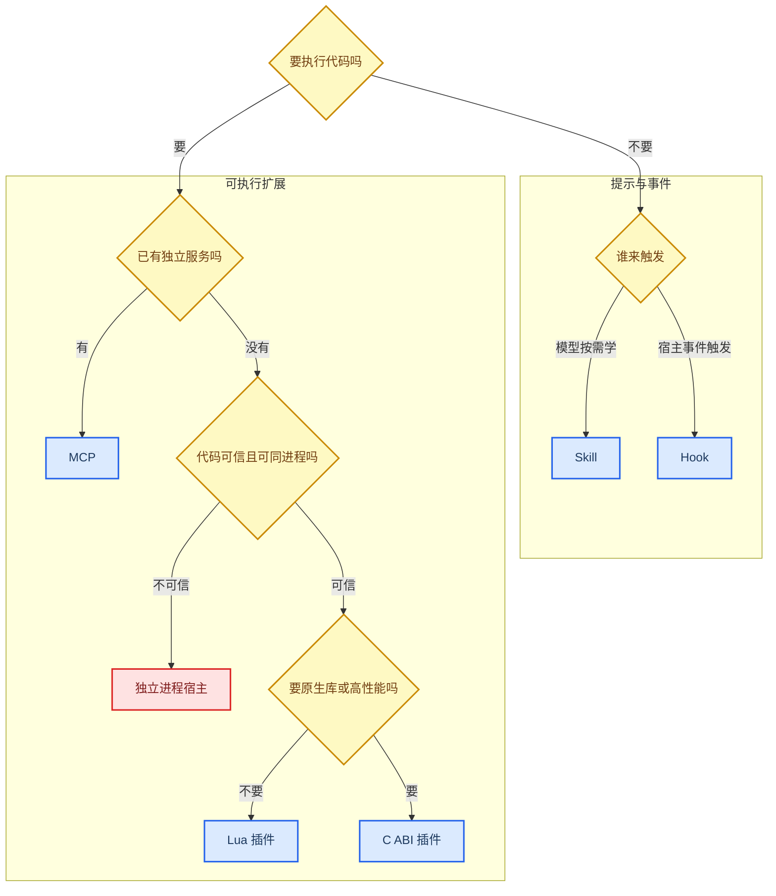

# 进程内插件系统深挖：Lua 与 C ABI

_面向技术面试、插件作者与源码走查：讲清插件为何存在、怎样安装、如何变成模型工具，又拿什么换掉 MCP 的进程与协议成本。_

---

[面试深挖导航](../../../interview/deep-dives.md) · [扩展指南](../../features/extensions/README.md) · [工具协议与扩展运行时](tool-extension.md) · [安全模型](../../development/security.md)

## 📋 先把设计动机说透

LubanCode 的插件系统不是为了再造一套 MCP。它要填另一道缝：有些工具压根不是服务，只是一枚本地函数。

数一段文本、改一种格式、查一张本地表、调一段现成 C 库，这些事若全包成 MCP，要备运行时、起子进程、握手、列工具、走 JSON-RPC、管 stdout、等超时、收进程。功能只有十行，房梁倒搭了半屋。

Lua 与 C ABI 走的是短路：

```text
模型 JSON 入参 -> 宿主里的函数 -> 文本结果
```

没有 MCP server。没有额外 daemon。没有 stdio RPC。工具仍进同一只 `ToolRegistry`，照走确认、Hook、展示、结果回填与 Agent Loop。

面试时可以这样答：

> MCP 适合“外面本来就有一套服务”；插件适合“这里本来只有一枚函数”。我没有拿插件取代 MCP，而是把函数调用与服务调用分成两条成本不同的路。

## ⚖️ 到底该选哪扇门

| 需求 | 首选 | 缘故 |
| --- | --- | --- |
| 只教模型一套做法 | Skill | 不需执行代码 |
| 拦工具、记审计、发通知 | Hook | 由宿主事件触发，不等模型挑工具 |
| 一枚可信本地函数 | Lua 插件 | 一份脚本，启动即挂载 |
| 接 C 库、系统 API、重计算 | C ABI 插件 | 同进程调用，少一层复制与 RPC |
| 接数据库、浏览器、云服务 | MCP | 服务有独立状态与生命周期 |
| 代码不可信，须隔离崩溃 | MCP 或独立进程宿主 | Lua/DLL 会连宿主一起拖下水 |
| 工具属于 LubanCode 核心能力 | 内置 `Tool` | 类型、测试、发行与兼容最稳 |



这张图只管主选择。现实里还能混用。比如 MCP server 内部可调 C 库；Hook 也能调用一段 Lua。先认清信任边界，再谈省不省事。

## 📦 能不能真装上

能。现版是“投放式安装”，不是包管理器。

插件目录固定在用户主目录：

| 平台 | 目录 |
| --- | --- |
| Windows | `%USERPROFILE%\.lubancode\plugins\` |
| Linux / macOS | `$HOME/.lubancode/plugins/` |

启动时只扫这一层，不递归。`.lua` 三个平台都认；原生库按平台加载（Windows `.dll`、Linux `.so`、macOS `.dylib`）；`plugin.json` 子目录走 process 插件（Python/Rust/任意可执行程序）。项目级 `<项目>/.lubancode/plugins/` 也认，但项目插件按内容指纹过信任账（`~/.lubancode/plugin-trust.json`），首次见到须批准。没有 `/plugin install`，也没有热重载。文件放好后须重启 LubanCode。

### 安装现成 Lua 示例

Windows PowerShell：

```powershell
$pluginDir = Join-Path $env:USERPROFILE '.lubancode\plugins'
New-Item -ItemType Directory -Force -Path $pluginDir | Out-Null
Copy-Item .\examples\plugins\word_count.lua $pluginDir
```

Linux / macOS：

```bash
mkdir -p "$HOME/.lubancode/plugins"
cp ./examples/plugins/word_count.lua "$HOME/.lubancode/plugins/"
```

重启后敲：

```text
/plugins
```

应当看见：

```text
plugin__word_count__word_count  (lua)
```

随后可直接问模型：“用 word_count 工具数一下 `the quick brown fox`。”工具若因总数过多被延迟挂载，先用 `/tools` 看状态。模型会先调 `tool_search`，下一枚 step 才见到完整 Schema。

### 安装 C ABI 示例

原生插件现版只支持 Windows DLL。先在仓库根目录构建：

```powershell
cmake -S .\examples\plugins\hello_plugin -B .\build\hello-plugin
cmake --build .\build\hello-plugin --config Release
```

再拷 DLL：

```powershell
$pluginDir = Join-Path $env:USERPROFILE '.lubancode\plugins'
New-Item -ItemType Directory -Force -Path $pluginDir | Out-Null
$dll = Get-ChildItem .\build\hello-plugin -Recurse -Filter hello_plugin.dll | Select-Object -First 1
if ($null -eq $dll) { throw '没有找到 hello_plugin.dll' }
Copy-Item $dll.FullName $pluginDir
```

重启，敲 `/plugins`。应当看见：

```text
plugin__hello_plugin__reverse_text  (DLL)
```

这不是纸面示例。`tests/CMakeLists.txt` 会把同一份 `hello_plugin.c` 真编成 DLL，`tests/test_plugins.cpp` 再用 `LoadLibraryW` 真加载、真调用，还拿中文 `你好ab` 验出 `ba好你`。

### 眼下“安装”还缺什么

| 能力 | 现状 |
| --- | --- |
| 复制本地 Lua / DLL | 已有 |
| 启动扫描与错误警告 | 已有 |
| `/plugins` 状态查看 | 已有 |
| 修改后热重载 | 没有，须重启 |
| `/plugin install/update/remove` | 没有 |
| 下载、校验哈希、签名验证 | 没有 |
| 版本锁与依赖解析 | 没有 |
| 单插件启停开关 | 没有，移走文件才算停 |

故而面试时别说“做了插件市场”。准话是：“做了本地插件 ABI、启动发现、挂载、诊断与示例工程；包管理和供应链验证尚未做。”

## 🔄 一份插件怎样变成模型工具

```mermaid
flowchart LR
    accTitle: 插件工具挂载与调用链
    accDescr: Lua 文件或 Windows DLL 在启动时被扫描、校验并适配成统一 Tool，随后经过延迟挂载、模型调用、Hook、权限与结果回填。

    subgraph startup ["启动发现"]
        file[插件文件] --> load{扫描并按类型加载}
        load -->|Lua| lua_state[建立 lua State]
        load -->|DLL| manifest[读取 C manifest]
        lua_state --> adapter[适配 Tool]
        manifest --> adapter
        adapter --> registry[注册 ToolRegistry]
    end

    subgraph turn ["回合调用"]
        defer{工具总数超阈值吗}
        defer -->|是| search[先走 tool_search]
        defer -->|否| request[进入模型 tools]
        search --> request
        request --> call[模型给 tool call]
        call --> hook[PreToolUse]
        hook --> confirm[权限确认]
        confirm --> execute[同进程执行并回填]
    end

    registry --> defer

    classDef decision fill:#fef9c3,stroke:#ca8a04,stroke-width:2px,color:#713f12
    classDef process fill:#dbeafe,stroke:#2563eb,stroke-width:2px,color:#1e3a5f
    classDef warning fill:#fee2e2,stroke:#dc2626,stroke-width:2px,color:#7f1d1d

    class load,defer decision
    class file,lua_state,manifest,adapter,registry,search,request,call,hook,confirm process
    class execute warning
```

启动装配在 `src/app/tool_runtime.cpp`：

1. 算出 `~/.lubancode/plugins/`。
2. DLL 与 Lua 各自扫描。
3. 坏文件记警告，别连累好文件。
4. 每件外部工具适配成 `Tool`。
5. 主会话与普通子代理都挂；Explore 只读角色不挂。
6. DLL 按路径只载一次，两张 registry 各拿一层 wrapper；`/plugins` 只记一份用户可见账。
7. 工具总数超过 `tool_search_threshold` 时，插件先只露名称与短说明。

插件工具的统一名字是：

```text
plugin__<文件 stem>__<工具短名>
```

前缀不只为好看。它把内置工具、MCP 工具与各插件隔开，也让 Hook matcher、日志和 `/tools` 能认出来源。

## 🌙 Lua 插件契约

每个 `.lua` 文件只能交出一件工具。脚本顶层须返回一张表：

```lua
return {
    name = "normalize_text",
    description = "折叠连续空白并去掉首尾空白。",
    input_schema = {
        type = "object",
        properties = {
            text = { type = "string" },
        },
        required = { "text" },
    },
    execute = function(input)
        if type(input.text) ~= "string" then
            error("text 必须是字符串")
        end
        return string.gsub(input.text, "%s+", " "):match("^%s*(.-)%s*$")
    end,
}
```

字段规矩：

| 字段 | 是否必填 | 现行行为 |
| --- | --- | --- |
| `name` | 是 | 空串或非字符串，整文件跳过 |
| `description` | 否 | 缺省为空；最好写清使用时机 |
| `input_schema` | 否 | 可写 JSON 字符串或 Lua table；缺省为宽 object |
| `execute` | 是 | 必须是函数，收一张入参表 |

### JSON 怎样进 Lua

| JSON | Lua |
| --- | --- |
| object | table，字符串键 |
| array | table，索引从 1 起 |
| string | Lua 字符串，UTF-8 字节原样搬 |
| integer / number | integer / number |
| boolean | boolean |
| null | `nil` |

`null` 是一道真边界。Lua table 存不住 `nil` 值。对象字段若是 null，进 Lua 后等于该键不存在；数组里的 null 也会留下洞。若业务必须区分“缺字段”与“显式 null”，现行 Lua 桥不合用，须改协议或改走 C/MCP。

### Lua 结果怎样回来

| 返回值 | 工具结果 |
| --- | --- |
| string | 原样文本 |
| integer / number | 转十进制文本 |
| boolean | `true` / `false` |
| table | 转 JSON 文本 |
| nil | 记错误，提示忘了 return |
| function / userdata | 记错误，无法字符串化 |

table 转 JSON 时，键恰好是 `1..n` 的连续整数才认作数组；其余认作 object。数字键会转字符串。嵌套超过 64 层报错，自引用也会撞上这道深度墙。

### 哪些错误能接住

脚本编译错、顶层执行错、`execute` 里的普通 `error()` 都由 `lua_pcall` 接住，翻成 `is_error=true`。一个坏 Lua 文件只留一条启动警告，其余插件照挂。

可别把 `pcall` 当沙箱。宿主调用了 `luaL_openlibs`，标准库全开。脚本可用 `io` 读写文件，可用 `os.execute` 起命令，也可用 `os.exit` 直接结束进程。死循环没有 instruction hook，内存分配也没有自定义上限。

## 🔩 C ABI 插件契约

C 插件不导出 C++ 类，只导出一枚函数：

```c
const luban_plugin_manifest* luban_plugin_entry(void);
```

`include/luban_plugin.h` 定了三层结构：

```text
luban_plugin_manifest
  -> api_version
  -> tool_count
  -> luban_tool_def[]
       -> name / description / input_schema_json
       -> execute(input_json)
       -> free_result(result)
```

### 为何不用 C++ ABI

C++ 类会把编译器、标准库、异常、RTTI、对象布局与编译选项一并带过边界。C ABI 只留整数、指针、结构体与函数指针，边界窄些。

窄不等于永远兼容。结构体末尾增字段、指针宽度、调用约定和打包方式仍会伤 ABI。现版靠 `LUBAN_PLUGIN_API_VERSION=1` 整体拒绝不兼容插件，没有细粒度 capability negotiation。

### 调用协议

宿主把模型入参 `dump()` 成 UTF-8 JSON 文本，再传给 `execute(const char*)`。插件返回：

```c
typedef struct {
    const char* content;
    int is_error;
} luban_tool_result;
```

结果拷进宿主 `std::string` 后，宿主立刻回调插件的 `free_result`。谁分配，谁释放。两边可能连着不同 CRT，宿主不能替 DLL `free()`。

`free_result` 在头文件契约里是必需项。现行 loader 没硬拒空指针；若插件分配了结果却不给释放函数，便会泄漏。插件作者不能拿 loader 的宽容当许可。

### 加载时怎样验

| 情形 | 结果 |
| --- | --- |
| 文件不是合法 DLL | 警告，跳过 |
| 没有 `luban_plugin_entry` | 静默略过，按依赖 DLL 看待 |
| 入口返回 null | 警告，跳过整个插件 |
| `api_version` 不合 | 警告，跳过整个插件 |
| manifest 没工具 | 警告，跳过整个插件 |
| 某条工具缺 name / execute | 只跳这一条 |
| Schema JSON 写坏 | 工具仍挂，退成宽 object Schema |

Lua 的坏 Schema 会拒绝整份脚本；C 插件却退成宽 Schema。这是两条实现目前不对称之处。面试时该如实报出。

## 🧵 并发、寿命与状态

插件执行是同步调用。主 Agent Loop 一次只顺序跑当步工具，不会替一批插件调用自动并行。后台子代理却可并发工作，主会话与子代理也可能同拍调用插件。

C 插件若用全局变量、静态缓存或第三方库，须自己保证并发安全。宿主不会替 `execute` 加全局锁。

Lua 侧每个工具对象有独立 `lua_State`，不同文件不串全局变量。同一工具另有 per-state mutex。多只后台子代理同拍调用时，会在这把锁前排队；不同 Lua 工具仍可并行。锁护住 Lua 栈，不替脚本限制总耗时。

DLL 生命周期由 `PluginHost` 扛住。主表与子代理表各有一层 `PluginTool`，底下共用一枚按路径幂等加载的模块。`PluginTool` 只借用 DLL 里的静态 `tool_def`。两张 registry 必须先析构，模块随后 `FreeLibrary`。顺序一反，函数指针和静态字符串便全悬空。

Lua state 随 `LuaTool` 析构而 `lua_close`。没有插件级 shutdown callback。插件若开了线程、句柄或临时文件，须自己收拾；宿主没法发“会话结束”通知。

## 🔐 确认不是沙箱

Lua 与 DLL 工具都把 `needs_confirm()` 固定为 true。调用前会走 PreToolUse、权限确认与审计。这道门只管“宿主要不要调用 execute”。

它管不住三件事：

1. DLL 在 `LoadLibraryW` 的 `DllMain` 里就能做事。
2. Lua 文件顶层在启动加载时已经执行，尚未轮到工具确认。
3. 用户一旦放行，插件拿的是宿主进程权限，不是某套收窄能力。

所以，陌生插件不能靠“反正会弹确认”来壮胆。插件目录是代码执行目录。Lua 可读写文件、起命令；DLL 能碰宿主地址空间、密钥与网络。

这也说明 MCP 并非白费进程。进程边界至少能隔开崩溃与地址空间，还能单独限权、杀进程、看 stderr。若扩展来自第三方，隔离常比那点 RPC 成本值钱。

## ⚠️ Corner case 与现存欠账

### 同名工具

最终名字取“文件 stem + 工具短名”。同一目录不能有两个同名文件，却可能有 `foo.lua` 与 `foo.dll`，二者再给出同一工具短名。一个 DLL 里也可能重复定义 name。

`ToolRegistry` 目前只追加，不查重；`Find` 返回第一项。这样请求 Schema 里可能出现重名工具，执行时又只命中先注册那件。插件作者应保证完整名唯一。宿主后续应在注册时拒绝重复名。

### 工具名不合 Provider 规矩

loader 只查 name 非空，没有收紧字符集与长度。某些模型端会限制工具名。文件 stem 含空格、中文或符号，也会进完整名。稳妥做法是只用 ASCII 小写字母、数字与下划线。

### Schema 不是运行时验证器

Schema 首要用途是告诉模型怎样构造参数。原始模型入参不会统一走完整 JSON Schema 校验；Hook 改写后的 `updatedInput` 才走一套浅校验。插件 `execute` 必须自己查字段、类型、范围与长度。

### 大输入、大输出

插件桥本身没有独立的输入、输出字节上限。结果进 Agent Loop 后会过 UTF-8 清洗，后续 context 管理也可能裁剪；这不能替代执行时的资源限制。插件若一口吐几百 MiB，宿主会先吃下它。

### 热更新

运行中覆盖 Lua 或 DLL 不会刷新 registry。Windows 上已加载 DLL 还可能被文件柄与模块映射占住。先退出 LubanCode，再替换文件，再启动。

### 故障隔离

Lua 普通异常能转工具错误；死循环、`os.exit` 与资源耗尽不能。DLL 的访问越界、栈破坏、ABI 错配也不能。文档里若写“插件坏了只跳过，不影响宿主”，只适用于加载期可识别的坏文件，不适用于执行期崩溃。

## 🎓 高频面试答法

### “plugins 有什么用？”

> 它让可信本地函数不用包装成 MCP 服务。Lua 适合轻逻辑与胶水；C ABI 适合原生库和系统能力。二者都适配成统一 Tool，照走 Schema、确认、Hook 与 Agent Loop。

### “这不就是重复造 MCP 吗？”

> 不是一个故障域。MCP 是进程外服务协议，换来隔离、语言自由与独立生命周期；插件是进程内函数 ABI，换来少部署、少序列化与低调用成本。是否值得起服务，要看工具本来是不是服务。

### “有例子吗？真能装吗？”

> 仓里有 `word_count.lua` 和 `hello_plugin.c`。Lua 拷进用户插件目录就能挂；C 示例在 Windows 编成 DLL 再拷。`/plugins` 查挂载。测试会真编、真载、真调 DLL，不只测假接口。

### “为什么 Lua 与 C 都要？”

> Lua 把开发门槛压到一份文件；C ABI 接住现成原生库与高性能逻辑。全用 C，简单工具也要编译；全用 Lua，系统 API、原生依赖与重计算又不趁手。

### “为什么 C ABI 不导出 C++ 类？”

> C++ ABI 牵着编译器、标准库、异常与对象布局。纯 C 结构体和函数指针更窄。结果由插件分配，也由插件释放，免得跨 CRT free。

### “插件安全吗？”

> 不安全。确认只挡调用，不挡加载期代码；Lua 标准库全开，DLL 与宿主同地址空间。只装可信插件。不可信扩展应走独立进程，MCP 反倒更合适。

### “这套系统还欠什么？”

> 欠包管理、签名与版本锁；C 插件还只支持 Windows；Lua 没 CPU 与内存墙；注册表也该拒绝重名。若要面向第三方生态，我会先做进程外 plugin host，而不是先做市场页面。

## 🔗 源码、示例与测试

| 主题 | 入口 |
| --- | --- |
| 统一工具接口 | `src/tools/tool.hpp`、`src/tools/registry.cpp` |
| Lua bridge | `src/tools/lua_tool.hpp`、`src/tools/lua_tool.cpp` |
| C ABI 头 | `include/luban_plugin.h` |
| DLL loader | `src/tools/plugin_loader.hpp`、`src/tools/plugin_loader.cpp` |
| 启动挂载 | `src/app/tool_runtime.cpp` |
| Lua 示例 | `examples/plugins/word_count.lua` |
| C 示例 | `examples/plugins/hello_plugin/hello_plugin.c`、`examples/plugins/hello_plugin/CMakeLists.txt` |
| 真加载与转换测试 | `tests/test_plugins.cpp`、`tests/CMakeLists.txt` |

往提交史追，可从 `7fb871d` 看初版全貌，从 `cf1e4ae` 看插件排序为何牵动请求前缀缓存。用户手册只看安装与字段，回[扩展指南](../../features/extensions/README.md)；要看插件与 MCP、Skill、Hook 怎样共用工具流水，接着读[工具协议与扩展运行时](tool-extension.md)。
