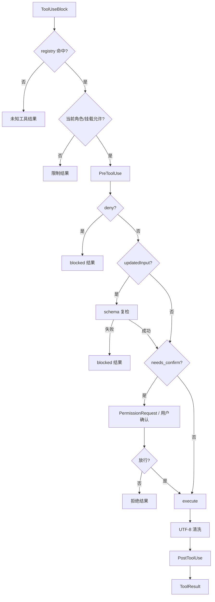

# 工具协议与扩展运行时深挖

[面试深挖导航](../../../interview/deep-dives.md) · [Query 数据流](../query-data-flow.md) · [工具调用流程](../tool-calling-flow.md) · [扩展指南](../../features/extensions/README.md) · [进程内插件深挖](plugin-runtime.md) · [Hooks 流程](../hooks-flow.md)

这页把单工具、多工具、四家 wire、中立层、MCP、Skill 与 Hook 串在一处。它专讲数据怎样走、失败怎样收、几套扩展为何不能混成一类。

## 一、工具的最小抽象

每只本地工具交五样东西：

```cpp
name()
description()
input_schema()
needs_confirm()
execute(json input) -> {content, is_error}
```

`ToolRegistry` 持有工具对象，按名字查找。`AgentLoop` 每个 step 从当前可见工具重建 definitions。延迟工具仍在 registry，却先被 filter 挡住，不进发给模型的 `tools`。

这只抽象故意很薄。文件工具、MCP wrapper、Lua/DLL plugin 与 memory tool 都能进同一循环；权限、Hook、回填、UTF-8 清洗不用各写一遍。

## 二、中立消息为何是核心

Agent 层不存某家原始 JSON。它只认：

```text
Message(role=User|Assistant)
  content[] =
    TextBlock
    ImageBlock
    ThinkingBlock
    ToolUseBlock{id, name, input: JSON}
    ToolResultBlock{tool_use_id, content, is_error}
```

工具定义也归一成：

```text
ToolDefinition{name, description, input_schema}
```

好处不只“少写重复代码”。更要紧的是：session 能按中立格式落盘，恢复后可换 provider；工具循环不必知道 Anthropic 没有 `role=tool`，Responses 又没有 `messages`。

代价也摆着：中立层只能表达四家共同语义与明确保留的扩展。某家专属字段若没进 `ContentBlock`，跨 provider 重放时便留不住。

## 三、工具定义在四家请求里长什么样

同一份中立定义：

```json
{
  "name": "read_file",
  "description": "读取文件内容……",
  "input_schema": {
    "type": "object",
    "properties": {
      "path": {"type": "string"},
      "offset": {"type": "integer"},
      "limit": {"type": "integer"}
    },
    "required": ["path"]
  }
}
```

翻到 wire：

| 协议 | 工具定义位置与形状 |
| --- | --- |
| Chat Completions | `tools[].type=function`，内套 `function.name/description/parameters` |
| Anthropic Messages | `tools[].name/description/input_schema` |
| OpenAI Responses | `tools[].type=function`，平铺 `name/description/parameters` |
| Gemini Generate Content | `tools[].functionDeclarations[]`，内放 `name/description/parameters` |

所以“工具入参是不是 JSON”要分两层答：宿主中立层是 `nlohmann::json` 对象；wire 上 Chat 与 Responses 的 arguments 是 JSON 字符串，Anthropic 的 `input`、Gemini 的 `args` 是 JSON 对象。流式回来后都拼成同一对象。

## 四、单工具调用的完整往返

### Chat Completions

```json
{
  "role": "assistant",
  "content": null,
  "tool_calls": [
    {
      "id": "call_01",
      "type": "function",
      "function": {
        "name": "read_file",
        "arguments": "{\"path\":\"README.md\"}"
      }
    }
  ]
}
```

结果重放：

```json
{
  "role": "tool",
  "tool_call_id": "call_01",
  "content": "     1\t# LubanCode\n"
}
```

### Anthropic Messages

```json
{
  "role": "assistant",
  "content": [
    {
      "type": "tool_use",
      "id": "call_01",
      "name": "read_file",
      "input": {"path": "README.md"}
    }
  ]
}
```

结果作为 user content block：

```json
{
  "role": "user",
  "content": [
    {
      "type": "tool_result",
      "tool_use_id": "call_01",
      "content": "     1\t# LubanCode\n",
      "is_error": false
    }
  ]
}
```

### Responses

```json
{
  "type": "function_call",
  "call_id": "call_01",
  "name": "read_file",
  "arguments": "{\"path\":\"README.md\"}"
}
```

结果是另一枚顶层 item：

```json
{
  "type": "function_call_output",
  "call_id": "call_01",
  "output": "     1\t# LubanCode\n"
}
```

### Gemini Generate Content

```json
{
  "role": "model",
  "parts": [{
    "functionCall": {
      "name": "read_file",
      "args": {"path": "README.md"}
    }
  }]
}
```

结果用函数名对账，不用调用 id：

```json
{
  "role": "user",
  "parts": [{
    "functionResponse": {
      "name": "read_file",
      "response": {"result": "     1\t# LubanCode\n"}
    }
  }]
}
```

中立层的 `ToolResultBlock` 只有 `tool_use_id`。Gemini adapter 会先扫历史，把 id 对回函数名。结果正文若是 JSON object，便原样放进 `response`；否则包成 `{"result": ...}`，错误则包成 `{"error": ...}`。

Chat、Responses 与 Gemini wire 没有稳定的 `is_error` 布尔位置。错误语义主要靠结果正文与下一轮模型理解；Anthropic 可显式带 `is_error=true`。中立层仍保留布尔值，给本地 UI、Hook 与 session 使用。

## 五、流式 arguments 怎样拼

provider 可能把一枚参数拆成多片：

```text
{"pa
th":"README
.md"}
```

adapter 先吐中立事件：

```text
ToolUseStart(id, name)
ToolUseInputDelta(partial_json)
...
ContentBlockDone
```

`MessageAssembler` 累加原始字符串，块结束时一次 `json::parse`。解析成功，写入 `ToolUseBlock.input`；失败则：

- 记录 `parse_error`。
- 仍保留工具调用 id 与名字。
- input 退成空 object，免 assembler 崩掉或丢调用块。

现存缺口在这里：`AgentLoop` 没有消费 assembler 的 `parse_error`。若工具自己要求必填字段，通常会回参数错误；若工具接受空对象，坏 JSON 可能退化成一次空参调用。稳妥修法是在执行前把 parse failure 变成成对的错误 `ToolResultBlock`，不触发工具。

## 六、原始入参、Hook 改参和 schema

schema 目前有三种用途：

1. 发给模型，约束它怎样构造调用。
2. `tool_search` 挂载后，下一 step 动态加入请求。
3. `PreToolUse` 返回 `updatedInput` 时，宿主统一复检。

第三条已有 `ValidateInputAgainstSchema`。它支持对象、required、常用 type、enum 等本项目所需子集。

须如实说一条：模型原始入参尚未在 `RunOneTool` 开头统一过 schema。多数内置工具在 `execute` 里逐字段验；MCP 还可交给远端服务验。于是 schema 眼下不是完整的宿主输入防火墙。

若补齐，次序应是：

```text
查工具/角色
-> 验原始 input schema
-> PreToolUse
-> 若 updatedInput，再验一次
-> 权限
-> execute
```

不能只在 Hook 后验一次，也不能拿 schema 代替路径、命令与权限检查。

## 七、`RunOneTool` 的执行状态机



所有出口都走 `on_tool_done`。UI 因而不会留下永远 Running 的条目。

`PostToolUse` 在副作用之后。它能追加反馈，不能撤销文件写入、命令执行或远端 MCP 动作。

## 八、多工具调用怎样处理

一条 assistant 可同时带文字、思考与多枚工具块。AgentLoop 遍历 content，只取 `ToolUseBlock`，按出现次序执行：

```text
assistant:
  ToolUse(a, id=a1)
  ToolUse(b, id=b1)
  ToolUse(c, id=c1)

user:
  ToolResult(a1)
  ToolResult(b1)
  ToolResult(c1)
```

三份结果收进同一条中立 user 消息，再开下一 step。工具调用数不是 step 数；上例仍只占一枚 assistant step，执行完才发下一次模型请求。

### 为什么顺序执行

- 每枚可能弹确认。
- Hook 可能依赖前一枚副作用。
- 两枚写工具可能碰同文件。
- 终端转录须有稳定顺序。
- Windows 临时环境注入路径也按顺序调用设计。

未来若只并发显式只读、无依赖工具，仍要解决稳定结果排序、共享 MCP client、取消与资源上限。现版没有这层调度器。

### ESC 落在多工具中间

正在跑的一枚不会被凭空抹掉。它收口后，真实结果入 history。尚未开始的调用逐枚补：

```text
用户按 ESC 打断,该工具未执行
```

每个 id 仍有一份结果。若在 SSE 半截打断，assembler 先强制收掉开块；发现孤 `ToolUseBlock`，也补未执行结果。配对比“看起来干净”更重要。

## 九、服务端内置工具不是本地函数工具

Responses / Anthropic 可声明厂商内置 web search。服务端自己执行，adapter 只画 `BuiltinToolStart/Done` 轨迹。

它不能再塞进 `ToolRegistry` 执行一次。否则同一搜索会跑两遍，权限、计费与结果全乱。

## 十、MCP 的装配链


每台服务器由一只长命 stdio 子进程承载。启动时顺序做：

1. 按 `command + args + env` 起进程。
2. 发 `initialize`，协议版本当前写 `2024-11-05`。
3. 发无 id 的 `notifications/initialized`。
4. 发 `tools/list`。
5. 每项包成 `McpTool`，注册为 `mcp__<server>__<tool>`。

主代理表与普通子代理表各放一只 wrapper，底下共用同一 `Client`。Explore 只读角色不拿 MCP。

## 十一、MCP transport 与 JSON-RPC

这里不是 LSP 的 `Content-Length`。MCP stdio 走 newline-delimited JSON-RPC：一行一份完整 JSON。

`LineFramer` 能处理：

- 一条 JSON 被 OS 拆成几段。
- 一次 read 收到多条 JSON。
- `\r\n` 与 `\n`。
- 尾部半行留到下一块。

残行超过 8 MiB 仍没换行，transport 判协议坏，清缓冲、杀进程。stderr 另存最近 8 KiB，绝不混进 stdout 协议流。

每份请求带递增整数 id。`pending_` map 存 id 到等待项；stdout 读线程解析一行，按 id 唤醒条件变量。未知 id、无 id通知、类型错与非法 JSON 都丢掉，不让读线程抛异常触发 `std::terminate`。

等待不是一口睡满：每约 100ms 醒来查子进程是否还活。普通握手/list 默认 30 秒，`tools/call` 默认 120 秒。进程已死，几百毫秒内便能带 stderr 尾巴返回，不白等两分钟。

超时后 pending id 被删。迟到响应再来，找不到 id，直接丢弃。

## 十二、MCP 结果与边界

`tools/call` 参数：

```json
{
  "name": "query_db",
  "arguments": {"sql": "select 1"}
}
```

客户端读取 `result.isError` 与 `result.content[]`。当前只拼 `type=text`：

- 多个 text block 直接顺序连接。
- image、resource 等非文本类型写成“不支持的内容类型”占位。
- result 字段缺失、类型错、JSON-RPC error、超时、进程退出都翻成 `Tool::Result{is_error=true}`。

MCP wrapper 默认 `needs_confirm=true`。schema 来自外部服务器，不代表工具无副作用，也不代表服务器可信。

### MCP corner cases

| 情形 | 当前处置 |
| --- | --- |
| 单台服务器起不来 | 打启动错误；其余服务器继续 |
| initialize 失败 | 不注册此服务器工具 |
| `tools/list` 少 tools 数组 | 此服务器装配失败 |
| 工具无 description | 允许，前缀仍标服务器 |
| 工具无 inputSchema | 用空 object |
| 两服务器同名工具 | server namespace 隔开 |
| stdout 混日志 | 日志行会被当 JSON，解析丢弃；请求可能超时 |
| 服务器主动通知 | 现版无 id 通知忽略 |
| 工具清单运行中变化 | 不自动重新 list；重启会话重建 |
| shutdown | 关 stdin 等 2 秒；未退便杀树 |

## 十三、Skill 系统怎样触发

Skill 是按需说明，不是可执行协议。启动时扫描三层：

```text
发行包官方 skills
~/.lubancode/skills
<cwd>/.lubancode/skills
```

同名取项目 > 用户 > 官方。结果按名字稳定排序。

启动只把 `name + description` 注入 system：

```text
- release-check: 发版前核对版本、测试、变更记录与产物。
```

模型判断当前任务命中，再调用：

```json
{"name":"release-check"}
```

`skill` 工具这才读取完整 `SKILL.md`，剥 frontmatter，把正文与技能目录交给模型。相对资源以该目录为基准，后续仍由模型用普通文件工具按需读取。

这叫渐进展开：索引常驻，正文按需，资源再按需。技能多时不必把所有说明与模板塞进每次请求。

## 十四、Skill 解析与 corner cases

frontmatter 不是完整 YAML parser。现版只认：

- 第一行必须恰是 `---`。
- 后面要有闭合 `---`。
- 块内按首个冒号切 `name`、`description`。
- 值两端成对单双引号会剥掉。
- 其他 key 与不含冒号的行忽略。

边界：

| 情形 | 当前行为 |
| --- | --- |
| 没 frontmatter | 整篇当正文；name 回落目录名 |
| 开了 `---` 未闭合 | 跳过整份技能，stderr 警告 |
| 无 description | 能加载；索引说明为空，较难触发 |
| 启动后手工改正文 | 清单不重扫；调用时按原目录重读正文 |
| 启动后删文件 | 调用报“目录还在但 SKILL.md 读不到” |
| 超长 SKILL.md | 当前整篇读入，没有独立字节上限；后续上下文层兜底 |
| 资源文件 | 不自动打包进结果，模型按相对路径再读 |
| 同名覆盖 | 以 frontmatter name 作 key，不只看目录名 |

`/skill install/update/remove` 属管理面，可刷新本场清单。模型侧 `skill` 工具只使用，不暗装外部内容。

Skill 是不可信文本。它能劝模型调用命令，却越不过宿主确认、Hook 与角色工具表；安装前仍须审脚本、网络与密钥要求。

## 十五、Hook 与工具调用怎样咬合

Hook 不进模型工具表。业务层在生命周期点调用 `HookDispatcher::Emit`。

装载链：

```text
用户定义 + 项目定义
-> 规范化与 legacy adapter
-> definition hash
-> 用户信任账 / disabled 状态
-> event + matcher 路由
```

项目 Hook 默认不可信。command、args、timeout、async 或类型一改，hash 变，须重审。仓库配置不能自己给自己盖章。

命中的同步 handlers 并发执行。全部返回后，程序按定义顺序归并，不按完成快慢：

```text
permission: deny > ask > allow > none
additionalContext: 全部按序追加
systemMessage: 全部按序保留
updatedInput: 最终为 allow 时取最后一份，再过工具 schema
```

`async:true` 现版只记 `skipped_async`，不执行，也不参与权限决定。

## 十六、Hook 子进程协议

v2 handler 从 stdin 收 UTF-8 无 BOM JSON。公共字段有 event、run id、session/turn id、cwd、transcript、permission mode 与 agent 身份；事件再添 tool、prompt、source 或 trigger。

首选 exec form：command 与 args 分开，不经 shell。字符串命令才走平台默认 shell。

返回三路：

- exit code：0 成功，2 阻断，其他按 failure policy。
- stdout：该事件准许的 JSON 决策。
- stderr：诊断，不当决策。

stdout 会按事件逐字段验。`updatedInput` 只许 `PreToolUse`；没有权限语义的事件不能乱回 `permissionDecision`。

多 handler 失败时，`failure_policy=warn` 默认告警放行；`deny` 可在有阻断语义的事件上转成拒绝。事后事件即便失败，也不能回滚已经发生的副作用。

## 十七、MCP、Skill、Hook 的区别

| 维度 | MCP | Skill | Hook |
| --- | --- | --- | --- |
| 本质 | 外部工具协议 | 模型操作说明 | 宿主生命周期回调 |
| 是否进模型 tools | 是 | 只有一只 `skill` loader | 否 |
| 触发者 | 模型选择工具 | 模型判断任务命中后加载 | 宿主在固定事件发射 |
| 数据协议 | stdio JSON-RPC | Markdown + 简单 frontmatter | stdin/stdout JSON + 退出码 |
| 能否阻断工具 | 经确认/Hook 间接阻断 | 不能 | `PreToolUse` 可直接阻断 |
| 是否可有副作用 | 由 MCP 服务决定 | 文本本身无，后续工具可有 | 脚本本身可有 |
| 信任重点 | 外部服务与 schema | 指令、脚本、资源 | 项目定义 hash 与命令 |
| 生命周期 | 会话长命子进程 | 启动扫描、按需读 | 每次事件起 handler 进程 |

## 十八、设计欠账与可演进处

- 在 `RunOneTool` 入口统一校验模型原始 input，parse error 直接回成对错误结果。
- 为工具增加只读/幂等/资源类能力元数据，才有资格做受控并发。
- MCP 补资源、图片等 content 类型，以及动态 `tools/list_changed` 通知。
- Skill loader 加正文大小上限、完整 YAML parser 与资源路径约束。
- Hook async 要等安全点投递、记录归并与退出收尾都设计好再开，不能只起线程便算完成。
- Chat/Responses 若要保留结构化错误语义，可在工具结果正文之外加宿主统一错误 envelope；要先验证兼容端接受度。

## 十九、源码与测试

| 责任 | 源码 | 测试 |
| --- | --- | --- |
| 中立类型与 assembler | `src/api/types.hpp`、`assembler.cpp` | `tests/unit/api/test_assembler.cpp` |
| 四 wire 请求 | `src/api/chat/request.cpp`、`responses/request.cpp`、`anthropic/client.cpp`、`gemini/request.cpp` | 四套 request 测试 |
| 工具循环 | `src/agent/loop.cpp` | `tests/unit/agent/test_loop.cpp` |
| registry/schema/deferred | `src/tools/registry.cpp`、`schema_check.cpp`、`tool_search.cpp` | `tests/unit/tools/test_tool_search.cpp` |
| MCP client/transport/wrapper | `src/mcp/client.cpp`、`transport.cpp`、`mcp_tool.cpp` | `tests/integration/protocols/test_mcp_client.cpp`、`test_mcp_tool.cpp` |
| Skill | `src/tools/skill_loader.cpp`、`skill_tool.cpp` | `tests/unit/config/test_skills.cpp` |
| Hook | `src/hooks/loader.cpp`、`dispatcher.cpp`、`protocol.cpp` | `tests/unit/hooks/test_hooks.cpp` |

若要看一条用户输入怎样把这几层全串起来，再读[Query 数据流](../query-data-flow.md)。
