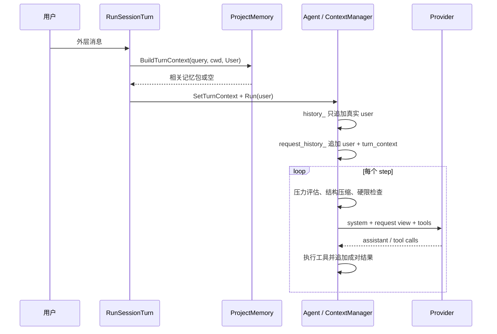

# 上下文、长文本与记忆深挖

> **V3-GAP-03（2026-09-23 复核已销项）：** v3 场召回注入已由 T08 接正式消息与上下文采用关系——隐藏快照消息经 AdmitMessages 进链，事实行带 memoryId/revision/hash/messageRef。本页流程描述仍以现行路径为准；MemoryStore 版本/CAS/遗忘屏障仍归总设计 §4.71（V3-GAP-08 伞下追踪），见 [Session v3](../session-v3.md)。

[面试深挖导航](../../../interview/deep-dives.md) · [会话与上下文](../../features/sessions/README.md) · [Context 压缩算法深挖](../context/compaction.md) · [项目记忆流程](flow.md)

这页答三道常被混在一起的题：模型每一步究竟看见什么，长文本怎样穿过窗口，跨会话记忆又何时召回、何时写入。命令语法与配置字段仍以各专题页为准。

## 一、先分四本账

| 账 | 活多久 | 装什么 | 谁会改它 |
| --- | --- | --- | --- |
| `history_` | 当前会话 | 用户、assistant、工具调用与结果、compact 存档 | `ContextManager` 追加；`Agent::ReplaceHistory` 可替换旧段 |
| `request_history_` | 当前会话的请求视图 | history 加本轮临时上下文与宿主标记 | `ContextManager` 随 turn/step 维护；不落 session |
| session JSONL | 跨进程 | 完整事件流水与 compact marker | 只追加，不因 compact 删除旧消息 |
| project memory | 跨会话 | 稳定项目事实、偏好、反馈 | memory worker 原子写主题 Markdown |

曾有一只独立 artifact 仓收超长工具结果原文（T17，2026-09-17 retired）。现行 v3 会话里，大结果的可追回存储是结果仓 `sessions/<id>/artifacts/res-*`（§四），预览说明区给绝对路径供 `read_file` 分段读回。

这套分账解开三个冲突：

- 模型要短，审计要全。请求视图可收短，session 仍留流水。
- 记忆要相关，不要每一步累积。召回包只进本 turn 的请求视图。
- prompt cache 要前缀稳定，工具表又会动态变化。每个 step 重建请求，同时记 cache epoch 与断因。

## 二、一次 turn 怎样装上下文



`AgentLoop::Run` 开头把 `Agent` 里的 `turn_context_` 复制进 `active_turn_context_`。这一步叫“钉住”：同一 turn 内，模型哪怕走十个 step，看到的仍是同一份记忆包。中途磁盘记忆变化，不追改已发前缀。

turn 结束，guard 清掉活动上下文。下一条外层用户消息再按新问题召回。

宿主合成消息默认不召回。后台完成通知、Hook 附注与 compact 续跑若也拿去搜记忆，容易让机器围着自己刚写的状态打转。

## 三、长文本不是一层解决

长文本有四种来路，处置各异。

| 来路 | 第一处理点 | 后续 |
| --- | --- | --- |
| 大文件 | `search` 定位；`read_file offset/limit` 分页 | 单次约 1 MiB，进入工具结果视图 |
| 海量命令输出 | 进程捕获层 2 MiB 封顶 | 到顶杀进程树，保留前段与标记 |
| 网页与搜索结果 | 工具自己的数量/字节上限 | 再走结构压缩与预览外置 |
| 巨型用户输入 | 没有源头工具可分页 | 只能靠窗口预算；单轮过大时明确拒绝 |

通用阶梯如下：

```text
源头限流
-> L1 请求视图结构压缩
-> 超长结果外置与预览
-> L2 冷工具结果微摘要
-> L3 全局语义 compact
-> L4 有损 hard trim + 明示告警
```

次序很要紧。若一开始就全局摘要，每读一段日志都要烧模型；若只靠最后 hard trim，任务约束与未完成项可能无声丢失。

## 四、L1 结构压缩怎样做

每次发请求前，`CompressWorkingView` 从 `request_history_` 派生一份视图。真 history 与 session 都不动。

它重点管冷区工具结果：

- 同一只读查询、同一输入键、同一内容指纹：正文只留一份，后来者写引用与次数。
- 同一读取对象出现新版本：新结果留正文；旧结果标“已改版”，留短预览。
- 结果很长：视图留指纹与头尾预览（T17 后不再落旧仓；原文在会话存档，v3 会话在结果仓 `artifacts/res-*`）。
- 有副作用的工具：不判重。相同 `run_command` 叫两次，执行语义也可能不同。

决策在一个 cache epoch 内钉住。已经发过全文，下一 step 不会因“现在看起来冷了”追改成摘要。否则旧请求前缀会变化，服务端 prompt cache 失效，模型也会看见一条会变形的历史。

### artifact 为什么要验 hash（retired 2026-09-17，T17/V3-ADD-03）

旧 ContextArtifactStore 的索引/blob 分层与 `context_search`/`context_read` 两把只读钥匙已退役。v3 会话的原文追回不再走专用工具：结果仓（`sessions/<id>/artifacts/res-*`）在预览说明区给绝对路径，模型用 `read_file` 的 offset/limit 分段读回；sha256 真值记在 `tool.result.persisted` 事件的六键 artifactRef 里，审计侧（ExpandResultPreview/insights）按它探缺口，读回端不重复校验。文件缺失由 `read_file` 明报，不冒充。

## 五、L2 微压缩为何单列（retired 2026-09-17，T17/V3-ADD-03）

L2 按需局部摘要（`context_read(summarize=true)` → 独占 cheap backend → RunMicrocompact）已随旧仓退役：触发工具删除后没有调用方。需要原文走 v3 结果仓路径 + `read_file`；全局摘要走 L3。本节保留为历史参考。

## 六、L3 全局 compact 何时触发

三只入口：

1. 用户敲 `/compact`。
2. 上一 turn 的真实 usage 到窗口约 80%，下一条用户消息入模前触发。
3. turn 中每个 step 发请求前，projected token 到约 80%，在工具结果已收齐的安全点触发。

projected 估算包含：

```text
system
+ 当前已挂载工具的 name / description / schema
+ 全份 request history
+ 输出 token 预留
```

窗口未知时跳过百分比判断。输出上限没配时，用保守预留。token 估算不是 provider tokenizer 的精确复刻：ASCII 约四字符一 token，非 ASCII 约每字 1.5 token。真实 usage 优先；估算只作发请求前的闸。

### 为什么只在 step 边界压

压缩不能切在三处：

- 模型 SSE 正吐半截。
- 工具已经调用，结果尚未回来。
- 一批多工具只跑了一半。

这些时刻动 history，容易留下孤调用，下一次请求被 provider 以配对不全拒绝。安全点必须是“上一条 assistant 与全部工具结果已成账，下一次请求尚未发”。

## 七、单次 compact 与分层 compact

压缩模型也有窗口：

```text
可用输入 = compact 模型窗口 - 输出预留 - 协议余量 - compact prompt
```

装得下便单次压。装不下便按 episode 做 map/reduce。

episode 边界来自外层用户输入与 `todo_write` 计划变化。边界落在完整 turn 上，工具调用与结果同进同退。每块直接读原消息生局部小结；旧 archive 只在 reduce 参考，不能塞回 map 再复印。

reduce 材料仍太大，便两两归并。整场历史若全挤在最后一轮，冷区为空，系统拒绝分层，绝不把一轮巨型输入硬劈。

### 摘要为何还要验收

模型须交六栏 archive 与 JSON manifest。宿主再查：

- 可见正文不少于 40 个 UTF-8 字符。
- manifest 能解析，`goal` 非空。
- 活动 todo 的原文逐项留在 `open_items`，只许空白有差。
- 工具调用与结果仍成对。

漏一项，旧 history 原样留下。摘要请求成功，不等于业务验收成功。

## 八、热区与 hard trim

compact 成功后，新 history 是：

```text
archive + manifest
最近完整 turns
```

默认热区预算 12k token，从最后一轮向前收。最新用户消息本身绝不丢；它所在的轮超出预算时，轮头保留、其余按"工具调用+结果"消息组从尾收，装不下就不进热区（mid-turn 巨轮曾因整轮全保而压缩反涨，实测 70.8k 压成 73.7k）。压缩结果不比原史短时程序拒收换账；距上次压缩收口新增不足 4k token 时不再连压（滞回带）。

若 token 预检仍装不下，程序会明确报“预检未通过”，不会发一份注定失败的 HTTP 请求；窗口未知时按 128k 兜底窗口评估，不裸奔。

L4 保命索只改工作视图，截掉超估算窗口 25% 的单条巨肥工具结果（token 轴口径；旧的字符上限整轮删裁已随字节轴拆除）。真触发时终端告警；session JSONL 仍留原文，可 `/export` 查。截断是确定性的：同一份历史每个请求截出同一副形状，旧消息不随历史增长被追改。

## 九、prompt cache 怎样守

服务端缓存喜欢“旧前缀一字不改，只在尾部追加”。LubanCode 为每步请求算指纹：model、system、tools 与旧消息。

- 只追加：留在同一 cache epoch。
- compact：开新 epoch，断因 `compact`。
- hard trim：开新 epoch，断因 `hard_trim`。
- 模型、system、工具表或旧消息变化：按 diff 记具体断因。

动态记忆不去改 system，而是随本轮 user 尾部进入请求视图。`tool_search` 挂新工具仍会改 tools 指纹，这类断点无法假装没有，程序只求把原因记清。

## 十、项目记忆怎样召回

### 1. 先过授权

默认关闭。用户全局配置才有权开总闸。项目配置只能收紧，不能偷偷开启，也不能把 `learn` 升到更激进档。

运行时三闸：

| 闸 | 管什么 |
| --- | --- |
| `enabled` | 整套项目记忆是否可用 |
| `use` | 是否召回进本轮 |
| `learn` | `off / review / auto`，是否抽取与怎样写 |

### 2. 再认项目

Git 仓库用 common git dir 算 project key。linked worktree 共用记忆；独立 clone 不共享。非 Git 目录向上找最近项目配置，再退到启动 cwd。

### 3. 只拿当前问题搜

查询材料含当前用户消息、相对 cwd、路径、扩展名、类名、函数名、命令与上次抽取留下的扩展词。程序不拿整场聊天搜。

检索只读 `.state/catalog.json`。主题 Markdown 才是真本；catalog 与 `index.md` 都可重建。

### 4. 排级再过闸

本地 BM25 管普通相关度，完整相对路径、符号与 keyword 有硬权重。时间只破同分。

命中后再剔：

- `archived`、`conflict`、过期与 scope 不合。
- 分数不足。
- 项目文件指纹漂移。此时只给陈旧提示，不注正文。
- 同 id、同正文或同证据重复。
- 用户级与项目级撞主题，项目级胜。
- 达到 `max_results` 或总字节预算。

所有落选理由进 recall trace，`/memory why` 可查。这是选择可解释检索的重要收益。

## 十一、项目记忆怎样写

三条入口最后都落成 pending job：

| 入口 | 触发 | 前台做什么 |
| --- | --- | --- |
| `/memory remember` | 用户明写 | 校验 `SaveRequest`，原子排 job |
| `memory_save` | 模型主动调用 | 校验稳定事实/偏好/反馈，原子排 job |
| turn 收尾抽取 | 每轮结束且 `learn != off` | 截本轮新增 history 到 24 KiB，调用模型提至多几枚候选 |

`review` 把候选放进候选箱。`auto` 也不是全收：事实须 `verified`，带项目内证据路径，无敏感内容，且不是纯推断；过不了仍进待审。

worker 在后台：

```text
抢全局锁
-> 按序取 pending job
-> 重验 project key、目录、operation、id、长度、scope、路径
-> 原子 upsert / forget / verify / rebuild
-> 从 Markdown 重建 catalog 与 index
-> 成功删 job，失败移 failed 并写错误
```

前台工具不直接改主题文件。进程半途退出，pending job 仍可被下一只 worker 接走。

## 十二、记忆系统 corner cases

| 情形 | 当前处置 |
| --- | --- |
| 零命中 | 不注空标题，不白占 token |
| worktree 切换 | 重新算身份；同 common git dir 仍共享 |
| 文件证据变化 | 标 stale，不把旧正文当真 |
| 同主题冲突 | 标 conflict，不自动编一份折中事实 |
| 用户拒绝候选 | 只留主题短 hash 与理由，不留被拒正文 |
| 抽取模型失败 | 报一行，不拖垮主回答，不自动重试 |
| catalog 损坏 | 从主题 Markdown rebuild |
| 子代理 | 不自动召回整库；主代理只带子任务所需事实 |
| 网页/MCP 原文 | 禁止直接存入记忆 |
| 密钥与个人资料 | 禁止写；磁盘仍是本机明文，须靠磁盘保护 |

## 十三、现存取舍与欠账

- 记忆没有 embedding。路径、符号明确的 coding 任务很合适；同义改写较重时召回会弱。
- 没有自然语言冲突自动消解。现版宁可把冲突拦在注入外。
- 没有自动拆并大主题。小主题与字节预算先保住可审计。
- 单条巨型用户输入不能靠 episode 分层解决。
- token 预算是统一启发式，不是逐模型 tokenizer；服务端真实 usage 与拒绝仍是最终事实。

## 十四、源码与测试

| 问题 | 源码 | 测试 |
| --- | --- | --- |
| turn context 与 mid-turn 压力 | `src/agent/loop.cpp`、`context_manager.cpp`、`src/app/interactive_session.cpp` | `tests/unit/agent/test_loop.cpp`、`test_request_prefix.cpp` |
| hard trim | `src/agent/context.cpp` | `tests/unit/api/test_context.cpp` |
| L1 结构压缩 | `src/agent/context_events.cpp` | `tests/unit/api/test_context_events.cpp` |
| （retired）旧 artifact 仓与 L2 microcompact | 已删（T17，2026-09-17） | 已删（T17） |
| v3 结果原文追回 | `src/trajectory/v3/result_store.cpp`、`src/runtime/v3_tool_result_material.hpp` | `tests/unit/trajectory_v3/test_v3_result_retrieval.cpp`、`test_v3_result_store.cpp` |
| L3 compact | `src/agent/compact.cpp` | `tests/unit/agent/test_compact.cpp` |
| session 回放 | `src/trajectory/replay.cpp`（workspace Journal 折叠） | `tests/unit/trajectory/test_replay_state.cpp`、`test_harness_replay.cpp` |
| 记忆召回与 worker | `src/memory/project_memory.cpp` | `tests/unit/memory/test_memory_retrieval.cpp`、`test_project_memory.cpp` |
| 收尾抽取 | `src/app/memory_extract.cpp` | 记忆抽取与候选测试 |

产品行为的完整表仍在[会话与上下文](../../features/sessions/README.md)、[上下文压缩机制](../../features/context/compaction.md)与[项目记忆](design.md)。
