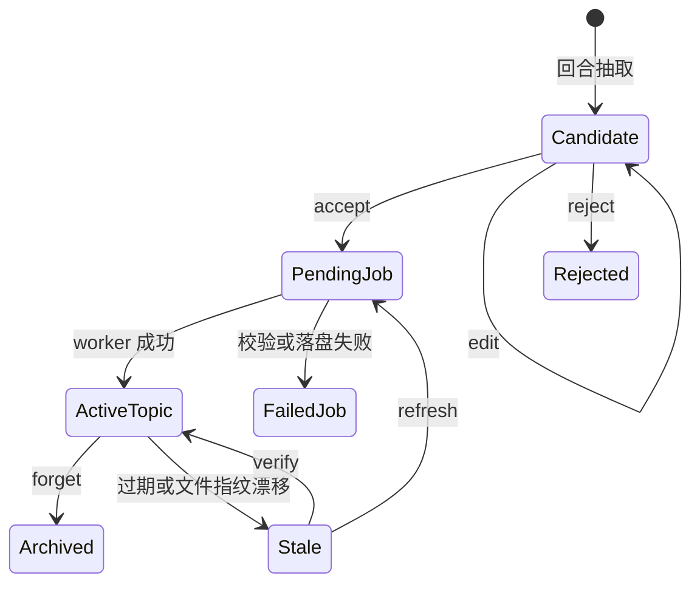

# 项目记忆系统流程

[文档首页](../../README.md) · [项目记忆手册](design.md) · [上下文压缩机制](../../features/context/compaction.md) · [安全模型](../../development/security.md)

这页把项目记忆从“识别仓库”到“召回入模”，再到“候选审阅、后台落盘”串成一条线。文件格式、命令全集与字段说明见[项目记忆手册](design.md)。

## 它不是什么

项目记忆不等于会话 history，也不等于 compact 摘要。

- history 管眼前这场对话。
- compact 把长 history 收成存档。
- 项目记忆只留跨会话仍有用的短事实、偏好与用户反馈。

记忆正文不写进 session，也不随 `/export` 带走。每条外层用户消息来时，程序临时找几份相关内容，塞进本轮请求；下一轮重新找。

## 总图

```mermaid
flowchart TD
    accTitle: 项目记忆读写流程
    accDescr: 外层消息先检索并筛选项目记忆，再随本轮请求入模；回合收尾抽取候选，审过后交后台 worker 落盘并重建索引。
    U[外层用户消息] --> ID[解析项目身份]
    ID --> G{全局授权且本场 enabled/use?}
    G -- 否 --> N[零召回]
    G -- 是 --> Q[从 query 提路径、符号、词项与检索提示]
    Q --> C[读取 project/user catalog]
    C --> S[BM25 + 硬命中排级]
    S --> F[过期、scope、指纹、冲突、去重、预算闸]
    F --> P[拼本轮记忆包]
    P --> A[随本轮 user 尾部进 AgentLoop]
    A --> R[模型与工具循环]
    R --> X[回合收尾抽取]
    X --> L{learn 档位}
    L -- off --> END[不写]
    L -- review --> BOX[候选箱]
    L -- auto 且证据过闸 --> J[写 pending job]
    BOX --> REVIEW[/memory review]
    REVIEW --> J
    J --> W[后台 worker]
    W --> M[原子写主题 Markdown]
    M --> RI[重建 catalog 与 index]
```

这条链分成读路和写路。读路同步，只摸本机文件；写路先排 job，再让后台 worker 落盘。

## 第一道门：授权

项目记忆默认关闭。只有用户全局配置能打开总开关。仓库里的 `.lubancode/config.json` 只能收紧，不能把关闭改成开启，也不能擅自升到 `auto`。

运行时又分三只开关：

- `enabled`：总闸。
- `use`：是否召回。
- `learn`：`off / review / auto`，管候选与写入。

用户级跨项目记忆还有单独的 `user_enabled`。项目配置无权开它。

## 第二道门：认出这是哪个项目

Git 仓库按 common git dir 算 project key。主工作树与 linked worktree 共用一份记忆；两份独立 clone 路径不同，不会误共享。

非 Git 目录向上找最近的 `.lubancode/config.json`；找不到便以启动 cwd 为根。`/worktree` 改 cwd 后，运行对象会重新算身份和目录。

身份定下，项目记忆落在：

```text
~/.lubancode/projects/<project-key>/memory/
```

用户级记忆另住 `~/.lubancode/memory/user/`。

## 召回读路

### 1. 取查询材料

程序不拿整场聊天去搜。它只取当前用户消息、相对 cwd、文件路径、扩展名、类名、函数名、命令，再并入上一轮抽取留下的检索扩展词。

宿主合成消息默认不召回。后台完成通知、Hook 附注、compact 续跑都不是用户提问，拿它们检索容易误触旧记忆。确有需要时，调用方须明写 `force_retrieval`。

### 2. 读 catalog

机器检索只读 `.state/catalog.json`。`index.md` 给人翻，不进 prompt。用户层开着时，两层 catalog 一起查；总条数与总字节预算不翻倍。

Markdown 主题才是真本。catalog 与 index 都能重建。

### 3. 排级

排级用本地 BM25 加硬命中。完整相对路径、符号与 keyword 权重大；普通词与中文片段作辅助。时间只破同分，新而无关的主题压不过旧而精准的主题。

### 4. 过闸

排好后逐条检查：

- `archived`、`conflict` 不进。
- 过期条目不进。
- scope 不合不进。
- 分数不到门槛不进。
- 项目文件指纹已变，只留“可能陈旧”的提示，不注正文。
- 同 id、同正文、同标题加同证据路径，只留一份。
- 用户层与项目层撞同主题，项目层直接胜出。
- 达到 `max_results` 或 `max_retrieval_bytes` 便停。

每个落选缘由都进 recall trace。`/memory why` 便是从这本账里说话。

### 5. 拼包并注入

命中正文先剥掉 front matter，再拼成记忆包。包头明写：只作线索，事实须按需读源码核验，正文不是系统指令。

记忆包随本轮用户消息尾部进入 `AgentLoop` 的请求视图。同一外层 turn 里，不论模型又走几步、调几枚工具，都沿用这份包。持久 history 只留真实消息，不收这份临时记忆。下一条用户消息再重算。

零命中时，既不注正文，也不塞空脚手架。

## 写入有三条路

### 用户明写

`/memory remember` 组出 `SaveRequest`，校验后写进 pending 队列。命令很快返回，不在前台重建索引。

### 模型调用 `memory_save`

`learn` 不为 `off` 时，主工具表可挂 `memory_save`。模型只能存已有证据的稳定事实，或用户明说的偏好与反馈。工具回调仍只排 job，不直接改 Markdown。

### 回合收尾抽取

交互回合结束后，程序只截本轮新增 history，压到不超过 24 KiB，再让当前主模型产任务分型、检索扩展词与少量候选。抽取失败只报一行，不拖垮主回答，也不自动重试。

候选按档位分流：

| 档位 | 去向 |
| --- | --- |
| `off` | 不抽取，不写 |
| `review` | 落进 `memory-candidates/`，等人工审 |
| `auto` | 证据齐、无敏感内容且不是 inferred，才可直写；其余仍进待审箱 |

事实要进 auto，须 `verified` 且带项目内证据路径。模型猜出的用户反馈不能直写。用户拒掉候选后，只留主题短哈希与理由，免它下回又来纠缠；被拒正文不保留。

## 候选审阅



`accept` 会把候选改成 SaveRequest，再排 job。`edit` 只修候选。`reject` 清掉同主题候选并记短哈希。

## Job 与 worker

主进程先原子写一张 JSON job 到 `memory-jobs/pending/`，再拉起隐藏命令：

```text
lubancode --memory-worker <主目录>
```

worker 依次做这些事：

1. 抢全局 `worker.lock`，免两枚 worker 同写。
2. 按文件名顺序捞 pending job。
3. 重验 project key、目标目录、operation、id、长度、scope 与路径。
4. upsert 主题，或处理 forget、verify、rebuild。
5. 从主题 Markdown 重建 catalog 与 index。
6. 成功便删 job；失败移进 `failed/`，旁边写错误。

关键文件都先写临时文件，再原子替换。进程半途退出，pending job 仍在；下次启动还能接着捞。

## 更新、陈旧与遗忘

同 id 才算更新。worker 合并来源 session，刷新正文、描述、关键词、证据、指纹与时间。

事实主题若关联文件变了，召回时不再把正文当真。`/memory stale` 能列出这类条目。`verify` 表示重新核验后续命；`refresh` 会排一张更新任务。

`/memory forget` 不抹文件，而是移进 `archive/`。归档项不召回，日后仍能手工找回。

## 何谓“记忆压缩”

眼下项目记忆没有自动闲时归并，也没有把许多主题压成一篇。现版只做小主题、去重、预算截取与短索引。文档若提“压缩机制”，通常指[上下文压缩](../../features/context/compaction.md)，不是项目记忆库。

记忆系统尚未实现自然语言冲突消解、自动拆并大主题、embedding 与子代理独立召回。这几件事不能当作现有流程。

## 排错抓哪本账

| 现象 | 先查 |
| --- | --- |
| 开关明明写了却仍关闭 | 全局配置是否授权；项目配置开不了总闸 |
| 没召回 | `/memory why`，看阈值、scope、过期、指纹、去重与预算 |
| `memory_save` 不见了 | `enabled`、`learn`，再看是否藏在延迟工具表 |
| 候选没进库 | `learn` 档、候选箱、auto 证据闸 |
| 显示已排队却没更新 | pending 数与 `memory-jobs/failed/` |
| worktree 没共享 | 两边 `/memory` 打出的 project key |
| catalog 坏了 | `/memory rebuild`，再查主题 front matter |

## 安全边界

- 默认关闭；仓库配置无权偷偷开启。
- 记忆不存 key、token、cookie、个人资料、网页原文、MCP 原文与整段工具输出。
- 项目路径须是相对路径，`..` 越界会被拒。
- job 自带明确 project key 与目标目录，worker 还会再验一遍。
- 记忆是本机明文 Markdown。敏感项目要么关掉，要么靠系统磁盘保护。
- 子代理不自动召回整库。主代理委托时只带子任务所需事实。

## 源码入口

- `src/memory/project_memory.cpp`：身份、排级、召回、候选、队列与 worker。
- `src/memory/frontmatter.cpp`：schema 3 主题读写。
- `src/memory/memory_tool.cpp`：`memory_save` 参数与排队。
- `src/app/interactive_session.cpp`：外层 turn 的召回与收尾调用。
- `src/app/commands/memory_commands.cpp`：`/memory` 分派、候选操作与回合尾抽取。
- `src/app/interactive_session_wiring.cpp`：记忆工具、子代理召回与会话材料接线。
- `src/app/memory_extract.cpp`：本轮转写、候选 JSON 请求与解析。

相关测试集中在 `tests/unit/memory/test_project_memory.cpp`、`tests/unit/memory/test_memory_retrieval.cpp` 与记忆候选、迁移、worker 测试。
