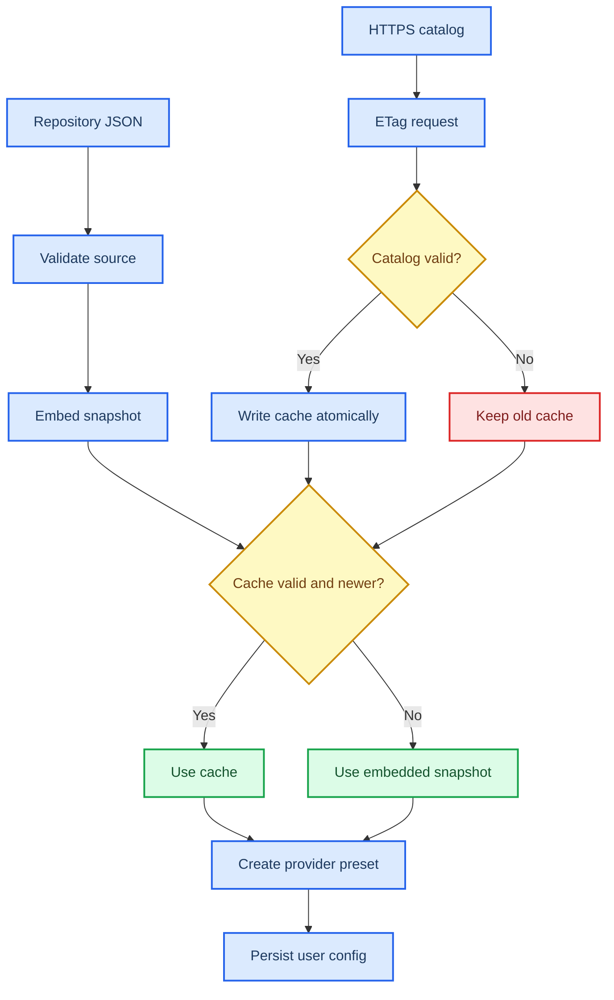

# 模型、Provider 与 JSON Schema 深挖

_面向技术面试与源码走查：讲清模型元数据从哪来，Schema 管哪本账，运行时怎样选模型、拼参数，又如何对待未知模型与坏目录。_

---

[面试深挖导航](../../../interview/deep-dives.md) · [Provider 目录](../../features/providers/catalog.md) · [配置手册](../../reference/configuration.md) · [四协议数据流](../query-data-flow.md)

## 📋 先把故事说准

LubanCode 没把“模型”写成一串散落各处的 `if model == ...`。它把端点、协议、模型元数据、用户配置与任务路由拆成几本账，再在请求前合起来。

面试时先报这五层：

| 层 | 管什么 | 典型载体 |
| --- | --- | --- |
| Provider catalog | 厂商预设、wire、默认模型、已知能力 | `catalog/providers.json` |
| Provider schema | 目录允许哪些字段 | `catalog/providers.schema.json` |
| Local model catalog | 用户按 slug 覆盖模型元数据 | `~/.lubancode/models.json` |
| Runtime config | 当前端点、密钥、模型、显式参数 | `~/.lubancode/config.json` 与项目配置 |
| Model router | normal、cheap、lao 任务该发给谁 | `ModelRouterService` |

一句话可这样答：

> 目录给默认知识，端点给真实可用列表，用户配置压过默认，路由按任务选 provider 与 model。Schema 只管数据形状，不替代运行时能力探测与协议校验。

## 🔍 到底参考了 OpenCode 什么

OpenCode 公开说明，它把 Models.dev 当模型元数据来源，取模型 ID、能力、模态、上下文与输出上限、价格等资料；再让 provider 定义、本地配置、模型选择与单次调用逐层覆盖。Models.dev 自己是一座开放模型规格库。[^1][^2]

LubanCode 与这条路有相似处：

- 模型知识数据化，不硬编码进每个请求 adapter
- provider、model、variant 分层
- 内置快照兜底，在线目录可刷新
- 用户配置与本地目录能覆盖默认值
- 未知模型仍可手填，不把目录当准入白名单

差异也要说足：

| 题目 | OpenCode / Models.dev | LubanCode 当前实现 |
| --- | --- | --- |
| 元数据广度 | 覆盖大量 provider、价格与能力 | 只收当前支持端点所需字段 |
| 数据来源 | Models.dev 生成快照 | 仓库自维护 `providers.json` |
| 运行时网络 | OpenCode 实现可刷新 Models.dev 缓存 | 只在显式/过期刷新 provider catalog |
| 配置格式 | OpenCode 自家 config schema | LubanCode 自家 config 与目录格式 |
| 协议层 | 基于其 provider/SDK 体系 | 四套自写 C++ wire adapter |
| 价格估算 | 元数据含价格 | 当前没有模型价格账 |

仓库内能证实的直接来源还有一条：提交 `3bb0f79` 与 `src/config/model_catalog.hpp` 注释写着“借鉴 Codex model-catalog”。仓内没有找到 `OpenCode` 或 `models.dev` 的历史字样。

所以最稳的说法是：

> 模型元数据驱动这条思路参考过 Codex，也可拿 OpenCode/Models.dev 作同类方案对照。LubanCode 没照搬 OpenCode schema，也不与 Models.dev 数据兼容；provider 目录、缓存策略和 C++ 解析器都按本项目四条 wire 边界来写。

若你本人确实在设计时看过 OpenCode，可以说“参考过分层与覆盖思路”。不要说“接入了 OpenCode 的模型库”，源码并不支持这句话。

## 📚 三种 JSON Schema 别混

面试官说“你那个 JSON Schema”，先反问是哪一层。仓里至少有三种语义。

### Provider catalog schema

`catalog/providers.schema.json` 用 JSON Schema Draft 2020-12 描述离线目录。它管：

- 顶层必须有 `schema_version`、`revision`、`providers`
- `schema_version` 只能为 `2`
- `revision` 形如 `YYYY-MM-DD`
- provider 必须有 `name`、`wire`、`base_url`、`key_env`、`default_model`、`models`
- `wire` 只能在 Messages、Responses、Chat Completions、Gemini 四套协议中选一
- `base_url` 与 `docs_url` 必须以 HTTPS 开头
- `key_env` 须像合法大写环境变量名
- model 至少有 `name`
- model 可直接声明 `reasoning.controls`、`supportedEfforts` 与 `wireDialect`
- 多层 `additionalProperties: false`，拼错字段立即拒绝

它是一份静态数据契约。编辑器、CI 与人都能读。

### Tool input schema

每件工具另有 `input_schema`。它告诉模型参数叫什么、何种类型、哪些必填。四家 wire 会把中立 schema 翻成各自 function/tool 定义。

这份 schema 不管模型目录。它管的是某一枚工具调用的 JSON 入参。

宿主现有 `ValidateInputAgainstSchema` 只实现一层子集：顶层 object、required、基础类型与 enum。嵌套 properties/items 不递归。且它目前主要复检 Hook 改过的 `updatedInput`；模型原始入参仍靠 provider 结构化 tool call 与各工具 `execute` 自验。

### Structured output schema

有些模型能力表写 `structured_output: true`。这指模型能按 JSON Schema 约束生成结果。它与工具入参 schema 又是两回事。

当前目录把这枚 capability 解析出来，主要用于展示与选择。它不代表 AgentLoop 已经给每份普通回答套了 structured output schema。

> ⚠️ **面试陷阱:** “用了 JSON Schema，所以请求安全”是错话。Schema 校验形状；路径权限、命令副作用、API key、Hook、确认框与 OS 账户另管安全。

## ⚙️ Provider catalog 怎样流动



### 构建时

CMake 把 `catalog/providers.json` 生成 `embedded_provider_catalog.hpp`，编进 exe。故而断网也能走 `/provider add`。

这枚快照不是用户配置。它只给向导默认值。用户选定后，程序把 provider 具体字段写进本地 config。往后目录更新，不会暗改已保存端点。

### 启动时

`LoadProviderCatalog` 先解析内置快照，再看缓存：

1. 缓存不存在，直接用内置。
2. 缓存打不开、超过 `2 MiB` 或解析失败，告警后用内置。
3. 缓存 revision 比 exe 内置旧，忽略旧缓存。
4. 缓存有效且不旧，使用缓存。

这种次序挡住降级攻击与旧缓存倒灌。它没做加密签名，信任仍落在 HTTPS、仓库发布链与本机缓存权限上。

### 刷新时

`RefreshProviderCatalog` 发 HTTPS GET，带 `If-None-Match`。服务端回 `304`，只更新 `checked_at` 与 ETag 元数据。

回新正文时，先在内存解析整份目录。schema version、字段、HTTPS URL、默认模型交叉引用任一出错，拒绝落盘。远端 revision 还不能比当前有效目录旧。

最后走临时文件与 rename。Windows 用替换语义，POSIX 同卷 rename。若校验或写盘失败，旧缓存仍在。

## 🧾 Schema 与 C++ 解析器为何并存

单有 `providers.schema.json` 还不够。发行程序不会在运行时拉一只通用 JSON Schema engine。`ParseProviderCatalogJson` 用 C++ 再做同等核心校验。

这层还补了 schema 不容易表达或代码更直观的账：

- `default_model` 必须真在同一 provider 的 `models` 里
- token 数要按 `k/m` 语法换成正整数
- variant 按 `none -> minimal -> low -> medium -> high -> extra -> xhigh -> max` 排序
- 未知字段逐层拒绝
- wire 字符串转内部 enum
- headers 与 extra body 转运行时结构

两份校验也带来维护成本。schema 添字段，C++ allowlist 与 parser 也得同步。若只改一边，会出现“编辑器说合法，程序却拒绝”或反过来。

维护时应把 schema 与 parser 当双实现契约，用测试钉相同边界。

## 💾 本地 models.json 是另一层

### 文件形状

`~/.lubancode/models.json` 当前格式如下：

```json
{
  "models": [
    {
      "slug": "example-pro",
      "display_name": "Example Pro",
      "description": "本地补充说明",
      "default_think": "high",
      "supported_think_levels": [
        {
          "effort": "high",
          "description": "深度推理",
          "extra_body": { "reasoning_effort": "high" }
        }
      ],
      "base_instructions": "模型专属提示",
      "context_window": "256k",
      "max_output_tokens": "32k",
      "supports_parallel_tool_calls": true,
      "input_modalities": ["text", "image"],
      "truncation_policy": "auto"
    }
  ]
}
```

除 `slug` 外，字段都可缺。slug 就是发 API 的模型 ID，精确匹配，大小写敏感。

### 它没有正式独立 schema

当前仓库没有 `models.schema.json`。`ParseModelCatalogJson` 用手写 C++ 校验字段类型。

整体 JSON 坏、顶层不是 `{ "models": [...] }`，便返回空用户目录与 warning。某一条坏，只跳那条，好条目照收。目录是增强层，不该因一条脏数据拦住启动。

这与 provider catalog 的策略不同：

| 目录 | 信任角色 | 坏一条怎样 | 原因 |
| --- | --- | --- | --- |
| provider catalog | 官方整体快照 | 整份拒绝 | 内部交叉引用须一致 |
| local models.json | 用户局部覆盖 | 跳坏条目 | 尽量保住其余定制 |

面试官若问欠账，可直接说：给 `models.json` 补一份正式 Draft 2020-12 schema，供编辑器提示与 CI 校验；运行时仍保留 C++ 容错 parser。

### 覆盖顺序

`LoadModelCatalog` 先从有效 provider catalog 摊平出内置模型，再读用户 `models.json`。用户同 slug 条目排在前，内置只补没有被覆盖的 slug。

`FindBySlug` 取第一条。于是用户可完整覆盖一枚模型元数据，不会把字段逐个与内置混合。

这种“整条覆盖”简单，却有 corner case：用户条目只写 `slug`，会遮住内置窗口与推理档。它是明确覆盖，不是增量 patch。

## 🔄 /model 到底信谁

### 可用性与元数据分开

裸敲 `/model` 时，程序先打当前端点的模型列表：

- Anthropic wire：`GET {base}/v1/models`
- Responses / Chat wire：`GET {base}/models`

返回的 `id` 决定菜单有哪些模型。目录不会把别家模型硬塞给端点。

目录只给已命中 id 补 `display_name`、窗口、推理档、专属指令等元数据。接口展示名次之，最后拿 id 兜底。

这套拆法很重要：模型目录可能旧；端点列表才反映账号、地区、中转站当下放了什么。反过来，端点常只回 id，不告诉窗口与推理档，目录正好补上。

### 直接输入未知模型

`/model some-new-id` 可以直接切。它不要求目录命中。切到目录外时：

- 当前模型字符串照常改
- 目录不自动改 think 与 window
- 上一模型的 `base_instructions` 清空
- 是否真可用，等下一次 API 请求验证

这叫开放世界设计。目录是提示，不是白名单。

### 端点列表失败

GET 网络错、HTTP 非 2xx 或响应缺 `data` 数组，`/model` 菜单失败并返回。程序不会拿目录列表冒充端点真实列表。

响应 `data` 中个别条目没字符串 id，只跳坏条目；整体 JSON 坏或没有数组，整次解析失败。

## 🎯 模型元数据怎样应用

### 启动与主动切换不同

`ComputeCatalogApplication` 收两枚布尔：用户是否显式配了 think，是否显式配了 window。

启动时，显式用户配置压过目录。目录只补未配置字段。`base_instructions` 没有同级用户字段，命中便应用。

主动 `/model` 切换时，两枚 explicit 都传 `false`。新模型声明了默认 think/window，就随模型切过去。否则沿现状。专属 instruction 每次都整体替换；未命中则清空旧模型指令。

### 输出上限的三级优先级

运行时 `ResolveOutputBudget` 按：

```text
agent.max_output_tokens
  > 当前 provider 声明
  > model catalog 声明
  > unset，交服务端默认
```

`unset` 不是 `0`。请求对象里的 `max_tokens` 是 optional。没声明便不发这字段，不能擅猜一个固定上限。

### reasoning 与 extra_body

推理档位直接写在模型条目里。不同模型各报各的档位；例如 GPT 5.6 可报六档，GLM 5.3 只报 `low/high/max`。运行时把这份档案带进中立 Request，各 wire 再翻成自己的正式字段。

请求体大致按这次序浅合并：

```text
协议内置字段
  <- provider extra_body
  <- request extra_body
```

后者同名顶层键压前者。是浅合并，不递归深合并。`extra_body` 只留给目录尚未建模的厂商私有字段，不再承载 effort、thinking 开关或 budget。若 provider 有：

```json
{ "temperature": 0.2, "vendor_flag": true }
```

request 另给：

```json
{ "temperature": 0.5 }
```

最终 `temperature` 为 `0.5`。

这处可预测，也容易踩坑。目录维护者得写完整顶层对象。

## ⚙️ capability 是事实还是提示

Provider catalog 允许任意 capability 名，只要求值是布尔。现有目录会写 `reasoning`、`tools`、`image`、`video`、`structured_output`、`built_in_tools` 等。

但“解析了”不等于“运行时全接线”：

| 字段 | 当前状态 |
| --- | --- |
| `context_window` | 已用于窗口与 compact 预算 |
| `max_output` | 已进入输出预算回退链 |
| `default_think` / variants | 已用于 think UI 与 request extra body |
| `base_instructions` | 已注入 system 独立段 |
| `capabilities` map | 已解析，主要供展示与选择 |
| `supports_parallel_tool_calls` | 本地目录可解析，主循环仍顺序执行 |
| `input_modalities` | 可解析，尚未统一做请求前 capability gate |
| `truncation_policy` | 可解析，尚未接进主请求裁剪 |

因此不能说“能力画像会自动阻止所有不兼容调用”。图片输入是否可用，还要看 wire adapter 与服务端。工具是否可用，也要看模型实际 function calling 表现。

更完整的能力系统应有三态，而不只布尔：`supported`、`unsupported`、`unknown`。未知模型走协议最低保证；需要图片、并行工具、structured output 等高级能力时，要么显式探测，要么请求前拒绝并给覆盖开关。

## 🧠 normal、cheap、lao 模型分工

模型选择不只当前会话一条线。`ModelRouter` 把任务分三种角色：

| 角色 | 典型任务 | 默认行为 |
| --- | --- | --- |
| `normal` | 普通 turn、compact repair | 当前会话模型 |
| `cheap` | compact、microcompact、记忆抽取、分类、标题 | 未配置便回落 normal |
| `lao` | plan | 未配置便回落 normal |

每个角色可写 provider、model、effort、context window 与 max output。`compact_model` 是兼容旧字段，只顶替 compact 类任务，不扩散到标题或记忆抽取。

### 跨 provider 不能只换 model 字符串

cheap 若指定另一家 provider，不能在当前 backend 上把 `model` 改名就发。wire、base URL、鉴权、headers、extra body 都可能不同。

`ModelRouterService` 会按目标 provider 条目造一只裸 backend，并按 provider 名缓存。同 provider 复用主 backend；找不到 provider，返回空 backend，让调用点明报任务不可发。它不会静默拿当前模型顶包。

### usage 怎样出账

`ModelUsageLedger` 按角色记 calls、模型、输入输出 token 与时长。provider 没报 usage 时，账上明写“usage 未报告”，不把缺失当零成本。

当前还没有价格表，故而不能给可靠金额。若将来接 Models.dev 一类价格库，也应把价格 revision 与模型身份钉进每次记录；缺一段价格时，宁可总价 unavailable，不拼一份残缺总数。

## 🔐 安全与供应链边界

### catalog 不存密钥

目录只存 `key_env` 名。header 需要 key 时写 `${LUBANCODE_API_KEY}`。程序发请求前才在内存替换。

缓存、仓库 JSON 与日志不该出现明文 key。用户本地 provider 仍可显式存 `api_key`，展示时必须打码。

### HTTPS 不是内容签名

刷新 URL 必须 HTTPS，parser 又做大小、schema 与 revision 检查。它能挡误配置、脏数据与降级，却挡不住上游仓库或发布账户失陷。

再往上加固可做：固定发布公钥、对 catalog 签名、把 revision 改成单调序号、记录内容 hash、更新前展示差异。

### extra_body 是逃生口，也是风险口

兼容端花样多，不能每加一项私有参数都改 C++，故而留 `extra_body`。它最后能覆盖内置字段，能力很大。

风险也随之而来：用户或目录可改 `model`、`tools`、`stream`、thinking 等顶层键。当前选择是给高级配置者明确控制权。日志与 `/config` 要显示来源，目录更新又不能暗改已保存 provider。

## ⚠️ 常见 corner case

| 情形 | 当前行为 | 面试该怎么说 |
| --- | --- | --- |
| provider schema 添了字段，C++ 忘了添 | 运行时拒绝未知字段 | 双实现契约，测试要同步 |
| 默认模型不在 models | 整份 provider catalog 拒绝 | 交叉引用强一致 |
| 缓存比 exe 旧 | 忽略缓存 | 防旧数据盖新快照 |
| 远端 revision 倒退 | 拒绝覆盖 | 更新只许向前 |
| 用户 models.json 一条坏 | 跳坏条目，其余照用 | 用户增强层容错 |
| 用户同 slug 只写最小条目 | 整条遮住内置元数据 | 覆盖不是字段 merge |
| `/model` API 少报 display name | 目录补名；再无则 id | 可用性与展示分开 |
| 目录有模型，端点没返回 | 菜单不展示 | 端点列表才是当下事实 |
| 用户直接切未知模型 | 允许，下一请求验证 | 开放世界，不设白名单 |
| 未知 think level | 提示但不硬拦 | 兼容端可能认新档位 |
| provider 不报 usage | 明写未报告 | 不把 missing 当 zero |
| 模型声明并行工具 | 主循环仍顺序跑 | capability 尚未接线 |
| variant 覆盖嵌套 object | 整个顶层对象替换 | 浅合并，不是 deep merge |
| Anthropic base 已带 `/v1` | 只补 `/models` | 防 `/v1/v1/models` |

## 🎓 高频追问答法

### “为什么不用一份 models.json 管全部？”

Provider 与 model 生命周期不同。Provider 绑 wire、URL、鉴权和请求私参；model 绑窗口、输出、能力与 variant。用户端点又可能只开放目录子集。拆开后，目录能补元数据，真实端点仍掌可用性。

### “为什么既有 schema，又有 C++ 校验？”

schema 给编辑器、CI 与读者；C++ parser 是发行时真正安全边界，还要做默认模型交叉引用、token 换算与 enum 映射。代价是两份契约要同步，测试须钉住。

### “OpenCode 参考到什么程度？”

参考模型元数据驱动、provider/model/variant 分层、快照与覆盖链。LubanCode 没用 OpenCode config schema，也没直接消费 Models.dev。仓内直接记载的参考来源是 Codex model-catalog。

### “模型 capability 靠谱吗？”

它是声明，不是远程证明。窗口和输出上限已接入预算；部分能力仍只解析展示。未知模型不猜高级能力。更强方案要做三态能力、端点探测与请求前 gate。

### “如何支持新模型而不发版？”

新模型 ID 可直接 `/model` 输入；本地 `models.json` 可补窗口、think 与指令；provider catalog 可在线刷新常见预设。若新模型要全新 wire 或流事件形状，仍须改 adapter 并发版。

### “为什么不用 `/models` 返回的窗口数据？”

多数兼容端只回 id，字段又不统一。端点列表只判可用性，窗口与能力由目录补。两边冲突时，当前还缺自动仲裁与探测，这是可继续做的账。

## 🔗 源码与测试

| 题目 | 源码入口 | 关键测试 |
| --- | --- | --- |
| provider schema | `catalog/providers.schema.json` | `tests/unit/config/test_provider_catalog.cpp` |
| provider 解析与缓存 | `src/config/provider_catalog.cpp` | `tests/unit/config/test_provider_catalog.cpp` |
| 本地模型目录 | `src/config/model_catalog.cpp` | `tests/unit/config/test_model_catalog.cpp` |
| `/models` 端点 | `src/api/models.cpp` | `tests/unit/config/test_models.cpp` |
| 模型应用与 system 段 | `src/app/commands/settings_commands.cpp`、`src/agent/prompts.hpp` | `tests/unit/config/test_model_catalog.cpp` |
| 输出预算优先级 | `src/agent/runtime_profile.hpp`、`src/app/runtime_profile.cpp` | `tests/unit/config/test_runtime_profile.cpp` |
| 模型角色路由 | `src/agent/model_router.cpp`、`src/app/model_router.cpp` | `tests/unit/memory/test_model_router.cpp` |
| variant 请求覆盖 | `src/app/backend_stack.cpp`、`src/api/*/request.cpp` | 四协议 request 测试 |
| 工具 schema 子集 | `src/tools/schema_check.cpp` | `tests/unit/hooks/test_hooks.cpp` |

面试题的横向清单见[高频技术面试追问题库](../../../interview/question-bank.md)。

## 🔗 参考资料

[^1]: OpenCode. “LLM package design: Model Catalog.” https://github.com/anomalyco/opencode/blob/dev/packages/llm/DESIGN.md

[^2]: Models.dev. “An open-source database of AI models.” https://github.com/anomalyco/models.dev
