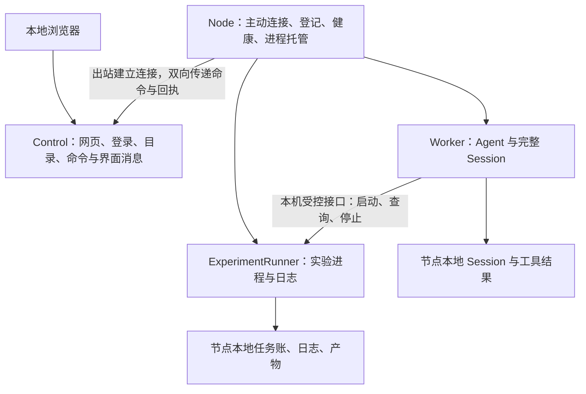

# 远端 Agent：部署、节点登记与两端存储

[架构首页](README.md) · [开工讨论单](../../todos/分布式D0开工讨论与分支拆分.todo) · [协作与远端验收](../development/cluster-collaboration.md)

状态：2026-09-27 设计草案。用户场景已确认，下面是拟议合同；尚未实现远端部署模式，命令名、配置键与消息名尚未冻结。本轮未在本地编译。

## 1. 已确认的边界

- 控制端能在本地电脑或服务器运行；执行端也能部署到不同机器。两端都以 Linux（含 Ubuntu）、macOS、Windows 为支持目标，实际支持按对应架构的构建与验收记录声明。
- 本地界面用于下指令、看消息、处理审批。CPU 执行机可做网站类工作，GPU 执行机可跑实验。GPU 不强制承担 Agent 模型推理。
- 用户负责网络连通。执行端配置控制端地址与凭据，主动联系控制端，登记自身、报告健康状态，再接指令开 Worker。
- 控制端和执行端各有存储。完整 Session 留在执行端，工具结果不整份上送控制端。
- 已启动实验需要跨 Agent 退出或重启继续运行。机器断电后原进程无法保留，恢复实验须另靠实验自身的 checkpoint。
- 多分支先合入集成分支；本地不编译，构建与执行测试交远端 CI。

## 2. 两个部署入口，三类执行职责

建议沿同一发行版本交付两个公开入口：Control 与 Node。可做同一程序的两个子命令；不要求用户另装数据库、容器平台或消息队列。两端可同机，也可分机。首版各用自己的本地状态目录，控制端使用嵌入式事务库。



Control 管界面与调度入口，不装远端项目环境。Node 是每台执行机上的常驻管理进程，负责开 Worker、查资源、收回执、连接控制端。Worker 跑 Agent，首版建议一场 Session 一只 Worker，限制同时运行数量。ExperimentRunner 管需要长久存活的实验，不归 Worker 的进程清理树。

停止 Agent、停止某项实验、停止接单与卸载 Node 必须分开。结束聊天不能顺手杀掉仍在跑的实验。网站开发服务若也需跨 Worker 重启存活，须显式交给相同的长期任务接口；普通短命令继续沿既有工具寿命。

控制端关闭时，网页与远程指令暂不可用。已受理工作按节点上的策略继续；恢复控制端后补消息和状态。控制端不承担训练进程的父进程职责。

## 3. 配置后主动登记，不扫描网络

配置结构示意，当前 CLI 不承诺已经接受这些键：

```toml
[control]
listen = "127.0.0.1:7443"
state_dir = "./control-state"

[node]
control_url = "https://control.example:7443"
enrollment_token_env = "LUBANCODE_NODE_ENROLL_TOKEN"
state_dir = "./node-state"
name = "experiment-a"
labels = ["gpu", "experiments"]
max_workers = 2
```

Control 与 Node 各读自己的配置段。地址、端口和路径都可改。`control_url` 必须从执行机能够访问；控制端在用户电脑上，也不等于远端节点应连接自己的 `127.0.0.1`。用户自行选择内网、VPN、转发或其他连通办法；程序不扫描网络、不代建隧道。

可达之后，程序仍须负责认证、协议协商、超时与重连。远程入口不能拿现有本地助理的免远程配置假设直接外露。首版建议标准 HTTPS/WSS 与明确的服务端信任配置；独立节点身份取代全节点共用管理员密钥。TLS 可由程序或明确配置的可信入口终止，不能因用户负责组网就接受未认证节点。

登记流程：

1. Control 创建限时、限次加入凭据。Node 从环境变量或凭据文件取值，生成自己的身份材料。
2. Node 发起认证连接。首次登记成功后持久保存 `controllerId`、`nodeId` 与节点凭据；后续启动复用身份，不反复生成新节点。
3. `HELLO` 报协议版本、程序版本、本次 `bootId`、OS/架构、允许的工作区别名、CPU/GPU 能力与资源上限。GPU 探测失败明确为未知，不能影响 CPU 模式启动。
4. Control 验证身份后回 `WELCOME`，给本次连接号、协商版本、心跳间隔与补传游标。配置过且获准的节点便出现在界面。
5. 心跳报告节点进程、Worker、实验任务与资源状态。断线退避重连，重新认证和对账；不借重连新建一遍 Worker。

`nodeId` 来自持久身份，`bootId` 标识 Node 这次启动，连接号每次握手更新，三者不能混用。复制状态目录到另一机器须重新登记；相同身份同时活跃时拒绝冲突，不能“后来者自动顶掉”并继续派活。

首版一台 Node 只接受一处 Control 的管理身份；同一状态目录只准一只 Node 持锁。多个控制端共同管理一台机器属于后续合同，不能靠各配一枚 token 就默认为支持。

## 4. health、在线与能否接活分开

`/healthz` 表示进程主循环活着，`/readyz` 表示自己的存储和必要依赖可用。网页中的节点在线状态来自经过认证的心跳；不要求控制端再探测节点入站端口。

| 状态 | 含义 | 能否接新工作 |
| --- | --- | --- |
| Online/Ready | 已连接，存储与执行接口可用，资源有余量 | 可以，仍受节点本地准入限制 |
| Busy | 活着，Worker 或设备配额已满 | 等待或拒绝，并回明确原因 |
| Degraded | GPU 不可用、磁盘不足或部分能力出错 | 只开放仍可用的能力 |
| Draining | 管理员要求停止接单 | 不接新活，已有任务按策略收尾 |
| Unreachable | 超过心跳阈值，控制端不知道近况 | 不派新命令；不能据此认定远端实验已死 |

界面分别显示“最后联系时间”和“最后确认的任务状态”。一枚绿色 health 不证明 GPU 可用，也不证明任务已经完成。标签描述用途，实时探测描述能力；GPU 分配和设备独占另有准入账，不能只靠 `gpu` 标签。

## 5. 首版会话固定在节点，离线不撤销已受理工作

建议采用节点持有会话的首用模式：创建后固定执行节点，不自动迁移，不在另一机器上重试已受理实验。首版运行权由节点持久账、单实例锁、Session 独占锁和资源准入共同约束。Control 掌握目标与操作状态，心跳只报告可达性。

这与旧路线图“控制端租约到期，节点立即停写”不同。若控制端关机就强制停止，无法满足长实验独立运行的目标。本模式不套用该停止条件，也不声称获得自动故障接管能力；完整集群的租约与迁移合同另行设计。

离线期间按已经接受的范围、预算和节点策略继续。需要新审批时停在审批点；不能把“控制端不在线”当成同意。远程取消或权限变更在送达前不可假报成功，界面显示未送达/待确认。节点本地管理员仍保有停止入口。

身份建议先用 `(nodeId, sessionId)` 定位；会话 ID 沿用节点现有 V3，普通恢复仍同 ID 续写。Control 先持久登记创建操作，Node 返回创建回执再绑定 Session。创建成功而回执未达时按原操作对账；缺少可证明映射时待核验，不盲目再建一场。V2 迁移保留既有新 V3 场和来源关系。

命令带固定 `commandId`、目标、操作类型和载荷摘要。Node 先持久接纳，再回 `accepted`；同键同载荷回原回执，异载荷报冲突。已经派发却没有终态的命令进入待核验，不凭“没有 user 行”自动重跑。旧连接不能带着迟到命令绕过新连接的身份与幂等检查。断线重连优先查询旧操作状态。

去重记录至少覆盖命令有效期与允许的重试窗口。清理后拒绝过期重投，不能把忘了旧键视作新命令。Control 整库丢失或恢复旧备份时，先封闭写入口、重新登记并对账；不能以一个新控制端空账让所有实验重开。

## 6. 两端分别存什么

建议的默认策略如下。聊天正文同步用于消息界面；工具原始正文不上传。审批材料和按需详情尚须分别确认。

| 数据 | Control | 执行节点 |
| --- | --- | --- |
| 用户、节点目录、身份与访问权限 | 管理真相；节点凭据只存验证所需材料 | 本节点身份、获准策略与管理端绑定 |
| 待发送命令、幂等键、受理/完成回执 | 持久保存命令与投递状态 | 持久接纳和实际执行事实；会话操作复用已有受理账 |
| 会话标题、所属节点、状态、最后活动时间 | 保存目录与最近确认状态 | 保存完整会话事实；状态变动从节点报告 |
| 用户输入、面向用户的 Agent 回答 | 保存已同步正文、消息 ID 与终态 | 保存原始受理与完整 Session 中对应内容 |
| 工具卡 | 仅工具名、调用 ID、开始/结束/等待状态、耗时、退出码或稳定错误码 | 完整调用记录、参数与结果 |
| 工具参数、结果、预览、diff、stdout/stderr | 默认不发送、不入库 | 按当前捕获与保留规则保存；不是无限日志承诺 |
| system、思考、压缩材料、模型请求原文 | 不同步 | 留在节点的原始记录中 |
| 实验任务 | ID、状态、结构化进度、所属会话与节点 | 实验规格、身份、进程状态、退出结果与持久任务账 |
| 数据集、图片、报告、模型权重、长日志 | 不上传字节；仅必要的不透明引用和白名单元数据 | 文件保留在执行节点，按节点规则清理或备份 |
| token/用量 | 同步单一来源的累计快照或带身份的增量；不重复计数 | 原始 usage 事实，缺报如实标记 |
| 模型密钥、环境凭据、私钥 | 不从执行端收取 | 专用本地凭据边界；不得夹入消息流、错误体或遥测 |

Control 的消息库存的是供人阅读的记录，不足以恢复 Agent 全部上下文。节点丢了且没有备份，不能拿聊天记录声称完整 Session 已恢复。Control 可在节点离线时展示已同步消息，未同步内容要标缺口，任务状态要标最后确认时间。

用户输入已经过 Control，Control 可以保存待投递原文；同一输入回显用操作 ID 合并。Agent 回答若引用工具内容，那段会随可见聊天同步。这不等于上传完整工具返回体，也不提供“任何结果片段都绝不离开节点”的保证。禁止直接复制整条 user/assistant 原生消息结构，其中仍可能嵌工具参数或结果。

## 7. 另建界面消息流，不能剪原账再验原链

筛选放在执行节点出网前。Node 从已持久化事实生成白名单 `UiRecord`，只允许明确的消息类型和字段；未知类型不发。不能先把完整 AppServer 帧交给 Control，再由网页隐藏工具结果。

白名单还须配统一文本脱敏：节点持有的密钥值、已识别凭据和禁止外发字段，先清除再写 UI outbox。聊天、历史、审批、错误和允许的详情共用此出口。临时 delta 必须跨分片识别，无法安全判定时先缓冲再发送，不能等秘密发完才在定稿中删掉。任意业务正文仍不能承诺自动识别所有敏感内容。

拟议记录：`nodeId, sessionId, uiStreamId, uiSeq, policyVersion, recordType, payload`。节点还维护内部来源游标；它与 `uiSeq` 分开。跳过十条工具事实不会让界面流出现十个缺口。`uiStreamId` 在普通进程重启后延续；显式重建或换筛选策略时开新代，通知控制端，不覆写原序号内容。

先实现正式消息与状态持久化，流式打字可以另走带消息 ID/分片号的临时事件。重连用正式消息与当前快照校正；不能把临时片段和完整定稿加两遍。非文本块、reasoning、tool_args、signature 不当作聊天 delta 转发。

节点先落界面 outbox 再发送，Control 事务写入后才 ACK 连续收到的 `uiSeq`。同流同序号同内容可重投；同序号异内容报冲突。来源扫描进度与 outbox 追加必须可恢复；以确定性的来源身份去重，不能崩溃后再发一套新号码。ACK 只证明这些界面记录已收到，不证明完整 Session、工具结果或工作区已经备份。

outbox 和两端消息库都要有保留上限。磁盘不足时拒绝新工作并报告故障；已确认的记录按明确保留策略清理，不静默丢弃未确认终态。确实缺页时回 `history_gap` 与最早可用位置，不造连续历史。慢网页不能拖住实验进程；日志写盘与界面上报分别限额。

原方案的 `EVENT_BATCH`、`event_projection.line_json` 与“I4：投影为原账前缀”不能直接套到这条流。V3 `lineHash` 覆盖完整行，删除 payload 或跳过工具行以后，就不是同一条哈希链。来源 hash 最多充当定位信息；如需界面记录自身的完整性校验，另定独立摘要合同，不冒称原账验证。

## 8. 工具详情、审批与产物

首版默认不自动传输工具结果正文、短预览、日志尾部、截图、diff 或产物字节，也不让 `command.result`、失败详情、历史查询、导出、缩略图绕开这条规则。实时、历史、消息搜索和重连快照用同一白名单 DTO。

“点击查看详情”是待确认扩展。若用户接受临时转发，再开显式请求，绑定用户、节点、会话、对象、范围和有效期；Control 只流式中转，不落消息库、不记响应正文、不自动缓存或预取。这仍会让数据经过 Control，不能称作完全未发送。用户尚未确认前，不把此能力当默认。

审批不能只有一枚模糊的“允许”按钮。建议按工具种类准备足够决策的最小材料，单独授权传输，并把答复绑定请求 ID、参数摘要与期限；Control 持久保存决策和摘要，非必要正文不留。若配置禁止提供必要材料，转执行节点本地审批或暂停，不诱导盲批。审批展示范围仍待确认。

产物引用使用对象 ID，不接受浏览器传任意宿主路径。实验脚本、环境变量、上传输入和模型配置也须各列职责；首版优先选已经在执行节点准备好的工作区与环境，不自动把本机凭据同步到所有节点。

## 9. 实验由独立 Runner 托管

Worker 通过本机受控接口调用 `job.start/get/cancel`，模型只拿任务句柄与适量状态。Node 验证会话、工作区与资源策略，Runner 负责实际启动、监督和收尾。实验有独立 `jobId`、启动操作键和结果，不与某次 Worker PID 绑定。

Runner 的持久目录至少保存启动规格及其摘要、创建意图、进程启动身份、状态、退出结果、日志文件与产物清单。凭据通过引用注入，不把环境密钥原文写进任务规格。日志直接写文件，不能依赖 Worker 存活来接管道。

Node 启动后先处于 Recovering：核验仍活 Runner 与任务，恢复 CPU/GPU、工作区和额度占用，对账完成才接新活。身份或占用拿不准时保持 Degraded 并冻结对应资源，不能先报 Ready 再慢慢查回旧实验。

Runner 自己必须活在 Worker 清理域之外。单靠后台 `&`、POSIX setsid 或 Windows 创建新进程组不够。Node 需能重连同一 Runner，校验启动身份与本机认证，不能只看 PID。状态目录丢失、启动身份冲突或“进程起来了但回执没落稳”时，先对账并标未知，禁止重复启动实验。

| 故障或动作 | 首版拟议行为 |
| --- | --- |
| 关网页、控制链路断开、Control 退出 | 已受理实验继续；重连补状态，控制端标不可达 |
| Worker/Agent 退出或重启 | Runner 与实验继续；新 Worker 通过 jobId 查询，不能重放 job.start |
| Node 管理进程重启 | 独立 Runner 继续；Node 重启后按目录与启动身份重新挂接，需要三平台真进程验证 |
| Runner 自身崩溃 | 不承诺透明继续；有终态证据则收口，无证据则标 Unknown/NeedsReview，核验进程与输出后裁决 |
| 明确停止某项实验 | Runner 先记录请求，再停对应进程树，拿到退出证据后回已停止；不可达时只回待确认 |
| 机器重启、断电 | 原进程消失；任务标中断/未知。只有支持 checkpoint 的实验才能另开恢复操作 |

Linux/macOS 需要平台进程与会话管理，Windows 需要明确的 Job Object 所有权和服务关闭合同。systemd、launchd、Windows Service 可作为可选托管方式，但不能成为程序在某平台启动的唯一前提。前台模式仍须说明关闭哪个进程会影响哪些任务。

要支持 Node 服务重启后实验继续，Runner 还须在 Node 服务的终止范围之外；两份 exe 不等于两处独立托管。Windows 子进程默认可能继承父 Job，关闭带 KILL_ON_JOB_CLOSE 的最后句柄会终止成员；systemd 默认停整个 unit 的控制组。分别依据 [Microsoft Job Objects](https://learn.microsoft.com/en-us/windows/win32/procthread/job-objects) 与 [systemd.kill 官方合同](https://raw.githubusercontent.com/systemd/systemd/main/man/systemd.kill.xml) 设计并做故障验收。

macOS 的用户 LaunchAgent 随登录用户存活，跨注销运行要另有守护进程方案，见 [Apple launchd 文档](https://developer.apple.com/library/archive/documentation/MacOSX/Conceptual/BPSystemStartup/Chapters/CreatingLaunchdJobs.html)。直接前台运行、开机启动、跨注销、跨 Node 重启是不同能力，分别探测和声明；缺某项就明报，不靠后台化选项伪装支持。


设备准入先支持人工配置与实际探测：CPU 模式不要求 GPU 驱动；GPU 编号、型号、显存和可用状态按平台报告。首版不把环境变量选择设备等同硬配额或强隔离。需要独占 GPU 时由节点分配并记账，Worker 不自行抢卡。

## 10. 当前代码能复用什么

核查基线：集成分支 `457e9cf5`，代码继承 `main` 的 `893e2b1a`。以下是源码观察，未运行本地测试。

- `SessionService::SubmitInput` 已有持久受理、同键去重与异载荷冲突；继续复用，不另造“看 user 行判断是否执行”。
- AppServer 的 WS `Detached` 已有断线继续回合的分支；`Shutdown` 与 stdio EOF 仍会收口。Node 的网络重连不能析构 Worker 或关闭它的 stdin。
- assistant 即时聊天装配仍为零工具；AppServer 部署档已有 MCP/插件/Skill 装配，但不是完整 CLI 工具面。读文件、写文件、运行命令须补受控 headless 装配与审批。
- 现有本地 `/healthz` 不是远端注册服务；LocalWebServer 仍有回环/同源限制。可复用出站 WS/TLS 基础，不可只改 host 就宣称支持本部署模式。
- 现有 AppServer 事件和历史 DTO 会携工具 input、diff、result；必须在节点新增白名单投影，不能透明转发。
- 现有 BackgroundTaskRegistry 主要在内存记账。Windows 后台进程受宿主 Job 关闭清理；POSIX 正常退出也有后台 PID 清理。现成 run_in_background 不能充当跨 Agent 重启的实验托管。
- ToolJobCoordinator 有持久任务状态，但执行仍在宿主内；不能把这份账当作独立 Runner 已存在。可复用状态与未知结果裁决思路，进程所有权须另落。

## 11. 首批分支与验收

先把本提案中的数据、寿命与协议合同收敛，再从集成分支开实现 PR。下面是拟议顺序，不代表分支已创建。

| 批次 | 交付 | 远端验收 |
| --- | --- | --- |
| Remote-0 | 协议/配置/数据白名单样本、平台能力合同与 CI 接线 | 正反例、零测试失败门、三平台构建入口 |
| Remote-1 | Control 本地运行、Node 主动登记、健康与幂等命令 | 两端换 OS、重连同身份、重复连接拒绝、Control 重启不重开 Worker |
| Remote-2 | 受控 Worker 工具装配与节点固定会话 | 真读/写/命令/审批，v3 原地恢复，独立目录与停止范围 |
| Remote-3 | 独立 Runner、持久任务账与重附着 | 杀 Worker、重启 Node 期间不重复分配资源、PID 复用、丢回执不重开、取消有退出证据 |
| Remote-4 | 白名单界面流、双端存储、前端选机与消息 | 当前与历史/导出均不带工具结果；ACK 丢失重投、缺页明报、节点离线仍看已同步聊天 |

Remote-3 与界面流可在公共合同明确后分支并行。正式 Node Bridge 的 SDK 集成、自动迁移、中央 Session Store、池化与强沙箱仍是后续工程；不能以本模式通过替它们销账。

首用验收需含真实 CPU 网站任务与 GPU 实验。常规 CI 先以短进程、假设备报告和故障注入验证逻辑；真 GPU 与服务托管行为另在有条件的远端机器补证，不拿普通 runner 冒充 GPU 实测。

尚待用户继续讨论：工具详情能否显式请求后临时转发；审批需要展示到什么程度；同一节点同时跑多少场以及 GPU 如何分配。网络如何打通由部署者决定，不再把公网地址、SSH 或 VPN 选型列作开发前置。
