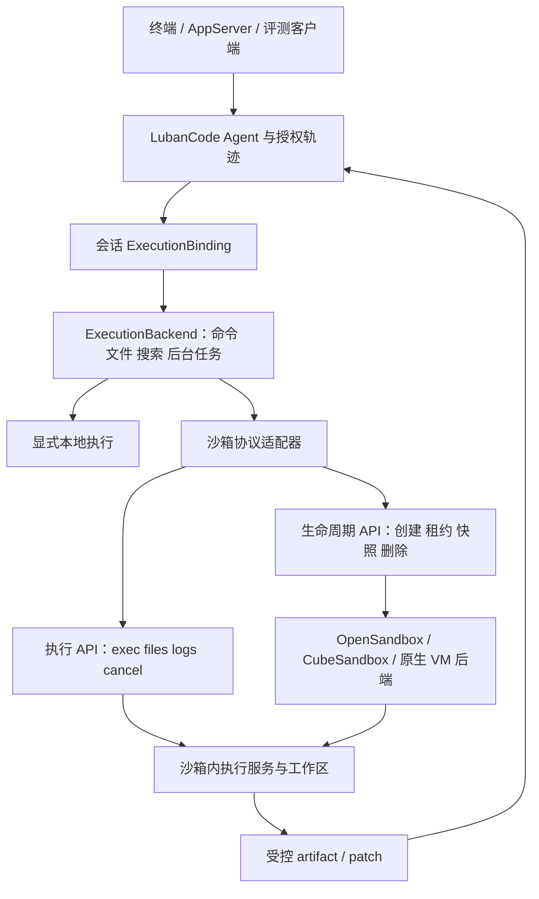

# LubanCode 沙箱平台接入设计

日期：2026-09-23。状态：设计稿，尚未实现。

本次按工作区源码核查，HEAD 为 `efcb0e18`；工作区另有既存改动，不能把 HEAD 当作整份工作区快照。外部依据来自当日打开的官方仓库与文档。没有部署后端，没有跑隔离、性能或三端验收。文中接口、配置、目录和错误码均为提案。

## 1. 先定边界

LubanCode 管 Agent 循环、授权、工具调用、轨迹和结果采纳。沙箱平台管执行环境、租约、资源、网络、快照和回收。两边通过版本化协议相接。

推荐先接 OpenSandbox，完成一条端到端路径；再接 CubeSandbox，验证 MicroVM 与快照分叉；训练批任务通过 ROCK/Harbor 适配，不另造训练调度平台。选型仍须锁版本、验能力，不能把平台名称当作隔离证明。

场景分两路：

- 日常编程：一次会话绑定一份沙箱工作区。Agent 在宿主运行，工作区相关工具进入沙箱。用户查看 diff 后采纳。
- 评测与自改进：每次 attempt 分配独立环境。可以把整个 LubanCode worker 放进去，再由外侧收轨迹、计成本、评分。此路也能先验证现有 CLI，但不替代日常编程那条工具接入路径。

“客户端支持 Windows/Linux/macOS”与“后端能运行 Windows/Linux/macOS 程序”分开写。Linux 镜像不能顶替 Windows API 或 Xcode。

## 2. 当前源码与缺口

| 入口 | 当前证据 | 接入要求 |
| --- | --- | --- |
| `src/agent/loop.cpp:745` | 执行工具时传 `ToolExecutionContext` | 保留既有授权、Hook、轨迹关口，增加可信执行目标 |
| `src/tools/tool.hpp:45` | 上下文含取消旗和 artifact 目录 | 增加不可变绑定，不向共享工具实例塞可变 sandbox ID |
| `src/tools/run_command.cpp:408` | 前台和后台调用平台进程 API | 两条路径一起迁移；shell 按目标环境选 |
| `src/tools/read_file.cpp:90` | 直接 `std::ifstream` 打开路径 | 绑定沙箱后改走远端文件服务 |
| `src/tools/write_file.cpp` | 直接操作宿主文件系统 | 写、编辑、撤销、预览统一归属工作区后端 |
| `src/tools/search_ripgrep_run.cpp:523` | 用 `ChildProcess` 跑 rg | 搜索不能留在宿主；rg 在目标环境执行 |
| `src/tools/skill_tool.cpp:191` | 加载技能说明，另有相对资源读取路径 | 加载不触发脚本执行；资源进入受控包，执行再走沙箱 |
| `src/platform/process.hpp:292` | `SpawnConstraints` 注明只限资源，未隔离文件和网络 | Job/rlimit/import 白名单不能当作任意恶意代码隔离 |
| `src/platform/process.hpp:343` | 限额设置失败允许继续启动 | 强隔离路径必须失败即停，不能复用静默降级语义 |
| `src/runtime/async_tool_runtime.hpp`、`src/tools/tool_job_coordinator.hpp` | 已有后台任务、ownerEpoch、完成信封、单写者机制 | 复用任务身份和结果投递；远端执行句柄另存映射 |

`cwd`、worktree 和用户点过“允许”，都不能建立系统隔离。只改 shell 入口会留下文件、搜索、LSP、插件等旁路。

## 3. 总体结构



本地模式保留现有使用习惯。创建会话时显式选沙箱，随后全部工作区操作固定走该环境。不要在每条命令上偷偷切本地/远端；确需切换时，先停写、同步、重新绑定并记录新代次。

执行服务只负责操作；不能持有宿主 Session writer、管理员凭据或任意宿主路径访问权。生命周期 API 与沙箱内执行服务分开鉴权。guest 内服务视作可能遭攻破，不能靠它自报“安全”来证明隔离。

## 4. 建议接口

以下只是接口草案，不是已存在的 C++ 定义。

```cpp
struct ExecutionBinding {
    std::string backend_id;
    std::string sandbox_id;
    std::string workspace_id;
    std::string policy_digest;
    uint64_t generation;
};

// 注入到 ToolExecutionContext；具体类型放中立执行层，避免依赖倒置。
// shared_ptr<const ExecutionBinding> binding;
// shared_ptr<IExecutionBackend> backend;

class IExecutionBackend {
    // DescribeCapabilities();
    // Exec(binding, request, cancellation) -> ExecutionHandle;
    // InspectExec(handle); StreamEvents(handle, after_sequence);
    // CancelExec(handle); ReadFile(...); WriteFile(...);
    // Search(...); ExportArtifact(...);
};

class ISandboxProvider {
    // Create(spec, idempotency_key); Inspect(id);
    // RenewLease(id, generation, deadline); Destroy(id, generation);
    // Snapshot(id, kind); Restore(snapshot, requirements); Fork(snapshot);
};
```

命令接口共用 `ExecRequest`：`argv` 或 `shell_script + shell_kind` 二选一，加上 guest cwd、环境白名单、墙钟、输出限额、stdin/PTY 选项。不要把 Windows 命令文本原样塞给 Linux shell。不要继承宿主完整环境。

创建请求至少携带：租户/项目身份、目标 OS/arch、工具链与镜像 digest、隔离要求、资源配额、网络策略、输入 manifest、TTL 和策略版本。租户身份由认证会话确定，不能只信请求里填写的 tenant ID。

能力返回按字段描述：`guest_os`、`guest_arch`、`isolation_mechanism`、`per_sandbox_kernel`、网络约束、资源约束、PTY、快照种类、跨节点恢复、GPU、实际版本。区分 `declared`、`observed`、`verified`；验证记录带版本、环境、时间和测试编号。

别用单一 `sandbox=true` 或线性“安全分数”。用户态内核与 MicroVM 各有兼容范围；先匹配必要能力，再比较成本。严格策略不满足，返回 `sandbox.capability_unsatisfied`，不得改跑本机。

建议提供的稳定 REST 面：

| 操作 | 路径草案 | 合同 |
| --- | --- | --- |
| 创建 | `POST /v1/sandboxes` | 幂等键与请求摘要绑定；不同请求复用键报冲突 |
| 查状态 | `GET /v1/sandboxes/{id}` | 返回实际后端、策略、代次、到期时间 |
| 续租 | `POST /v1/sandboxes/{id}/lease` | 旧代次拒绝；客户端不能突破组织最长时限 |
| 执行 | `POST /v1/sandboxes/{id}/executions` | 先持久接单，再派发；返回 exec ID |
| 流输出 | `GET /v1/executions/{id}/events` | 事件序号、游标续读、终态标记、背压 |
| 取消 | `POST /v1/executions/{id}/cancel` | 请求取消不等于进程已死 |
| 文件 | `GET/PUT /v1/sandboxes/{id}/files/...` | guest 相对路径；大小、哈希、版本前置条件 |
| 快照 | `POST /v1/sandboxes/{id}/snapshots` | 明写种类、一致性与恢复前提 |
| 销毁 | `DELETE /v1/sandboxes/{id}` | 幂等、可查询回收进度 |

这些是 LubanCode 侧统一语义，不要求第一期另起 API 网关。适配器可直接翻译到后端现有协议。先做 C++ 客户端；评测 SDK 优先借用 Python 后端 SDK，等合同稳了再封装。

## 5. 工具归属与旁路

| 工具/组件 | 沙箱会话中的归属 |
| --- | --- |
| run_command、后台进程、PTY | 全在同一沙箱，回传不透明 exec ID，不拿远端 PID 当宿主 PID |
| read/write/edit/undo、glob/grep、Git | 全在同一 guest 工作区；宿主预览取远端版本，不能读本地旧副本 |
| LSP | 在 guest 起 server；协议可代理，URI 和路径用工作区映射 |
| 项目携带的脚本、构建钩子、MCP server、进程插件 | 进入 guest；第一期未支持便禁用，不能回宿主补跑 |
| 进程内不可信插件 | 不能装进宿主；搬到独立受控 worker 或不启用 |
| 受信任宿主 Hook | 只接净化数据；不能解释 guest 返回的脚本或自动运行仓库 Hook |
| 远端 MCP、浏览器、web_fetch | 属另一条外部访问边界；单独授权、鉴权和网络控制，不宣称继承 guest 隔离 |
| 模型 API、Session 写盘、UI | 留宿主；凭据不下发工作区 |

在工具注册元数据中声明执行域；执行闸门拒绝未知域。重点核对 PTC 调回工具、Workflow、子代理、AppServer 与 one-shot，不能只修交互终端。

子代理默认继承策略。只读任务可共享同一 workspace；并行写任务优先 fork 独立工作区，再合并 patch。文件工具与 shell 共享写入锁；shell 写集未知时锁整个工作区。代码生成器不会可靠声明全部副作用。

## 6. 三端安排

| 客户端/工作负载 | 首期安排 | 后续本地后端 | 不能混淆的边界 |
| --- | --- | --- | --- |
| Windows 客户端跑 Linux 代码 | HTTPS 接远端 Linux 沙箱 | WSL2/独立 Linux VM 作为承载层，再在里面建立每任务隔离 | 整个 WSL2 发行版不能直接当作每任务独立沙箱 |
| Windows 原生代码 | 专用 Windows VM runner | AppContainer 配资源与权限策略；需更强边界则用 Hyper-V VM/适用的隔离容器 | Linux 后端跑不了 Windows API；MSVC、GUI、驱动各自验兼容 |
| Linux 客户端/负载 | 同机或远端 OpenSandbox | bubblewrap 加完整策略用于受控本地任务；gVisor 或 MicroVM 用于不可信任务 | namespace 容器共享宿主内核；cgroup 不是逃逸防护 |
| macOS 客户端跑 Linux 代码 | HTTPS 接远端 Linux 沙箱 | Apple container 候选 | Apple 官方要求 Apple Silicon、macOS 26；运行的是 Linux guest |
| macOS 原生/Xcode | 专用 Mac VM/runner 池 | 原生权限隔离另做兼容性试点 | 不能让 Linux VM 冒充 macOS；签名凭据放外侧受控签名服务 |

Microsoft 区分 Windows process isolation 与 Hyper-V isolation：后者为每容器提供独立内核和硬件隔离。AppContainer 管权限和资源访问，不等于独立内核。依据：[Windows 隔离模式](https://learn.microsoft.com/en-us/virtualization/windowscontainers/manage-containers/hyperv-container)、[AppContainer](https://learn.microsoft.com/en-us/windows/win32/secauthz/appcontainer-isolation)。

Apple container 的平台和 guest 限制见[官方仓库](https://github.com/apple/container)。bubblewrap 官方明说策略由调用方构造，见[仓库说明](https://github.com/containers/bubblewrap)。gVisor 提供用户态应用内核，也有 syscall 开销与兼容限制，见[官方架构说明](https://gvisor.dev/docs/)。

首次能力探测检查目标 OS/arch、虚拟化支持、版本、配额权限、网络 enforcement 和镜像。嵌套虚拟化不可用就报告缺项。x86_64/arm64 仿真必须显式声明，性能结果单列。

远端传输用工作区相对路径。导入/导出处理大小写冲突、Windows 保留名、盘符、UNC、反斜杠、CRLF、执行位和 symlink。遇到目标文件系统无法表达的路径，拒绝并列出冲突，不偷偷重命名。

## 7. 生命周期、恢复与快照

环境状态草案：

```text
Requested -> Provisioning -> Ready -> Quiescing -> Snapshotting -> Ready
                               |          |
                               |          +-> Paused -> Restoring -> Ready
                               +-> Draining -> Destroying -> Destroyed
任一非终态 -> Failed / Unknown -> 调和核验 -> 恢复服务或销毁
```

执行另有状态：`Accepted -> Running -> Succeeded/Failed`；取消走 `CancelRequested -> Cancelled`。断网只说明状态未知，不能记成功，也不能自动重跑有副作用命令。

外部句柄按 `session_id / tool_execution_id / job_id / sandbox_id / remote_exec_id / generation` 关联。沿用 V3 单写者：远端只回事件和完成信封，宿主核验租约代次再落账。后台任务恢复先查远端 exec，再决定重连；首次接单必须可按幂等键查询，避免请求超时后重复执行。

工具 job 的 ownerEpoch 与沙箱 lease generation 分开存，各管各的所有权，不能拿一枚值替两套租约。旧客户端即使拿到迟到响应，也不能写新环境。

服务端按 TTL 独立回收，不能依赖客户端 finally。节点失联时停止新派发、隔离旧 owner，保留 `Unknown`；不能一边让旧 VM 继续访问外部服务，一边在新节点重跑。回收失败隔离节点并告警，不能把脏环境放回池。

快照明确分三类：

- 工作区快照：文件、权限和输入版本，不含进程内存。
- 磁盘快照：guest 磁盘状态，不承诺保留运行进程。
- 运行态快照：内存、磁盘及后端支持的设备状态；外部 TCP 连接、第三方状态和已经发出的请求不能一并回滚。

快照前停止接收写操作，处理后台任务并等待静止点；不能静止就标明 crash-consistent 或拒绝。绑定 image/kernel/runtime/arch/CPU 特征与策略摘要。不满足恢复前提就拒绝，不伪装“恢复成功”。恢复/克隆后换实例身份、租约、随机源和短期凭据，重新挂网络策略。

快照可能含源码、内存凭据和评测材料。按租户鉴权、加密、定期删除，不跨租户拿活快照当预热模板。V3 会话恢复与 VM 快照恢复分开记：恢复文件不等于撤销已经发生的外部副作用。

## 8. 文件、网络与强隔离合同

输入先生成 manifest，列相对路径、大小、摘要和权限。包含用户选择的未提交改动；默认不带 `.env`、凭据目录、宿主会话日志。仅用 gitignore 过滤不够，也不能盲传 `.git` 中的 Hook、配置或含密钥远端地址。需要 Git 元数据时生成净化副本。

guest 使用只读基础镜像与独立可写层。禁挂宿主根目录、Docker socket、SSH agent、管理员 named pipe 和设备。严格模式禁 host network/PID、privileged 和多余 capability；VM 管理进程也按最小权限运行。镜像、VMM、内核和执行服务要锁版本、更新与回滚。

文件服务按目录句柄约束路径，防 `..`、symlink/reparse point、硬链接和检查后替换。宿主导出器同样验路径、解压体积、文件类型、数量和摘要。guest 内检查不能替代宿主导出检查。

产物先进隔离 artifact store。patch 记 base digest，应用前核对宿主当前版本；冲突则做三方合并或返回冲突。不得覆盖用户新改动，也不随 patch 自动执行构建或 Git Hook。写回采用原子替换与可恢复记录。

网络默认拒绝出口，按任务开放目的地；封住宿主、集群控制面、云 metadata、相邻租户和未授权内网。必须检查 IPv4/IPv6、DNS rebinding、重定向、UDP/QUIC 和直连 IP 旁路。域名规则需受控代理/DNS 配合网络层封堵，单设 HTTP_PROXY 不够。允许外网服务也可能成为泄露出口，不能只因在白名单就无限放行。

模型凭据留在外侧；若整只 Agent 进入 guest，通过限额、限模型、限时、限路径的代理调用。代理注入凭据只能减少原始密钥暴露，仍须限制代理本身可执行的动作。

资源同时限 CPU、内存、PID、磁盘字节/inode、输出、墙钟、网络流量及租户并发。强隔离模式中，任何必需约束未生效都停止创建。对任意本机代码不能宣称“零逃逸”；验收写清威胁模型与已测边界。

K8s 负责节点调度与基础资源管理，沙箱平台负责环境租约、恢复与快照语义。用 [RuntimeClass](https://kubernetes.io/docs/concepts/containers/runtime-class/) 选运行时，计入 VM 额外开销。必须确认 CNI 实际执行 [NetworkPolicy](https://kubernetes.io/docs/concepts/services-networking/network-policies/)；提交 YAML 不代表网络已经封住。

## 9. 三套开源方案怎么用

| 方案 | 官方材料给出的范围 | 本设计中的用途 |
| --- | --- | --- |
| OpenSandbox | 生命周期与执行面分开；Docker/K8s 后端；命令、文件、代码执行；能力随后端变化，当前文档还列 FastSandbox MicroVM 接入 | 第一只适配器。先锁定一套部署与隔离运行时，跑闭环 |
| CubeSandbox | KVM MicroVM、控制面与节点生命周期、快照/克隆、网络组件、E2B 接口兼容方向 | 第二只适配器，验证快照分叉、密度和尾延迟 |
| ROCK | Agentic RL 环境管理；Job 入口有 BashJob/HarborJob，也能把 Agent 安装进环境 | 外侧训练/评测调度，接 LubanCode worker 和轨迹导出 |

依据：[OpenSandbox 架构](https://open-sandbox.ai/architecture/)、[CubeSandbox 仓库](https://github.com/TencentCloud/CubeSandbox)、[ROCK 仓库](https://github.com/alibaba/ROCK)、[ROCK Agent Job 文档](https://alibaba.github.io/ROCK/docs/Getting%20Started/rock-agent/)。

CubeSandbox 当前 README 同时写有 ARM64 支持与 x86_64/KVM quick-start 要求；因此按目标部署文档、版本和实机探针确认，不能拿其中一句推断全平台支持。它也把部分 E2B 兼容与故障恢复能力列在路线图，接入必须做合同测试。README 启动/内存数字仅属项目自报，不作为 LubanCode 指标。

无需第一期自研 hypervisor。若后续要深挖底层，可独立研究 [Firecracker](https://github.com/firecracker-microvm/firecracker) 节点后端；届时仍要自己负责调度、存储、网络、镜像和恢复，VMM 不包办平台。

## 10. 冷启动、并发与 RSI 闭环

先把“启动”拆开量：排队、分配、镜像/模板获取、恢复、网络策略就绪、执行服务可用、工作区上传、首条命令完成。预热命中、模板本地命中和全冷启动分组报告。不能拿 clone 时间冒充用户端到端耗时。

优化顺序：按工具链制作只读模板；节点预取镜像；内容寻址增量传输入；同会话复用环境；按模板/租户/策略维护预热池；空闲暂停；根据内存峰值、CPU 与磁盘压力调度。预热池只含未执行用户代码的净模板；脏环境销毁或从可信基线重建。

大批任务用配额、公平队列、并发背压、取消传播和模板缓存亲和，避免热缓存节点过载。控制面创建风暴与数据面日志风暴分别限流。显式测每节点净基线开销、真实任务 RSS/PSS、页缓存与 CoW 写放大；“空壳内存小”不能推算编译任务密度。GPU 另设能力与隔离策略，首期不承诺。

评测流程：

```text
固定代码/镜像/题目版本
  -> 独立 attempt 沙箱
  -> LubanCode 执行并产出 patch + 轨迹
  -> 外侧可信评测器在新环境验证
  -> 汇总通过率、成本、违规与基础设施故障
  -> 候选版本通过晋级门槛后成为下一轮输入
```

隐藏测试、奖励逻辑和晋级策略放外侧。候选 Agent 不能改评分器、关闭隔离、提预算或修改生产版本。沙箱只是批量实验底座，不等于已经具备 RSI 学习算法。

每次 attempt 记录 task/attempt、模型与采样参数、Agent build、prompt/skill 摘要、输入/镜像 digest、策略、sandbox/exec ID、随机种子、轨迹引用、产物和资源消耗。随机种子不保证模型与外部服务完全可复现。分开统计环境失败、代码失败、Agent 决策失败；避免把后端超时算作算法退步。

## 11. 分期与验收门

| 阶段 | 交付 | 通过条件 |
| --- | --- | --- |
| P0 合同 | 威胁模型、工具执行域清单、能力/schema、路径与恢复规范 | 已知旁路全有归属；未知/不支持项一律拒绝 |
| P1 远端闭环 | ExecutionBinding；OpenSandbox 适配；命令/文件/搜索/后台任务；输入/patch | Windows 客户端在 Linux guest 改文件、运行测试、断线重连、采纳 diff；宿主不出现未授权访问 |
| P2 生命周期 | 服务端 TTL、幂等、代次 fencing、取消核验、配额、回收调和 | 创建响应丢失不重复建；断网不重跑；客户端崩溃仍回收；脏节点不再接单 |
| P3 强隔离与快照 | 固定 gVisor/VM 后端；CubeSandbox 适配；fork/restore | 隔离测试通过；快照类别与前提准确；克隆无凭据串用；尾延迟与密度有实测 |
| P4 原生三端 | Windows 原生 runner、Mac 原生 runner、可选本地轻隔离 | 各自编译/运行真实样例；文件语义与取消验收；不能用远端 Linux 通过代替原生验收 |
| P5 批评测 | ROCK/Harbor worker 适配、结果/轨迹规范、外侧评分器 | 同基线批量复跑；隔离基础设施故障；预算与晋级门生效 |

P1 的合同闭环不自动证明强隔离可发布；P3 是对恶意代码开放前的发布门。先接强后端也不能跳过测试。

建议新增中立目录 `src/execution/` 放合同和文件/执行后端接口，`src/sandbox/` 放生命周期与 provider 适配。修改 `ToolExecutionContext`、会话装配和相关工具；V3 schema 用兼容扩展保存绑定与远端执行引用。现有 `platform/process_*` 继续服务显式本地后端和受信任宿主进程，不在这里全局截获所有启动。

最低验收集：读宿主 secret、路径穿越与 symlink 竞态、网络直连绕代理、metadata 访问、跨租户文件/日志/快照访问、fork bomb/磁盘爆写/日志爆写、PTY 与后台后代逃出取消范围、强制杀客户端、节点丢失、重复响应、旧租约迟到、patch 冲突、快照恢复后凭据轮换。

性能报告至少列 cold/warm P50/P95/P99、并发 1/10/50/100、真实 Python/Node/C++ 任务、成功率、取消清理时延、恢复时延、每任务成本。记录硬件、内核、后端版本、模板与网络距离。目标数值待基线实测后定，不借上游宣传数字签收。

第一条可演示链路：Windows 上启动 LubanCode → 创建 Linux 沙箱 → 受控上传工作区 → read/edit/search/exec 同处运行 → 断网后查询原 exec → 导出带基线摘要的 patch → 核验并采纳 → 服务端确认销毁。这条链通了，再扩三端原生环境与批量训练。
