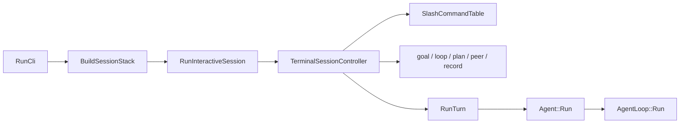

# 会话装配与控制边界

[架构总览](README.md) · [Query 数据流](query-data-flow.md) · [Agent Loop](agent-loop/reliability.md) · [命名规范](../development/naming.md)

这页专讲交互会话怎么拆。旧路把配置、后端、工具、提示词、界面、存档、命令、goal、loop、peer、plan 与录制全塞进一只控制器。如今各件已经分家，`TerminalSessionController` 只守会话状态机、路由与公平泵。

## 1. 两道边界

先看编译边界：

```text
lubancode_engine
  <- lubancode_runtime
     <- lubancode_core
        <- lubancode_app
           <- lubancode executable
```

再看运行边界：



两张图别混。CMake target 管编译依赖，类与函数管运行所有权。

## 2. 组合根只装一次

`app::RunCli` 走进交互模式，先组 `InteractiveSessionOptions`，再调 `BuildSessionStack`。`SessionStack` 持这些长寿件：

| 所有物 | 用处 |
| --- | --- |
| 生效配置、Skill、prompt 材料 | 给会话与 Agent 取当前策略 |
| `RebuildableBackend` | 切 provider 时换内层 client，外层引用不动 |
| `ModelRouterService` | 给 compact、记忆抽取、标题等小活选模型 |
| `ToolRuntime` | 持主/子 registry、MCP、LSP、插件与延迟工具账 |
| `WorktreeSession`、artifact store、context tracker | 托住目录、上下文材料与显示统计 |

控制器只借这些件。单测若没传 stack，也走同一只工厂兜底，不另造装配路。

寿命顺序不可倒：

```text
SessionStack 先构造
  -> TerminalSessionController 构造并借资源
     -> Agent 借 Backend 与 ToolRegistry
     -> 会话运行
  <- Controller 先拆回调、停 peer、停 timer、清后台任务
<- Stack 后析构工具表、插件模块与后端
```

## 3. 控制器分成装配半边与运行半边

| 文件 | 职分 |
| --- | --- |
| `src/app/interactive_session_controller.hpp` | 私有类形状与所有权次序 |
| `src/app/interactive_session_assembly.cpp` | 构造、析构、恢复、Agent 重建、请求策略同步、dispatch context 装配 |
| `src/app/interactive_session.cpp` | `ProcessLine`、`RunSessionTurn`、主循环与公平泵 |
| `src/app/interactive_session.hpp` | 对外只露 options 与 `RunInteractiveSession` |

这条拆法把“怎么接”与“怎么跑”分开，又不把控制器私头漏给别层。

## 4. 一条输入怎么开 turn

```mermaid
sequenceDiagram
    accTitle: 会话输入分派
    accDescr: 斜杠命令交给命令表，普通输入与外来消息则装成 TurnContext，经 Agent 和 AgentLoop 推进，末了写入会话。
    participant Input as 输入/外来消息
    participant Session as TerminalSessionController
    participant Turn as RunTurn
    participant Agent as Agent
    participant Loop as AgentLoop
    participant Store as SessionStore

    Input->>Session: ProcessLine 或 pump 取件
    alt slash 命令
        Session->>Session: DispatchSlashCommand
    else 正文
        Session->>Session: RunSessionTurn(source)
        Session->>Turn: TurnContext
        Turn->>Agent: Run(message, TurnWiring)
        Agent->>Loop: Run(Agent&, ...)
        Loop-->>Agent: RunOutcome
        Agent-->>Turn: outcome
        Turn-->>Session: RunTurnResult
        Session->>Store: persist new events/messages
    end
```

`RunSessionTurn` 用 `TurnSource` 分两路：

| 来源 | 多做什么 | 少做什么 |
| --- | --- | --- |
| `User` | 配置门、建档、窗口同步、自动 compact、提及账、trace、usage、plan 与记忆收尾 | 无 |
| `Incoming` | peer 忙闲状态、必要时静默回流 | 不挂录制，不追用户 usage，不做提及与收尾抽取 |

两路只在边界处分岔，开模型 turn 的骨架仍是一份。peer 来信与后台子代理结果不再另立一只回合入口。

## 5. RunTurn 是宿主边界

`RunTurn(TurnContext)` 不持跨轮真值。它拿一束借用材料，管这一轮：

- 组 `agent::TurnWiring`，接审批、Hook、Plan 闸与 execution id；
- 把 Agent 事件扇给终端、session 与 trace sink；app-server 另有回合驱动，吃同一事件合同；
- 起 ESC/排队输入监听，收尾后关线程；
- 汇 usage、活动视图与转录；
- 把 `RunOutcome` 折成 `RunTurnResult`。

`Agent` 才持跨 step 状态：`AgentProfile`、系统提示、`ContextManager`、`AgentWiring` 与工具可见性。`AgentLoop` 是推进器，只借 `Agent&`。这条边界使主会话、子代理、workflow agent 能共用同一引擎。

## 6. slash 命令怎样分派

```text
ParseSlashCommand
-> SlashCommandTable 查枚举
-> SlashCommandSpec.handler
-> commands/<domain>_commands.cpp
```

`SlashCommandSpec` 记命令枚举、对账名、handler、`needs_console` 与 `needs_idle`。47 枚解析枚举在表里逐案登册，`Image` 与 `NotSlash` 留空 handler 作完备性对账。

handler 按领域住 `src/app/commands/`：session、settings、workspace、hook、peer、doctor、goal、loop、workflow、memory、trace、model 等各收各账。`SlashDispatchContext` 只借会话资源，handler 不拥有控制器，也不反向 include 控制器私头。

添命令时要同时改：

1. `cli::SlashCommand` 与解析/帮助表；
2. 对应域 handler；
3. `SlashCommandTable()` 注册行；
4. 命令注册表与行为测试。

## 7. 五只会话接线器

| 接线器 | 自己持什么 | 向会话借什么 | 泵口或收口 |
| --- | --- | --- | --- |
| `GoalSessionWiring` | coordinator、checkpoint、work source、公平账、活跃 iteration | 配置、存档、模型路由、评估 backend、trace | `PumpContinuation` / `CloseIteration` |
| `LoopSessionWiring` | scheduler、wake token、活跃 tick、control state | 配置、存档、SessionRuntime、IdleWakeCoordinator | `PumpDueTick` / `FinishTick` / `Shutdown` |
| `PlanSessionWiring` | plan 计数、待审稿、恢复标记 | mode 真值、prompt options、artifact、Agent 与 registry 窄口 | `HandleCommand` / `EvaluateGate` / `CollectProposal` |
| `PeerSessionWiring` | PeerRuntime、ready/held 收件池、起停状态 | 主题、会话标题、权限档 | `RefillPool` / `TakeReadyMessage` / `Stop` |
| `RecordSessionWiring` | recorder | 录制根、Skill 安装根、刷新回调 | `MakeCommandContext` / `recorder` |

每只 wiring 都用 `Host` 收借用件。状态随 wiring 走，会话只握句柄。goal 与 loop 都能报“有活”，可到底先跑谁，仍由控制器和 `SessionWorkScheduler` 仲裁。公平规矩只留一份。

## 8. 空闲泵怎么排活

控制器每拍先收输入和外来消息，再看后台结果、peer、goal、loop 等候选。它一次只开一枚主 turn。接线器不能自己从 timer 线程直闯 Agent：

```text
timer / transport thread
-> 只投 wake 或 mailbox
-> 主线程 pump 取件
-> RunSessionTurn
-> RunTurn
```

这条单飞线守住 history、终端画面、审批框和 session 落盘次序。`LoopSessionWiring::Shutdown` 会摘 wake source、停 timer、join 线程；`PeerSessionWiring::Stop` 会先摘名册再停传输。

## 9. 状态该放哪儿

拿不准时照这张表放：

| 状态寿命 | 去处 |
| --- | --- |
| 跨 step，随 Agent 活 | `agent::Agent` / `ContextManager` |
| 只活一轮 | `TurnContext` / `RunTurn` 局部件 |
| 跨 turn，属某子系统 | 对应 `*SessionWiring` |
| 跨子系统，属整场会话 | `TerminalSessionController` 或 `SessionRuntime` |
| 比控制器活得久，供多件借用 | `SessionStack` |
| 跨进程要恢复 | `sessions` 事件与 replay |
| 只关终端画法 | `cli` presenter / renderer |

别把同一真值在两边各存一份。若 wiring 只需会话一只动作，给 `Host` 一根窄回调；别把控制器整只递进去。

## 10. 验证入口

| 要验什么 | 入口 |
| --- | --- |
| 命令表齐全、查表稳定 | `tests/unit/app/test_command_registry.cpp` |
| 五只 wiring 装配与状态归属 | `tests/unit/app/test_session_wirings.cpp` |
| Agent step、工具回填与请求皮 | `tests/unit/agent/test_loop.cpp` |
| workflow agent 共用 Agent 工具循环 | `tests/unit/workflows/test_workflow_agents.cpp` |
| JSONL 恢复与事件守恒 | `tests/unit/sessions/` |

改会话编排后，先跑这些窄用例，再跑 Release 构建与 CTest。Windows 上用单 job，免得超时后留一串 MSBuild 进程：

```powershell
cmake --build build\release --config Release -j 1
ctest --test-dir build\release -C Release --output-on-failure
```
