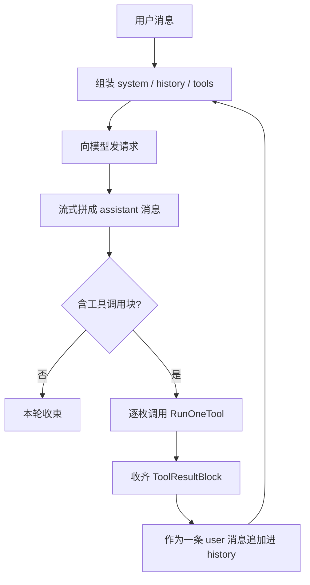
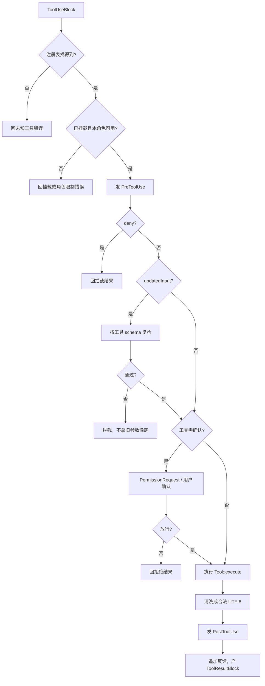

# 工具调用流程

[文档首页](../README.md) · [工具参考](../reference/tools.md) · [Query 数据流](query-data-flow.md) · [Hooks 流程](hooks-flow.md) · [PTC 手册](../features/tools/ptc.md)

这页讲一枚工具调用怎样从模型手里落到本机，又怎样把结果送回模型。工具名、参数与输出上限见[工具参考](../reference/tools.md)；三种 wire 的报文差异见[Query 数据流](query-data-flow.md)。

## 四个计数别混

- `turn`：用户交来一轮任务，直到主循环收束。
- `step`：这一轮里发一次模型请求，收一条 assistant 消息。
- `tool call`：assistant 消息里一枚工具调用块。
- `request`：真正送到 provider 的一次 HTTP/SSE 请求。

一个 step 可以带多枚工具调用。LubanCode 会逐枚执行，收齐结果，再开下一个 step。

## 总流程



模型并不直接碰文件、shell 或网络。它只产一枚有名字、有 id、有 JSON 入参的调用块。宿主认出它，再走本地执行链。

## 请求前：工具表怎样来

每个工具都向 `ToolRegistry` 交三样东西：名字、说明、输入 JSON Schema。`AgentLoop` 每个 step 都重新拼工具表。这样 `tool_search` 若在半途挂上新工具，下一次请求立刻能看见它。

工具分两层：

- 核心工具直接进请求。
- 延迟工具先留在注册表，暂不进 schema。模型须调用 `tool_search`，命中并挂载后，下一步才带完整定义。

模型若硬叫一枚尚未挂载的工具，宿主不执行，只回一条错误，叫它先走 `tool_search`。

## 模型回包：先拼消息

三种 provider wire 各有各的流事件。assembler 把文字、思考、工具名与分段 JSON 参数攒成一条中立 assistant 消息。Agent loop 只认中立块，不把 OpenAI、Anthropic、Responses 三套细节带进执行层。

终止帧偶尔会写 `end_turn`，消息里却已有工具块。此时信消息内容：照样执行工具。若只信终止原因，history 里便会留下孤零零的调用块，下一次请求容易被远端拒绝。

## `RunOneTool` 的七道关



次序不能乱：

1. 查名字。找不到便回错误。
2. 查过滤器。延迟工具未挂载、子代理角色无权使用，都在这里停。
3. 跑 `PreToolUse`。`deny` 直接拦，连确认框也不弹。
4. 若 Hook 给了 `updatedInput`，拿工具 schema 重新验。验不过就拦；不能偷偷改回旧参数执行。
5. 工具若标了 `needs_confirm`，再走权限策略、`PermissionRequest` 与用户确认。
6. 调 `Tool::execute`。
7. 清洗外部文本，再跑 `PostToolUse`。Hook 只能追加反馈，不能撤销已经发生的副作用。

JSON 工具调用与 PTC 脚本都走这一个 `RunOneTool`。PTC 只换模型怎样编排调用，不换权限、Hook、schema 与执行边界。

## 多枚调用怎样收账

同一条 assistant 消息若含三枚调用，程序按出现次序执行。三份结果收进同一条 `role=user` 消息，各自用调用 id 配对：

```text
assistant: ToolUse(a), ToolUse(b), ToolUse(c)
user:      ToolResult(a), ToolResult(b), ToolResult(c)
```

当前链不是并发执行。这样确认框、Hook、终端转录与副作用次序都有一条清楚的账。

用户若在中途按 ESC，正在跑的工具等它收口，结果照常入 history；尚未轮到的调用各补一条“未执行”错误结果。配对仍齐，随后退出本轮。

## 结果怎样回模型

工具返回 `content` 与 `is_error`。宿主先修掉非法 UTF-8，再包装成 `ToolResultBlock`。错误也是结果，不另开一条隐形异常通道。

收齐后，结果消息追加进 history。下一次 step 重拼请求：旧 assistant 调用块在前，新结果块紧随其后。模型据此继续调用别的工具，或给最终正文。

长结果进请求前还会过上下文视图层：重复只读结果可折成引用，超长结果可换 artifact 预览。执行与 session 真账不受影响。详见[上下文压缩机制](../features/context/compaction.md)。

## 权限与 Hook 怎样相接

`PreToolUse` 能表态 `deny / ask / allow`。归并顺序是 `deny > ask > allow`：

- `deny`：工具不执行。
- `ask`：即使普通策略本想放行，也要问用户。
- `allow`：可跳过普通确认；硬权限规则仍可拦。

`PermissionRequest` 只在宿主原本要确认时发。它可拒绝、免弹，或不表态交回原流程。完整归并规则见[Hooks 流程](hooks-flow.md)。

## 常见失败

| 结果 | 是否执行工具 | 模型会看到什么 |
| --- | --- | --- |
| 未知工具 | 否 | 未知工具错误 |
| 延迟工具未挂载 | 否 | 先用 `tool_search` 的指路 |
| Hook 拒绝 | 否 | 拒绝理由与 Hook 附注 |
| Hook 改参后 schema 不合 | 否 | 改参校验错误 |
| 用户拒绝确认 | 否 | 用户拒绝执行 |
| 工具自身报错 | 已调用 | `is_error=true` 与错误正文 |
| `PostToolUse` 失败 | 工具已调用 | 原结果照留，另有告警；不能回滚 |

## 安全边界

- 工具 schema 只是参数形状，不是操作系统沙箱。
- `needs_confirm`、权限策略和 Hook 都在宿主侧执行，模型越不过。
- 外部工具输出先过 UTF-8 边界，再进 Hook、history 与终端。
- 工具调用与结果须成对。恢复、打断、流错误都要补齐这条契约。
- PTC、插件、Lua、MCP 最终仍须走同一执行链；若另开旁路，便会漏掉权限与审计。

## 源码入口

- `src/agent/loop.cpp`：`AgentLoop::Run` 与 `RunOneTool`。
- `src/tools/registry.cpp`：工具注册与查找。
- `src/tools/schema_check.cpp`：Hook 改参后的 schema 复检。
- `src/api/assembler.cpp`：流事件拼成中立消息。
- `src/tools/tool_search.cpp`：延迟工具检索与挂载。
- `src/ptc/`：程序化调用 runner；最终回到 `RunOneTool`。

相关测试集中在 `tests/unit/agent/test_loop.cpp`、`tests/unit/agent/test_agent_tool.cpp`、`tests/unit/tools/test_tool_search.cpp`、`tests/integration/ptc/test_ptc_tool.cpp`、`tests/unit/api/test_request_prefix.cpp` 与各 wire 请求测试。
