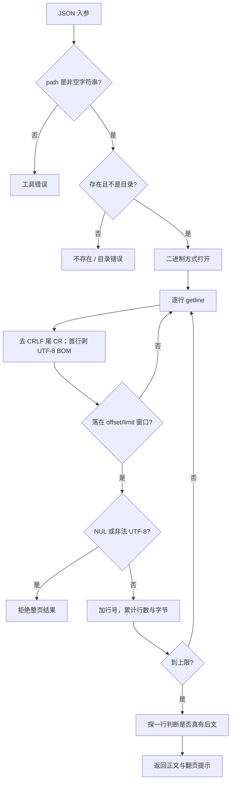
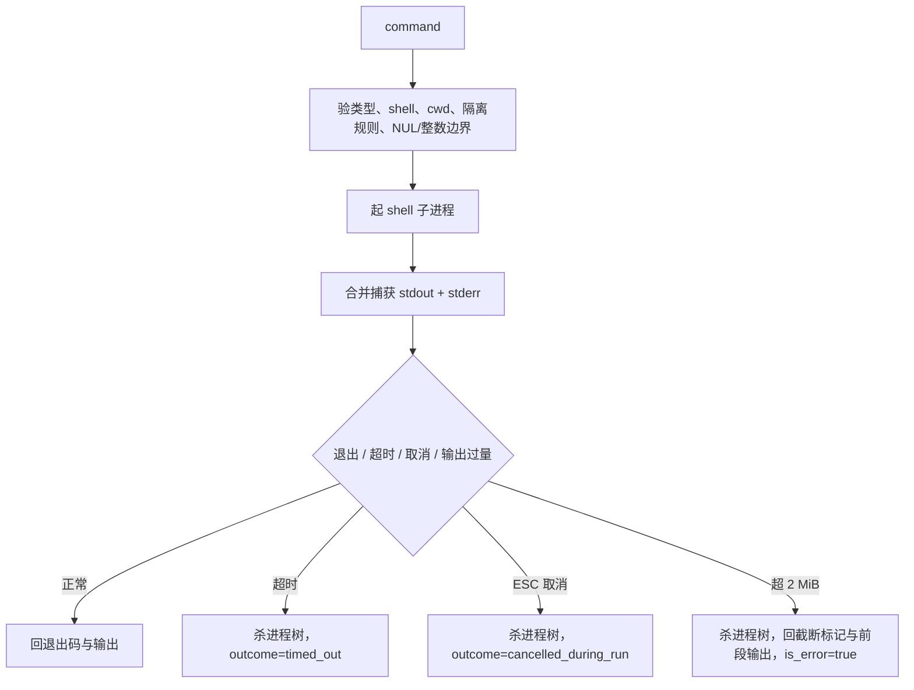

# 文件读取与命令执行深挖

[面试深挖导航](../../../interview/deep-dives.md) · [工具参考](../../reference/tools.md) · [工具调用流程](../tool-calling-flow.md) · [安全模型](../../development/security.md)

这页从两个看似简单的工具往下钻：长文件怎样读，shell 命令怎样起、怎样收、怎样不把上下文和进程表撑坏。它写当前实现，也把不够漂亮的边界摆出来。

## 一、`read_file` 的契约

```json
{
  "path": "src/agent/loop.cpp",
  "offset": 420,
  "limit": 180
}
```

| 参数 | 规则 |
| --- | --- |
| `path` | 必填字符串；相对或绝对路径。 |
| `offset` | 1 基；小于 1 收到 1。 |
| `limit` | 默认 2000 行；负数回到默认值。 |
| 总输出 | 约 1 MiB 硬顶，显式传很大的 `limit` 也越不过。 |

输出用六位右对齐行号、tab 与正文：

```text
   420	if (trim_report.trimmed_turns || trim_report.truncated_results) {
```

触发行数或字节上限，且文件后面真有内容，末尾添：

```text
[内容过长已截断,只读到第 2419 行;继续读请用 offset=2420]
```

## 二、读文件的实际流程



文件按 `std::ios::binary` 打开。这样换行与编码由工具自己定，不让 C 运行库在不同平台偷偷改字节。

`std::getline` 遇 `\n` 切行；Windows 文件留下的行尾 `\r` 手工去掉。UTF-8 BOM 只在物理首行剥一次，不混进行号后的正文。

## 三、为什么长文件要“先找再读”

面对十万行日志，正确路子不是从 1 页一路翻到 50 页。

```text
rg / search 找符号或错误词
-> 取命中行号
-> read_file 读命中前后几十到几百行
-> 若要追定义，再用 LSP / search
```

原因有四个：

- `offset` 分页按行从文件头扫描到目标行。它不建行偏移索引，深页仍是 O(n)。
- 每页正文会进入工具结果，再吃 token、session 与 artifact 空间。
- 大文件常有大量无关段，顺序全读反会冲淡证据。
- 同文件重复读取虽可在 L1 视图折叠，磁盘读取本身仍真实发生。

若任务真要遍历全文件，应先考虑流式命令、专用解析器或分块程序。`read_file` 是给模型看局部文本的，不是 ETL 引擎。

## 四、编码边界

`read_file` 只收合法 UTF-8：

- UTF-8 中文逐字节保真。
- UTF-8 BOM 剥掉。
- 任一选中行含 NUL，按二进制拒绝。
- 任一选中行有非法 UTF-8，整次调用报错，并给第一处坏行。
- 不猜 GBK，不按本机代码页静默转码。

“选中行”三个字不能漏。offset 之前与 limit 之后的坏字节不会在本次被查；这是分页工具该守的成本边界。翻到那一页才会发现。

拒绝坏字节不是洁癖。工具结果要进 JSON、history、Hook 与终端。原样放行一串非法 UTF-8，可能在更远处才炸，届时很难定位源头。

## 五、`read_file` corner cases

| 情形 | 当前行为 | 说明 |
| --- | --- | --- |
| 空文件 | `(空文件)`，不是错误 | 文件存在，只是无正文 |
| offset 超 EOF | 返回总行数提示，不算工具错误 | 模型可停翻页 |
| 刚好读到 EOF | 不添截断提示 | 会多探一次确认后文 |
| 最后一行无换行 | 正常返回 | `getline` 仍读得到 |
| 一行自身超过 1 MiB | 先把整行读进内存，再发现字节超限 | 总输出有顶，单行内存峰值仍可很高 |
| `limit=0` | 现实现会落到“offset 超总行数”样式 | 文案并不准确；调用方不该用 0 表示探测 |
| 文件读取中被改 | 没有快照锁 | 可能读到修改前后混合视图；需按任务重读核验 |
| symlink | 跟随文件系统解析 | `read_file` 自身没有工作区沙箱 |
| 权限不足或占用 | 打开失败，回人话错误 | 平台对“占用”的严格程度不同 |

面试时可直说：行数与总输出封顶挡住常见爆量；它没有 mmap、随机行索引、单行上限与读取快照。若要服务 GB 级日志，该另造索引工具，不该继续给这个接口堆参数。

## 六、`run_command` 的契约

```json
{
  "command": "cmake --build build --config Debug",
  "cwd": ".",
  "timeout_ms": 120000,
  "shell": "powershell",
  "run_in_background": false
}
```

| 参数 | Windows | POSIX |
| --- | --- | --- |
| `command` | 必填 shell 字符串；含 NUL 拒绝 | 同左 |
| `shell` | 默认 `powershell`，也可 `cmd`；本机装了 PowerShell 7 时可选 `pwsh` | 默认 `sh`(/bin/sh)；本机装了 bash 时可选 `bash` |
| `timeout_ms` | 前台默认 120000；整数范围 1~86400000，越界报错 | 同左 |
| `max_runtime_ms` | 只对后台有意义：不填无限；到点自动收树 | 同左 |
| `cwd` | 可选，真实目录；含 NUL 拒绝 | 同左 |
| `run_in_background` | false；true 时忽略 timeout | 同左 |

`shell` 的可选值随本机探测动态进 schema：bash/pwsh 不随包附送，装了才认、才进枚举；没装就报"本机未装"，不猜路径、不偷换。`/doctor shell` 打印实际唤起的 shell、版本、login/profile 与 TTY 语义。

它默认 `needs_confirm=true`。确认、Hook 与权限发生在 `execute` 之前，详见[工具调用流程](../tool-calling-flow.md)。

## 七、前台命令怎样跑



输出恰好等于上限不算超限；读到第 limit+1 个字节才置截断并杀树。截断结果 `is_error=true`、`error_code=process.output_limit`——半截构建不是成功。

### Windows PowerShell

用户命令先嵌进一段脚本，再转 UTF-16LE + Base64，交给：

```text
powershell.exe -NoProfile -NonInteractive -EncodedCommand <base64>
```

脚本做三件事：

1. 关 PowerShell 进度噪声。
2. 把 Console OutputEncoding 设成 UTF-8。
3. 合并错误流，转成纯文本，免 CLIXML 混进结果。

管道会盖掉 `$?`，故而退出码先看 `$LASTEXITCODE`，没有才退到 `$?`。

### Windows cmd

走 `cmd.exe /d /s /c`。平台层按系统 ANSI 代码页把输出转成 UTF-8。语法仍是 cmd 语法，不能把 PowerShell 命令混过来。

### POSIX sh

走 `/bin/sh -c`。不是用户的交互 shell，也不保证有 Bash 扩展。数组、`[[ ]]`、`source` 等写法不可想当然。

## 八、工作目录与隔离

工具不改宿主进程 cwd。命令的 cwd 一律走操作系统参数(前台后台同一份)：
Windows 落 `CreateProcessW` 的 `lpCurrentDirectory`；POSIX 子进程 exec 前
`chdir`，失败经 exec-error 管道回报 spawn_failed。命令文本不拼 `cd` /
`Set-Location`——路径里的引号、`%`(cmd 展开)、`!`、`$` 各家 shell 的坑
整个类别绕开，也不用再维护各家的手写 quote。多会话、子代理与后台线程
不会争一只进程级 cwd。

隔离 worktree 还有两道闸：

- `cwd` 指回主 checkout，拒绝。
- 命令里出现已知的 Git 改道写法，拒绝。

这仍不是 OS 沙箱。shell 字符串能做什么，最终取决于当前账户、确认策略与 Hook。

## 九、超时、输出上限与杀树

前台默认捕获上限 2 MiB。到顶时：

1. 留住已捕获前段。
2. 标 `output_truncated=true`。
3. 终止整棵进程树。
4. 继续把管道读到 EOF，免子进程卡在写端。
5. 回一条醒目标记。

跨平台收树：

- Windows：Job Object，`KILL_ON_JOB_CLOSE`。
- POSIX：独立进程组，先 SIGTERM，再 SIGKILL。

超时走相同收树语义，结果 `is_error=true`。非零退出码也置 `is_error=true`。

(历史注：输出超限的结果曾 `is_error=false`，正文却明写“命令已被强制终止”——调用方只看布尔值会把半截构建当成功。已修：截断即 `is_error=true`、`outcome=output_limit`、`error_code=process.output_limit`。)

## 十、后台命令怎样跑

`run_in_background=true` 只等 spawn，不等业务结束。stdout/stderr 直接合流写临时日志，不进前台内存。

返回：

```text
task_id + PID + log_path
```

随后 `BackgroundTaskRegistry`：

- 先建台账条目再起 watcher(次序反过来曾有竞态：watcher 抢先在表里找不到自己，任务永远 running)。
- watcher 持平台层 `BackgroundProcessHandle` 的共享状态等在原生句柄上，不凭 PID 猜生死。
- 记录 running / stopping / completed / failed / stopped / stop_failed。
- 退出码是 `optional`：收尸方拿不到就如实 unknown，不借 0 冒充成功；POSIX 受信号终止另记 signal。
- `max_runtime_ms` 到点由 watcher 收整棵树，状态进 stopped。
- 单任务日志 8 MiB 上限(到顶截断保留尾部并落标记)；终态任务保留 200 条，超出的删日志出表。
- 主循环在安全点 drain 新完成项，给用户提示。
- `background_output` 查状态与日志尾部。
- `stop_background` 收整棵树：状态 stopping → 树死透才 stopped；收不动如实 stop_failed，不先盖章。

`background_output` 默认读最后 50 行。内部最多读日志末尾 64 KiB；起刀处先退到完整换行(半行不冒充整行，首段被截加 `[日志前部已省略]` 标记)，出口保证合法 UTF-8(按 shell 的 encoding_hint 清洗)。

### 后台跨平台差异

| 题 | Windows | POSIX |
| --- | --- | --- |
| 存活域 | 每任务专属 Job Object + 会话级兜底 Job | `setsid` + 进程注册表 + atexit |
| 宿主退出收尾 | 句柄关闭由内核杀 Job 内进程 | `atexit` SIGTERM/SIGKILL |
| 崩溃/被信号杀 | Job 仍有较强保证 | `atexit` 未必运行，可能留进程 |
| 退出码 | 长持进程句柄，`GetExitCodeProcess` 精确 | 唯一收尸线程 `waitpid` 落共享完成态；收不到如实 unknown |
| 主动停止 | `TerminateJobObject` 收整棵树 | 进程组 SIGTERM → grace → SIGKILL |

watcher 等在原生句柄(Windows process handle / POSIX 收尸线程的条件
变量)上，不拿 PID 轮询探活，PID 复用窗口已消。Windows 后台 spawn 走
`STARTUPINFOEX` + `PROC_THREAD_ATTRIBUTE_HANDLE_LIST` 句柄白名单，
只传 stdin/stdout/stderr 三只句柄；环境经显式 UTF-16 块
(`lpEnvironment`)注入，不改父进程环境——并发 Hook 不串值。

## 十一、取消与命令工具

ESC 置位的取消旗贯穿 `RunCommandTool::SetCancel` 进平台层等待循环
(POSIX 每拍查旗；Windows 等待切 100ms 片)：前台长命令即时收整棵树，
`outcome=cancelled_during_run`，不再只能等 120 秒超时。已捕获输出照旧
带回。尚未轮到的同批工具补"未执行"(cancelled_before_start)。

后台模式的 spawn 很快返回。之后要停，用 `stop_background`。这比让主取消信号跨多轮一直绑着后台进程更清楚。

## 十二、命令执行 corner cases

| 情形 | 当前行为 |
| --- | --- |
| `timeout_ms` 类型错/超 int 范围 | 前台报错(64 位解析 + 1~86400000 范围检查)；后台彻底忽略此字段 |
| `command`/`cwd` 含 NUL | 拒绝执行(系统命令行会在 NUL 处截断，界面所见与所跑不一致) |
| 非正 timeout | 报错(历史版曾回落 120000) |
| shell 在平台不支持/没装 | 明报错，不静默换 shell，不猜路径 |
| spawn 失败 | `is_error=true`、`outcome=spawn_failed`，回平台错误 |
| 进程非零退出 | 回 `[退出码 N]` 与输出，`is_error=true`、`outcome=process_exit_nonzero` |
| 输出超限 | `is_error=true`、`outcome=output_limit`；恰好等于上限不截断 |
| ESC 取消 | 收整棵树，`outcome=cancelled_during_run`，带回已捕获输出 |
| PowerShell 解析期吐本地代码页 | 捕获后再过 UTF-8 清洗，免 JSON 序列化炸 |
| stdout/stderr 时序 | 合进一条捕获流，适合读日志；不适合精确区分来源 |
| 等待交互输入 | stdin 不是交互终端，常会挂到 timeout；这类命令不该走普通前台工具(需要 PTY 另立 run_terminal，不往无头工具里塞半套伪终端) |
| 命令重试 | 无通用自动重试：spawn 明确失败可由用户/模型重试；一旦进程可能跑过指令，绝不自动重启(git push 跑两遍比报错更坏)。Agent 重试须重新作一枚可见 tool call |
| shell 注入 | `command` 本就是 shell 程序，不作参数级转义；靠确认与权限边界 |
| Windows 后台 PowerShell + `cwd` | 当前后台分支编码的是原 `command`，没用拼过 cwd 的字符串；`cwd` 现阶段不生效 |
| POSIX cwd 含单引号 | 当前单引号拼接沿用“翻倍”写法，不是严谨的 POSIX 转义；这类路径不可靠 |

最后两条是源码现状，不该在面试里藏。修法也不复杂：后台 PowerShell 改用 `command_with_cwd`；POSIX 单引号按 `'"'"'` 形状转义，并加路径测试。

## 十三、该怎样测试

### 文件读取

- UTF-8 中文、BOM、CRLF、末行无换行。
- 默认 2000 行、显式分页、刚好 EOF、offset 超界。
- 1 MiB 字节截断与超长单行。
- GBK、残缺多字节、混合编码、NUL。
- 文件不存在、目录、权限与参数类型错。

### 命令执行

- 正常输出、中文、非零退出码。
- timeout 真的在期限附近回来，后代进程也死。
- 无限输出到 2 MiB 后收树，不再增长。
- PowerShell / cmd / sh 各自语法与代码页。
- 后台秒级返回、日志可读、完成通知、主动停止。
- 宿主退出后的后台收尾。
- cwd、中文路径、空格、引号与隔离越界。

## 十四、源码入口

| 责任 | 文件 |
| --- | --- |
| `read_file` 参数、分页、编码 | `src/tools/read_file.cpp` |
| `run_command` shell 与结果包装 | `src/tools/run_command.cpp` |
| 前台/后台进程抽象 | `src/platform/process.hpp`、`process_win.cpp`、`process_posix.cpp` |
| 后台任务台账 | `src/tools/background_tasks.cpp` |
| 后台查询与停止 | `src/tools/background_output.cpp` |
| worktree 命令闸 | `src/tools/command_safety.cpp`、`isolation.cpp` |
| UTF-8 清洗 | `src/platform/text_encoding.cpp` |

关键测试在 `tests/unit/tools/test_tools.cpp`、`tests/unit/cli/test_utf8_boundary.cpp`、`tests/integration/process/test_background_tasks.cpp` 与平台进程测试。

## 十三、run_command 进程生命线单的评估落定(2026-08)

### shell=bash / shell=pwsh:做

落定方式是"装了才进 schema":POSIX 探 /bin/bash、/usr/bin/bash 与
PATH;Windows 对 pwsh 按 PATH 找 pwsh.exe。装了才把枚举值放进 shell
参数、才在执行分支认得;没装就报"本机未装",不猜路径。依据:单子的
口径本就是"先探可执行文件,再把能力放进动态 schema""不偷换",而两枚
shell 的引号/包装语法与既有方言同族(bash 同 sh 的 POSIX 单引号,pwsh
同 powershell 的 -EncodedCommand wrapper),接入面小、语义不新增分叉。
/doctor shell 打印实际唤起的 shell、版本、login/profile 与 TTY 语义,
落差摊开说。

### 独立 run_process argv 工具:不做(现状已覆盖)

不给模型另开无 shell 的 argv 工具。依据:无 shell 的 argv 执行路已有
三条现成覆盖——Hook v2 的 exec form(RunProcessWithStdin,argv 直起)、
插件 process runtime(ChildProcess::Start,argv + cwd + env)、platform
层对内部调用方的 RunProcess(argv)。模型侧的 run_command 定位就是
shell 工具;给模型再加一件第三入口要连带动 schema、确认分类、隔离闸、
Hook 语义与文档,收益(免一层 shell 引号)撑不起接口面。真有"绝不经过
shell"的硬需求(带秘密参数的命令),该走插件/受限 host,不是给模型
一只更锋利的通用刀。单子"不做"节的"不做 shell 之间的魔法翻译"同源。

### 持久后台任务(跨宿主恢复):不做,另立单

任务表只在本进程内存里,本单如实写进契约("同一宿主进程内可查询")。
跨重启恢复需要 session-owned task journal(进程身份不只 PID:Windows
creation time、Linux /proc/<pid>/stat starttime 或 pidfd)与核身收养
逻辑,另立单,不夹带。POSIX 的 SIGKILL 孤儿窗口靠 atexit + 会话级注册
表兜底,语义差已在上表写明。

### 日志路径默认遮蔽:不做(维持明路径)

工具返回里的日志绝对路径维持明示,不默认遮蔽。依据:现有契约(task_id
+ log_path 同报)与既有测试、background_output 的 tail 语义、用户"自己
Get-Content 看日志"的用法都建立在明路径上;单子自己也承认这是"调试档
才展示路径"的建议档位。真正的泄密面(同机他账号读日志)已由 POSIX
0600 + 独占创建堵住;模型可见的路径本就在会话工作目录语境里。要收紧成
"默认 task_id、调试档才给路径"是一枚产品决定,须连 UI 与文档一起动,
不在本单顺手做。
