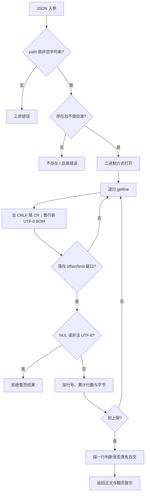
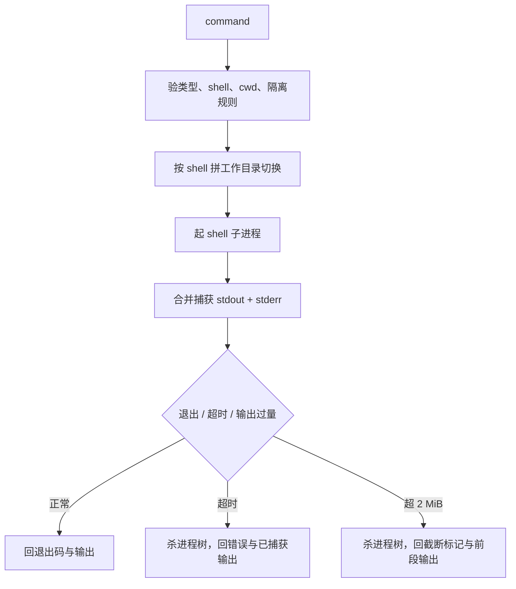

# 文件读取与命令执行深挖

[面试深挖导航](../../../interview/deep-dives.md) · [工具参考](../../reference/tools.md) · [工具调用流程](../tool-calling-flow.md) · [安全模型](../../development/security.md)

这页从两个看似简单的工具往下钻：长文件怎样读，shell 命令怎样起、怎样收、怎样不把上下文和进程表撑坏。它写当前实现，也把不够漂亮的边界摆出来。

## 一、`read_file` 的契约

```json
{
  "path": "src/agent/loop.cpp",
  "offset": 420,
  "limit": 180
}
```

| 参数 | 规则 |
| --- | --- |
| `path` | 必填字符串；相对或绝对路径。 |
| `offset` | 1 基；小于 1 收到 1。 |
| `limit` | 默认 2000 行；负数回到默认值。 |
| 总输出 | 约 1 MiB 硬顶，显式传很大的 `limit` 也越不过。 |

输出用六位右对齐行号、tab 与正文：

```text
   420	if (trim_report.trimmed_turns || trim_report.truncated_results) {
```

触发行数或字节上限，且文件后面真有内容，末尾添：

```text
[内容过长已截断,只读到第 2419 行;继续读请用 offset=2420]
```

## 二、读文件的实际流程



文件按 `std::ios::binary` 打开。这样换行与编码由工具自己定，不让 C 运行库在不同平台偷偷改字节。

`std::getline` 遇 `\n` 切行；Windows 文件留下的行尾 `\r` 手工去掉。UTF-8 BOM 只在物理首行剥一次，不混进行号后的正文。

## 三、为什么长文件要“先找再读”

面对十万行日志，正确路子不是从 1 页一路翻到 50 页。

```text
rg / search 找符号或错误词
-> 取命中行号
-> read_file 读命中前后几十到几百行
-> 若要追定义，再用 LSP / search
```

原因有四个：

- `offset` 分页按行从文件头扫描到目标行。它不建行偏移索引，深页仍是 O(n)。
- 每页正文会进入工具结果，再吃 token、session 与 artifact 空间。
- 大文件常有大量无关段，顺序全读反会冲淡证据。
- 同文件重复读取虽可在 L1 视图折叠，磁盘读取本身仍真实发生。

若任务真要遍历全文件，应先考虑流式命令、专用解析器或分块程序。`read_file` 是给模型看局部文本的，不是 ETL 引擎。

## 四、编码边界

`read_file` 只收合法 UTF-8：

- UTF-8 中文逐字节保真。
- UTF-8 BOM 剥掉。
- 任一选中行含 NUL，按二进制拒绝。
- 任一选中行有非法 UTF-8，整次调用报错，并给第一处坏行。
- 不猜 GBK，不按本机代码页静默转码。

“选中行”三个字不能漏。offset 之前与 limit 之后的坏字节不会在本次被查；这是分页工具该守的成本边界。翻到那一页才会发现。

拒绝坏字节不是洁癖。工具结果要进 JSON、history、Hook 与终端。原样放行一串非法 UTF-8，可能在更远处才炸，届时很难定位源头。

## 五、`read_file` corner cases

| 情形 | 当前行为 | 说明 |
| --- | --- | --- |
| 空文件 | `(空文件)`，不是错误 | 文件存在，只是无正文 |
| offset 超 EOF | 返回总行数提示，不算工具错误 | 模型可停翻页 |
| 刚好读到 EOF | 不添截断提示 | 会多探一次确认后文 |
| 最后一行无换行 | 正常返回 | `getline` 仍读得到 |
| 一行自身超过 1 MiB | 先把整行读进内存，再发现字节超限 | 总输出有顶，单行内存峰值仍可很高 |
| `limit=0` | 现实现会落到“offset 超总行数”样式 | 文案并不准确；调用方不该用 0 表示探测 |
| 文件读取中被改 | 没有快照锁 | 可能读到修改前后混合视图；需按任务重读核验 |
| symlink | 跟随文件系统解析 | `read_file` 自身没有工作区沙箱 |
| 权限不足或占用 | 打开失败，回人话错误 | 平台对“占用”的严格程度不同 |

面试时可直说：行数与总输出封顶挡住常见爆量；它没有 mmap、随机行索引、单行上限与读取快照。若要服务 GB 级日志，该另造索引工具，不该继续给这个接口堆参数。

## 六、`run_command` 的契约

```json
{
  "command": "cmake --build build --config Debug",
  "cwd": ".",
  "timeout_ms": 120000,
  "shell": "powershell",
  "run_in_background": false
}
```

| 参数 | Windows | POSIX |
| --- | --- | --- |
| `command` | 必填 shell 字符串 | 必填 shell 字符串 |
| `shell` | 默认 `powershell`，也可 `cmd` | 只认 `sh` |
| `timeout_ms` | 前台默认 120000；非正数回默认 | 同左 |
| `cwd` | 可选，真实目录 | 可选，真实目录 |
| `run_in_background` | false；true 时忽略 timeout | 同左 |

它默认 `needs_confirm=true`。确认、Hook 与权限发生在 `execute` 之前，详见[工具调用流程](../tool-calling-flow.md)。

## 七、前台命令怎样跑



### Windows PowerShell

用户命令先嵌进一段脚本，再转 UTF-16LE + Base64，交给：

```text
powershell.exe -NoProfile -NonInteractive -EncodedCommand <base64>
```

脚本做三件事：

1. 关 PowerShell 进度噪声。
2. 把 Console OutputEncoding 设成 UTF-8。
3. 合并错误流，转成纯文本，免 CLIXML 混进结果。

管道会盖掉 `$?`，故而退出码先看 `$LASTEXITCODE`，没有才退到 `$?`。

### Windows cmd

走 `cmd.exe /d /s /c`。平台层按系统 ANSI 代码页把输出转成 UTF-8。语法仍是 cmd 语法，不能把 PowerShell 命令混过来。

### POSIX sh

走 `/bin/sh -c`。不是用户的交互 shell，也不保证有 Bash 扩展。数组、`[[ ]]`、`source` 等写法不可想当然。

## 八、工作目录与隔离

工具不改宿主进程 cwd。它在命令前拼一条 shell 原生命令：

```text
PowerShell  Set-Location -LiteralPath '<cwd>' ; <command>
cmd         cd /d "<cwd>" && <command>
sh          cd -- '<cwd>' && <command>
```

这样多会话、子代理与后台线程不会争一只进程级 cwd。

隔离 worktree 还有两道闸：

- `cwd` 指回主 checkout，拒绝。
- 命令里出现已知的 Git 改道写法，拒绝。

这仍不是 OS 沙箱。shell 字符串能做什么，最终取决于当前账户、确认策略与 Hook。

## 九、超时、输出上限与杀树

前台默认捕获上限 2 MiB。到顶时：

1. 留住已捕获前段。
2. 标 `output_truncated=true`。
3. 终止整棵进程树。
4. 继续把管道读到 EOF，免子进程卡在写端。
5. 回一条醒目标记。

跨平台收树：

- Windows：Job Object，`KILL_ON_JOB_CLOSE`。
- POSIX：独立进程组，先 SIGTERM，再 SIGKILL。

超时走相同收树语义，结果 `is_error=true`。非零退出码也置 `is_error=true`。

有一处值得追问：输出超限的结果现版 `is_error=false`，正文却明写“命令已被强制终止”。这意味着调用方不能只看布尔值认定业务命令跑完；这是现存契约不一致，后续宜改成结构化终态或至少置 error。

## 十、后台命令怎样跑

`run_in_background=true` 只等 spawn，不等业务结束。stdout/stderr 直接合流写临时日志，不进前台内存。

返回：

```text
task_id + PID + log_path
```

随后 `BackgroundTaskRegistry`：

- 给任务分单调递增 id。
- 每 200ms 左右探一次进程。
- 记录 running / completed / failed / stopped。
- 主循环在安全点 drain 新完成项，给用户提示。
- `background_output` 查状态与日志尾部。
- `stop_background` 发停止信号。

`background_output` 默认读最后 50 行。内部最多读日志末尾 64 KiB；`tail_lines<=0` 也只是读这 64 KiB，不会把几 GB 日志吞进内存。

### 后台跨平台差异

| 题 | Windows | POSIX |
| --- | --- | --- |
| 存活域 | 进程级 Job Object | `setsid` + 进程注册表 |
| 宿主退出收尾 | 句柄关闭由内核杀 Job 内进程 | `atexit` SIGTERM/SIGKILL |
| 崩溃/被信号杀 | Job 仍有较强保证 | `atexit` 未必运行，可能留进程 |
| 退出码 | 可查询精确值 | 脱离后通常只知死活，记 `-1` |
| 主动停止 | 当前实现按根进程终止 | 对进程组发信号 |

watcher 用 PID 探活，存在极小的 PID 复用窗口。现版未长持跨平台进程句柄来彻底消掉它。

## 十一、取消与命令工具

ESC 取消主循环，不等于异步杀掉任意正在执行的普通工具。当前一枚同步工具会先收口；它若是前台长命令，只能靠自身 timeout 结束。随后结果入 history，尚未轮到的同批工具补“未执行”错误。

后台模式的 spawn 很快返回。之后要停，用 `stop_background`。这比让主取消信号跨多轮一直绑着后台进程更清楚。

## 十二、命令执行 corner cases

| 情形 | 当前行为 |
| --- | --- |
| `timeout_ms` 类型错 | 前台报错；后台彻底忽略此字段，哪怕值是垃圾 |
| 非正 timeout | 回到 120000，不表示无限等待 |
| shell 在平台不支持 | 明报错，不静默换 shell |
| spawn 失败 | `is_error=true`，回平台错误 |
| 进程非零退出 | 回 `[退出码 N]` 与输出，`is_error=true` |
| PowerShell 解析期吐本地代码页 | 捕获后再过 UTF-8 清洗，免 JSON 序列化炸 |
| stdout/stderr 时序 | 合进一条捕获流，适合读日志；不适合精确区分来源 |
| 等待交互输入 | stdin 不是交互终端，常会挂到 timeout；这类命令不该走普通前台工具 |
| shell 注入 | `command` 本就是 shell 程序，不作参数级转义；靠确认与权限边界 |
| Windows 后台 PowerShell + `cwd` | 当前后台分支编码的是原 `command`，没用拼过 cwd 的字符串；`cwd` 现阶段不生效 |
| POSIX cwd 含单引号 | 当前单引号拼接沿用“翻倍”写法，不是严谨的 POSIX 转义；这类路径不可靠 |

最后两条是源码现状，不该在面试里藏。修法也不复杂：后台 PowerShell 改用 `command_with_cwd`；POSIX 单引号按 `'"'"'` 形状转义，并加路径测试。

## 十三、该怎样测试

### 文件读取

- UTF-8 中文、BOM、CRLF、末行无换行。
- 默认 2000 行、显式分页、刚好 EOF、offset 超界。
- 1 MiB 字节截断与超长单行。
- GBK、残缺多字节、混合编码、NUL。
- 文件不存在、目录、权限与参数类型错。

### 命令执行

- 正常输出、中文、非零退出码。
- timeout 真的在期限附近回来，后代进程也死。
- 无限输出到 2 MiB 后收树，不再增长。
- PowerShell / cmd / sh 各自语法与代码页。
- 后台秒级返回、日志可读、完成通知、主动停止。
- 宿主退出后的后台收尾。
- cwd、中文路径、空格、引号与隔离越界。

## 十四、源码入口

| 责任 | 文件 |
| --- | --- |
| `read_file` 参数、分页、编码 | `src/tools/read_file.cpp` |
| `run_command` shell 与结果包装 | `src/tools/run_command.cpp` |
| 前台/后台进程抽象 | `src/platform/process.hpp`、`process_win.cpp`、`process_posix.cpp` |
| 后台任务台账 | `src/tools/background_tasks.cpp` |
| 后台查询与停止 | `src/tools/background_output.cpp` |
| worktree 命令闸 | `src/tools/command_safety.cpp`、`isolation.cpp` |
| UTF-8 清洗 | `src/platform/text_encoding.cpp` |

关键测试在 `tests/test_tools.cpp`、`tests/test_utf8_boundary.cpp`、`tests/test_background_tasks.cpp` 与平台进程测试。
