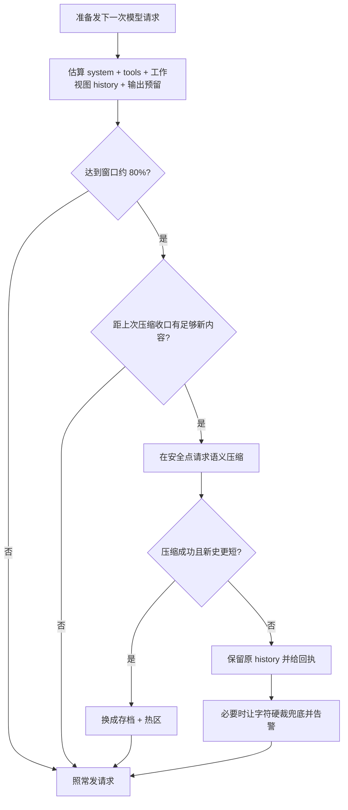
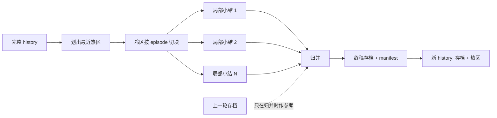

# 上下文压缩机制

[文档首页](../../README.md) · [会话与上下文](../sessions/README.md) · [Context 压缩算法深挖](../../architecture/context/compaction.md) · [Query 数据流](../../architecture/query-data-flow.md) · [项目记忆流程](../../architecture/memory/flow.md)

这页只讲一件事：长会话怎样收短，又怎样守住尚未做完的活。配置字段与命令语法见[配置手册](../../reference/configuration.md)和[命令参考](../../reference/commands.md)。项目记忆另走一套链，见[项目记忆流程](../../architecture/memory/flow.md)。

若要追到主 system 是否改写、episode 怎样切、map/reduce 怎样装预算、哪些中间结果只做弱验收，直接读 [Context 压缩算法深挖](../../architecture/context/compaction.md)。

## 先分清三本账

| 名称 | 装什么 | 压缩会不会改它 |
| --- | --- | --- |
| `history` | 下一次模型请求要看的活历史 | 会。语义压缩会换成“存档 + 热区” |
| session JSONL | 用户消息、回复、工具来回、usage、压缩事件 | 不删旧账，只追加 `compact_v2` |
| project memory | 跨会话仍有用的项目事实与偏好 | 不碰。它按下一条用户消息另行召回 |

所以，`/compact` 不是删聊天记录，也不是整理项目记忆。它只换模型眼前那本账。旧流水仍能 `/resume`，也能 `/export`。

## L0 到 L4 的阶梯

源码把它叫“四级压缩阶梯”：L0 是未压缩基线，真正收束从 L1 算起。

| 层级 | 手段 | 何时动 | 改哪里 | 原文去向 |
| --- | --- | --- | --- | --- |
| L0 | 原样与按需装载 | 结果尚短 | 请求视图照放 | history、session 原样 |
| L1 | snip / 结构压缩 | 每次拼请求视图 | 重复引用、版本标记、artifact 预览 | history、session 原样；长结果另存 artifact |
| L2 | 按需 microcompact | 模型显式调用 `context_read(summarize=true)` | 在历史尾部追加局部摘要工具结果 | artifact 与 session 原文都留着 |
| L3 | global compact | 手工、回合前或回合中达到窗口线 | 用存档替换冷 history，留下热区 | session 旧账仍在 |
| L4 | hard trim | L3 没赶上或失败，工作视图仍过大 | 裁请求视图 | session 原文仍在；终端告警 |

L1 先收拾工具结果。相同只读结果只留一份正文，后来者改成引用；旧版本留下预览，新版本照常保留；超长结果换成 artifact 引用。带副作用的工具结果不判重。

L2 与 L3 都会请模型写摘要，分量却不同。L2 一次只收调用方点名的一枚 artifact，把摘要当新工具结果添在 history 尾部；L3 收整段旧对话，会换活 history。L4 连活 history 也不改，只钉住一份较短工作视图。四层不可混叫。

## L2：工具结果微压缩

程序默认不跑 L2。L1 artifact 预览不够时，模型先用 `context_search`、`context_read` 找证据。只有原文很长，逐段读取反倒更贵，才显式调用 `context_read(artifact_id="aNNNN", summarize=true)`。

这次调用走 cheap 模型。单枚输入最多取 24 KiB，超出便从原文头尾各取一半，并在行边界收口。模型须回严格 JSON：`summary` 与 `key_facts`。摘要少于 20 字节、JSON 坏、请求失败或 45 秒超时，工具便报错；旧消息、L1 预览与 artifact 原文一概不动。

L2 守四条规矩：

- 不扫描冷区，不在回合收尾自动花 token。
- 输入永远从 artifact blob 原文来，不拿旧摘要再摘要。
- 摘要带 source artifact id 与产出模型，作为新的 `tool_result` 追加。证据不够时可用 `context_read` 追回全文。
- 成败都不删 blob，也不改 session 旧行；本次工具调用与结果照常追加。

`summarize=true` 不可与 `chunk_id`、`line_start`、`line_count` 混用。子代理只拿到普通 `context_read`，不露摘要参数，免得几路 cheap 请求同时抢账。

## 何时触发



projected 里的 history 按"结构压缩后的工作视图"估算——与真正发出去的请求同一本账。拿未压缩的全量估，重复工具结果与超长回包都被虚算进去，真实请求 47k 时估出 189k，压缩会被误触发又一压再压。`/context` 的历史估算与压缩前后账走同一口径。

触发口有三处：

- 手工：`/compact [重点说明]`。
- 回合前：上一回实测 usage 已过阈值，下一条用户消息入模前先收一次。
- 回合中：工具结果已收齐、下一次请求尚未发出时，拿 projected token 再算一次。过线便先压，免得长工具循环撞窗。

回合中的安全点很要紧。工具不能跑到一半被切断；调用块与结果块也不能拆散。故而程序只在两次模型请求之间动 history。

## 预算怎样算

压缩模型也有自己的窗口。可用输入预算是：

```text
compact 模型窗口 - 输出预留 - 协议余量
```

程序再估压缩指令与待压历史。装得下，走单次压缩。装不下，走分层压缩。模型窗口若已知而输入仍塞不下，程序明报失败，不截一半去碰运气。窗口未知时仍可发请求，只在结果中记下“未做窗口校验”。

## 单次压缩

单次压缩把冷历史一次交给压缩模型。模型须交两份东西：

1. 六栏 Markdown 存档：任务目标、已证实事实、关键决策、涉及文件与符号、关键命令与结果、未完成事项。
2. 一枚 JSON manifest：`goal`、`constraints`、`open_items`、`next_action`。

用户给 `/compact` 添的重点会写进压缩要求。活动待办也会逐字列给模型，不能随手改写。

## 分层压缩

历史塞不进单次请求时，程序先切阶段，再做 map/reduce：



episode 有两种显式边界：一条新的外层用户输入，或一次 `todo_write` 带来的计划变化。块界落在轮边界，工具调用与工具结果同进同退。

每块先从原始消息生局部小结。上一轮存档不进 map，只在 reduce 时作参考。这样可挡住“旧摘要再抄成新摘要”的层层失真。归并材料若还太大，便两两再并，直到装得下。

若整份历史都挤在最后一轮，冷区为空，也就无从分块。这时程序拒绝，绝不把一轮巨型输入劈碎。

## 热区怎样留下

摘要通过后，程序从最后一轮往前收整轮消息，直到热区预算用尽。默认热区预算是 12k token。最新用户消息本身绝不丢；它所在的轮若超出预算，热区预算也当真——轮头保留，其余按"assistant 工具调用 + 紧随的工具结果"消息组从尾往前收，收满为止，没收进的中段交给存档概括。工具调用与结果的配对永不拆开。

（末轮整轮全保的旧规矩在 mid-turn 长工具循环上会让压缩反涨：整轮吞掉全部历史，存档只添不删，实测 70.8k 压成 73.7k。）

最终形状如下：

```text
[对话存档,此前内容已压缩]
六栏摘要
JSON manifest

最近几轮原始消息
最近工具调用与结果
```

压缩从不拆开一组工具调用与结果。否则恢复后再发请求，远端多半会因配对不全报错。

## 验收闸

模型回了摘要，不等于可以换账。程序还要查：

- 正文去掉空白后不少于 40 个 UTF-8 字符。
- manifest 能解析，`goal` 非空。
- 活动待办逐项留在 `open_items`，只许调整空白。
- 工具调用与结果仍成对。

有一项不过，旧 history 原样留下。程序不会拿半份摘要顶掉真账。

## 落盘与恢复

成功后，程序把压缩边界追加成 `compact_v2` 事件。事件里有 archive、`kept_from`、压缩 epoch、触发来源、实现路径、map 块数、reduce 轮次、前后 token、manifest 与 `source_digest`。

`/resume` 读到它，便按同一规则重建“存档 + 热区”。旧版 `compact` 事件仍能读。session 旧消息未删，导出时也能看见压缩点。

压缩会改请求前缀，故而另开一个 cache epoch，并把断因记作 compact。后续工具来回再从这份新前缀往后追加。

## 失败时怎样认

| 现象 | 程序怎样办 | 去哪里查 |
| --- | --- | --- |
| 压缩模型请求失败 | 原 history 不动 | 终端错误、provider 配置 |
| 压缩输入超过模型窗口 | 不发请求，明报预算不足 | `compact_model`、模型目录里的窗口 |
| 摘要漏待办或 manifest 坏 | 拒收摘要 | 压缩错误与活动 todo |
| 压缩后新史不比原史短（反涨） | 拒绝换账，历史一字未动，终端讲明当前轮占大头 | 当前轮的工具循环、`/export` |
| 距上次压缩收口无足够新内容（滞回带内） | 跳过本次压缩，不发摘要请求 | 新内容攒足后会自动再收 |
| 单轮巨型历史无法分块 | 明报拒绝 | 缩小单次输入，或另开会话 |
| 按需摘要请求或 JSON 失败 | 工具报错；旧消息、L1 artifact 预览与原文不动 | cheap 路由与工具结果 |
| 语义压缩失败后仍过大 | 字符硬裁兜底，终端告警 | `/export` 查完整流水 |

`/compact --dry-run` 只看结构压缩能省多少、哪些内容被钉住。它不发模型请求，也不改 history。

## turn 分区双账压缩（四分区，现行主路）

压缩真触发后，先把原始对话按"真正用户输入"收成完整 turn（工具结果回填不开新 turn，工具 use/result 成原子组），再按 L1 工作视图的 token 重量切成 `compact_partition_count` 份连续分区（默认 4，可配 2..8，越界报错）：前 n-1 份是冷区、各 map 一次，末份是热区、保留原文形状。分区边界只落 turn 之间，工具原子组永不拆开。

`/context` 打一行策略（如 `compact turn 策略：按 token 平衡 4 分；前 3 份 map，末份热区`）；`/compact --dry-run` 打完整计划——每份的 turn 范围、token 估算、外置 ToolResult 枚数、预计 map 次数、长结果外置前后的 token 对照，以及分区或单 turn 超压缩模型预算的警告。全部纯计算，不调模型。旧存档（上一轮压缩的 archive）会被剥出单独记账：不算 turn，只作 final reduce 的基线。

真跑起来是三步：

1. **map**。每个冷分区发一次请求，模型只许回严格 JSON 的 `TurnGroupSummary`（用户需求变化、已证实事实、工具结果、涉及文件、已做修改、失败尝试、未完成事项、下一步候选八栏），turn 范围与事件范围由程序钉死。分区超预算时只沿 turn 边界递归拆这一份（map 次数可多于 n-1）；单枚 turn 仍超预算则整次明确拒绝——不截半条用户输入、不拆工具对。map 任一块失败，整次压缩失败，旧历史一字不动。
2. **final reduce**。旧档（新双账或旧 manifest，都作结构化基线）+ 全部局部小结 + 热区原文（最近一轮的纠正必须被总账吸收）一道归并，产出严格双账 JSON：
   - `UserContract`（用户要什么）：目标、当前有效约束、验收条件、后来补充、已被废旧要求（带 `superseded_by` 与 `superseded_at_turn`）、尚待澄清。每条带 `source_turns`，只能指向真正的用户输入轮——assistant 与工具结果永远成不了用户要求的来源；后用户可覆盖前用户，旧要求不消失、进 superseded 留下来源；找不到明确覆盖关系的冲突进 open questions，不许擅自删一条。
   - `WorkState`（做到哪）：已证实事实、关键工具结果（错误码、退出码、测试结论不许只写"处理过"）、涉及文件、已做修改、失败尝试、未完成事项、下一步。证据用 `evidence_refs`（`t4:e3` 一类），活动待办逐字守恒。
3. **换账**。程序校验双账（来源存在、覆盖方向从旧指新、无环、证据落账、待办一条不少）；任一不过旧历史不动。新历史固定是：

```text
[对话存档:用户契约 + 工作状态,单枚 JSON]
[最近热区原文(末分区,消息形状原样)]
```

旧档（`compact`、旧 flat `compact_v2`、新双账 `compact_v2`）都能 `/resume` 回放；第二次压缩从旧双账继续归并，旧档不进 map 块，阻断"摘要复印摘要"。`/export` 全量流水照旧可查。

阶段 5 的评测夹具在 `tests/integration/compact_turn_sharding/`：30 道多轮压缩题 × 10 次忠实模型，token 账（FULL/CONCAT/双账对照、P90-P10 分布）与成功账（约束保真、纠正归位、坏模型检测）分开记。管道保真与 token 收益有账；真实模型的语义质量仍须真机评测，本文不越线宣称。

## 源码入口

- `src/agent/compact.cpp`：单次压缩、episode 切分、map/reduce、manifest 校验、`BuildTurnPartitionPlan` 四分区纯计算、`CompactTurnPartitioned` 双账压缩（TurnGroupSummary map、UserContract/WorkState final reduce、双账校验）。
- `src/agent/loop.cpp`：回合中 projected 估算、结构压缩、硬裁与 cache epoch。
- `src/agent/context.cpp`：轮级裁剪与工具结果截断、公共 turn 切分（`IsUserTurnStart` / `SplitIntoTurns`）。
- `src/sessions/session_store.cpp`：`compact` / `compact_v2` 的写入与回放。
- `src/agent/context_events.cpp`：L1 结构压缩、artifact/重复/版本视图。
- `src/agent/microcompact.cpp`：L2 按需局部摘要、输入裁面与格式校验。

相关测试集中在 `tests/unit/agent/test_compact.cpp`、`tests/integration/compact_turn_sharding/`（阶段 5 评测夹具）、`tests/unit/memory/test_microcompact.cpp`、`tests/unit/api/test_context.cpp`、`tests/unit/api/test_context_events.cpp`、`tests/unit/sessions/test_session_store.cpp`、`tests/unit/api/test_request_prefix.cpp` 与 `tests/unit/memory/test_artifact_store.cpp`。
