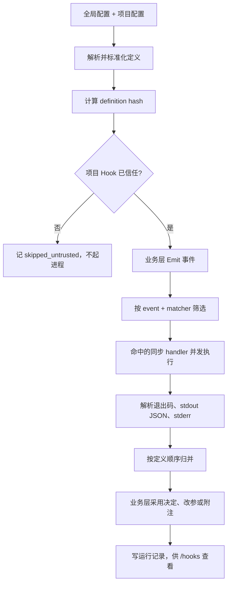
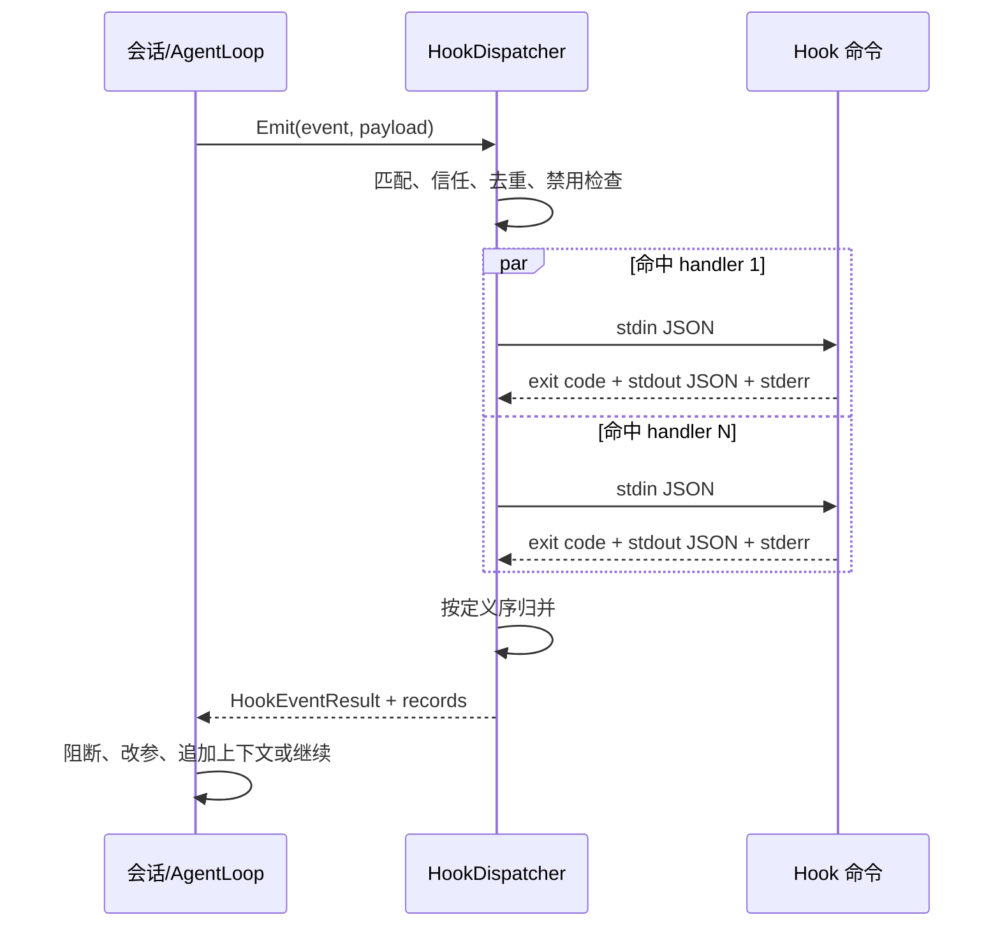
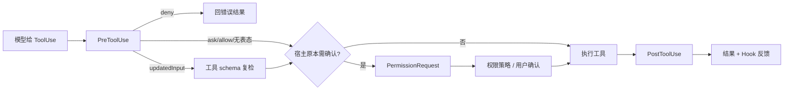

# Hooks 运行流程

[文档首页](README.md) · [Hooks 手册](hooks.md) · [工具调用流程](tool-calling-flow.md) · [配置手册](configuration.md) · [安全模型](security-model.md)

这页讲 Hook 从装载到回收的整条路。事件字段、JSON schema、配置示例与 `/hooks` 命令见[Hooks 手册](hooks.md)。

## 总图



业务层只发事件。匹配、信任、起进程、超时、协议校验、归并与留痕，都收在 `HookDispatcher`。

## 装载期

程序同时读用户全局 hooks 与项目 hooks。两层相加，用户级在前；项目层删不掉全局定义。

装载时会：

1. 校验事件名、matcher 与 handler 字段。
2. 把 legacy 四类配置转成统一定义。
3. 展开 `${LUBANCODE_PROJECT_DIR}`。
4. 为每条定义算稳定 hash。
5. 合并禁用状态与信任账。
6. 标出同事件、同定义的重复项。

项目 Hook 默认不可信。定义 hash 未在用户主目录的信任账里，dispatcher 只记一条 `skipped_untrusted`，绝不起子进程。命令或参数一改，hash 跟着变，须重新审。

## 事件怎样发出

主要边界如下：



每次 Emit 都拿一个 `hook_run_id`。主代理、子代理另带 `agent_id` 与父子关系，免运行账串在一起。

## 匹配与调度

dispatcher 先按事件名筛，再拿 payload 的 `match_value` 过 matcher。工具事件匹配 `tool_name`；SessionStart 匹配 source；Compact 事件匹配 trigger。没有匹配字段的事件只认 `*`。

命中以后，还要过四道筛：

- disabled：记 `skipped_disabled`。
- untrusted：记 `skipped_untrusted`。
- 同 hash 重复：记 `skipped_dedupe`，只跑一份。
- `async: true`：现版记 `skipped_async`，不执行，也不拿它参与决定。

余下同步 handler 各起一条线程，并发执行。全部收齐以后，程序按“来源 + 声明次序”归并，不按谁先跑完谁先说话。运行总耗时大致取决于最慢一只，而不是逐只相加。

## 子进程协议

v2 Hook 收 stdin JSON。公共字段有事件名、run id、session/turn id、cwd、转录路径与权限模式；各事件再添 tool、prompt、source、trigger 或 agent 字段。

首选 exec form：`command` 与 `args` 分开，不经 shell。只写 command 字符串时才走平台默认 shell。

进程回三样东西：

- 退出码：表明正常、拒绝或失败。
- stdout：必须是该事件准许的 UTF-8 JSON。
- stderr：供诊断，不拿来冒充结构化决定。

stdout 会逐事件验 schema。比如 `updatedInput` 只许 `PreToolUse`；`PostToolUse` 不能声称撤销工具副作用。输出字段越权，记 `schema_error`。

Windows 下若输出不是 UTF-8，程序会尝试控制台代码页与系统 ANSI 页。仍解不动，便留原始字节摘要，不拿替换字符硬拼 JSON。

## 归并法

多只 Hook 可以同时表态。归并法固定，不看配置先后抢覆盖：

```text
deny > ask > allow > 无表态
```

- `additionalContext`：按定义序全部收下。
- `systemMessage`：按定义序全部收下，供 UI 与记录查看。
- `updatedInput`：只在最终决定为 allow 时有效；多只都给，取定义序最后一份。工具执行前还要重过 schema。
- `continue=false`：只在可阻断事件上拉闸。
- `failure_policy=deny`：Hook 起不来、超时、退出失败或 schema 错时，可在有阻断语义的事件上按拒绝处理。

`PostToolUse`、`SessionEnd` 一类事后事件没有回滚本领。即便某只 Hook 失败，也只能记账、告警、追加反馈，不能假装已经撤销外部动作。

## 工具调用里的 Hook



`PreToolUse` 跑在确认之前。它若 deny，工具不跑，用户也不用白看确认框。它若 ask，会把本来可直跑的工具推到确认。它若 allow，可免普通确认；硬权限规则仍能拦。

`PermissionRequest` 只在宿主本来要确认时发。无人表态，照原流程问；allow 可免弹；deny 直接拒绝。

`PostToolUse` 拿到的是已经清洗过的工具结果。它的 `additionalContext` 追加进模型所见结果，原工具结果仍保留。

## Compact 与 Stop

手工或自动压缩前先发 `PreCompact`。它若阻断，history 不动。压缩成功后发 `PostCompact`，再以 `SessionStart(source=compact)` 走上下文重注入。

主回合正常收束时发 `Stop`。若 Hook 回 `continue=false`，宿主可要求模型再收口一轮，最多一次，免 Hook 与模型来回不止。

子代理对应 `SubagentStart` 与 `SubagentStop`。后台子代理拿 definitions 与 context 的只读快照执行，运行记录稍后由主 dispatcher 收养；后台线程不直接改主账本。

## 失败怎样算

| 情形 | 默认 `warn` | `failure_policy=deny` |
| --- | --- | --- |
| 起进程失败 | 告警后放行 | 可阻断事件按拒绝 |
| 超时 | 告警后放行 | 可阻断事件按拒绝 |
| 非法 stdout JSON | 记 `schema_error`，放行 | 可阻断事件按拒绝 |
| handler 普通失败 | 记 failure，放行 | 可阻断事件按拒绝 |
| 项目 Hook 未信任 | 不执行 | 仍不执行；须先人工信任 |

legacy `pre_tool` 的非零退出仍按旧语义拦截；其他 legacy 失败只警告。legacy 不套 v2 的 `failure_policy`。

## 看账与排错

`/hooks` 先看定义来源、事件、matcher、hash、信任与禁用状态。再看最近记录：

- `skipped_untrusted`：先审定义，再信任 hash。
- `skipped_async`：现版没执行，别把它当生效。
- `spawn_failed`：查命令、cwd、PATH 与平台参数。
- `timeout`：查超时值与脚本是否等输入。
- `schema_error`：查 stdout 是否只含一份合法 JSON，字段是否属于当前事件。
- `blocked`：看 decision、退出码与理由。

修改 Hook 配置后须重启进程。信任与禁用命令会更新运行时状态，不用改仓库配置。

## 安全边界

- Hook 是外部进程，不是沙箱。它能做什么，取决于当前用户权限。
- 项目 Hook 先过定义 hash 信任；仓库本身改不了用户信任账。
- stdin 可含 prompt、工具参数与结果。Hook 脚本不得把敏感正文随手写进日志。
- timeout 会杀进程树；事后 Hook 超时也不能回滚已经发生的动作。
- stdout 决策须过逐事件 schema；stderr 只作诊断。

## 源码入口

- `src/hooks/loader.cpp`：全局/项目定义装载与 legacy adapter。
- `src/hooks/hash.cpp`、`trust.cpp`：定义 hash 与信任账。
- `src/hooks/dispatcher.cpp`：匹配、并发执行、归并与记录。
- `src/hooks/protocol.cpp`：stdin/stdout JSON 与逐事件校验。
- `src/hooks/detached.cpp`：后台子代理的只读快照与记录回收。
- `src/agent/loop.cpp`：工具调用边界采用 Hook 结果。

相关测试集中在 `tests/test_hooks.cpp`、`tests/test_agent_tool.cpp`、`tests/test_ptc_tool.cpp` 与 app 会话事件测试。
