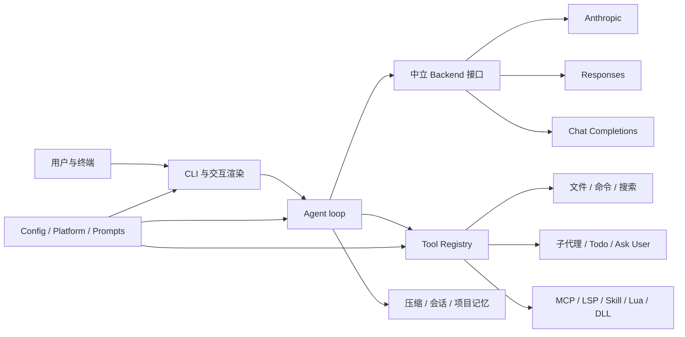

# LubanCode 求职项目手册

[文档首页](README.md) · [功能总览](feature-reference.md) · [架构说明](architecture.md) · [终端交互](terminal-ui.md) · [工具手册](tools.md)

## 一、项目概览

### 一句话介绍

LubanCode 是一款用 C++23 编写的跨平台 AI 编程 CLI。它用统一事件模型接入 Anthropic Messages、OpenAI Responses 与 Chat Completions，并把代码工具、子代理、MCP、LSP、插件、上下文与终端交互收进同一套代理运行时。

### 30 秒介绍

我用 C++23 独立做了一款终端 AI 编程工具。项目不只包了一层模型接口。我把三套流式协议归一成中立消息与事件，写了可扩展工具注册表、子代理、MCP/LSP 接入、上下文压缩与会话恢复。终端侧支持流式 Markdown、行内 Unicode 数学、块级盒式 LaTeX、可编辑输入、消息排队、diff 确认与工具明细折叠。底层进程管理分别适配 Windows Job Object 与 POSIX 进程组。当前产品代码约 5.40 万行，测试约 2.89 万行，本地全量 1374 个用例、7094 条断言通过，CI 覆盖 MSVC、GCC 与 Clang。

### 2 分钟介绍

项目起因很直接：我想要一款真正能读仓库、改代码、跑命令，又不绑死某家模型的终端代理。市面上的轻量实现常把协议、工具和界面搅在一起，换模型便要改主循环，工具一多又把 schema 全塞进上下文。

我把系统拆成三条主线。第一条是协议线。API 层先做 SSE 分帧，再由各协议解析语义，最后统一成 `StreamEvent`。Agent loop 只认中立消息，不认厂家字段。第二条是工具线。所有工具共用名称、说明、JSON Schema、确认策略与执行接口；MCP、LSP、Skill、Lua 和 C ABI 插件都从这条边界接入，工具过多时再延迟挂载。第三条是交互线。正文流、状态画板、工具条目和输入框会争同一块终端，我用统一输出锁、原子状态、屏幕锚点与重画事务收束并发写屏。

这个项目最能说明我的三项能力：能拆跨模块边界，能处理平台与并发细节，也肯为用户可见故障补回归测试和交付链。

## 二、核心功能

| 功能 | 能做什么 |
| --- | --- |
| **多模型接入** | 原生接入 Anthropic Messages、OpenAI Responses 与 Chat Completions；可添加多家 provider，在会话中切换服务、模型与推理强度。 |
| **仓库理解** | 读取文件、遍历目录、搜索代码；借助 LSP 查询定义、引用、符号与诊断；按目录加载 `AGENTS.md`，让代理遵守项目规矩。 |
| **代码修改** | 新建文件、整段写入、容错替换；改动先生成彩色 diff，再由用户确认是否落盘，找不到唯一匹配时拒绝冒险改写。 |
| **命令与验证** | 前台执行构建、测试与 Git 命令，也可把长任务放到后台；支持超时、输出捕获、日志读取与整棵子进程树清理。 |
| **代理工作流** | 支持多轮工具调用、子代理、待办清单与 `ask_user`；工具过多时先搜索再挂载，还可在隔离 Git worktree 中完成任务。 |
| **终端交互** | 流式渲染 Markdown；行内公式换成数学 Unicode，块级 LaTeX 用二维字符盒排分式、根式、上下标、括号与矩阵；执行中仍可排队消息，支持逐键编辑、多行输入、粘贴折叠、打断、工具明细展开与全文聚焦。 |
| **安全确认** | 提供 `confirm`、`auto`、`yolo` 三档；支持工具与命令黑白名单、项目级权限、hooks 与 diff 预览；工具可在本场放行，也可写入项目配置长期生效。 |
| **上下文与会话** | 展示 token 占用，自动或手工压缩长对话；支持会话存档、恢复、续聊、标题与 Markdown 导出，并提供默认关闭的项目记忆。 |
| **扩展能力** | 可挂载 MCP stdio 服务、LSP、Skills、Lua 工具与 C ABI DLL 插件；主题、语言、soul 和 system prompt 均可定制。 |
| **跨平台交付** | 支持 Windows、Linux 与 macOS；提供初次配置向导、显式 Release 更新检查、安装脚本、CMake 构建、三平台 CI 与按标签自动发布，发行包连同官方 Skills 一并安装。 |

### 典型工作流

1. 在代码仓库启动 LubanCode，用 `/init` 生成或加载项目指令。
2. 用自然语言交代任务。代理先搜索、读文件，也可调用 LSP 或联网查资料。
3. 代理拆出待办，必要时派出子代理；主代理汇总结果后修改代码。
4. 终端铺开 diff。用户确认后才写盘，高风险命令仍会单独询问。
5. 代理执行构建与测试，读取失败信息，继续修到验证通过。
6. 会话可随时打断、恢复、续聊或导出；长对话接近上限时自动压缩。

## 三、项目数据

| 项目 | 当前证据 |
| --- | --- |
| 语言与标准 | C++23，另含 C、Lua、PowerShell、Shell 与少量 Python 测试夹具 |
| 产品代码 | 225 个 C/C++ 文件，约 53,955 行 |
| 测试代码 | 98 个测试/夹具文件，约 28,901 行 |
| 自动测试 | 本地 Release 全量 1374 个用例、7094 条断言通过 |
| 提交记录 | 227 次提交，10 个版本标签 |
| 模型协议 | Anthropic Messages、OpenAI Responses、Chat Completions |
| 平台 | Windows x64、Linux x64、macOS arm64 |
| 编译器矩阵 | MSVC、GCC、Clang |
| 核心依赖 | CPR/libcurl、nlohmann/json、Lua 5.4、doctest |
| 构建与交付 | CMake、vcpkg/FetchContent 双路依赖、GitHub Actions、三平台打包 |

这些数字只说明工程规模，不说明用户价值。没有真实用户数、响应时延或稳定性数据时，不要编造“提升 80%”之类的句子。

## 四、简历文案

### 标准版：C++ / AI Agent / 基础设施

**LubanCode：跨平台 AI 编程 CLI｜独立开发｜C++23**

- 设计中立消息、工具调用与流式事件模型，将 Anthropic Messages、OpenAI Responses、Chat Completions 三套协议隔离在独立后端；Agent loop 无须感知厂家字段，支持运行时切换 provider 与模型。
- 构建 Schema 驱动的工具注册表与多轮代理循环，覆盖文件读写、容错编辑、命令执行、搜索、子代理和待办；接入 MCP、LSP、Skills、Lua 与 C ABI 插件，并用延迟挂载控制工具 schema 的上下文开销。
- 处理终端并发渲染难题：以统一 stdout 锁、原子状态、屏幕锚点和重画事务协调流式 Markdown、二维 LaTeX 公式、动态状态、工具条目与可编辑输入；支持执行中排队、打断、diff 确认及工具明细折叠。
- 统一跨平台进程语义：Windows 采用 `CreateProcessW` 与 Job Object，POSIX 采用 `fork/exec`、进程组和 `poll`；实现超时、输出捕获、后台任务、长命双向管道及整棵进程树回收。
- 建立 CMake + doctest + GitHub Actions 交付链；本地 Release 全量 1374 个用例通过，CI 在 MSVC/GCC/Clang 三路编译测试，并按标签生成 Windows/Linux/macOS 发行包。

### 精简版：简历位置只够两条

**LubanCode｜C++23 跨平台 AI 编程代理**

- 独立设计三协议统一 Agent runtime，完成流式事件、工具循环、子代理、MCP/LSP、插件、上下文压缩与会话恢复；以抽象边界隔离模型协议、工具执行和终端 UI。
- 解决跨线程终端重画与跨平台进程回收问题；项目约 5.40 万行产品代码、2.89 万行测试，本地 1374 个用例通过，三平台 CI 与自动发布链齐备。

### 偏 AI 应用基础设施岗位

- 将三套模型协议归一为中立消息与事件，支持流式文本、工具调用、推理参数、厂商扩展字段与模型目录；新增协议不改 Agent loop。
- 实现工具 schema 延迟挂载、子代理隔离工具表、token 占用分析、自动压缩与项目记忆召回，控制上下文预算并保住长会话可用性。
- 将高风险动作纳入确认档、项目级黑白名单、hooks 与 diff 预览；记忆默认关闭，敏感字段不落盘。

### 偏 C++ 客户端 / 系统岗位

- 用 C++23、`std::expected`、RAII、线程与原子变量构建长生命周期 CLI，明确业务错误、资源寿命与跨线程输出协议。
- 分别封装 Win32 与 POSIX 进程、控制台、路径和编码；统一一次性命令、后台任务、MCP/LSP 长命子进程的调用语义。
- 为真实控制台补刮屏驱动，覆盖粘贴、滚屏、状态块、diff 残色与工具折叠等单元测试难以触达的交互路径。

### 偏开发者工具岗位

- 围绕“读、改、验”设计完整闭环：仓库搜索、LSP 语义查询、容错编辑、diff 确认、命令验证、会话恢复与 Markdown 导出。
- 支持 `AGENTS.md` 分层项目指令、项目级权限、隔离 worktree、Skills 和插件，能嵌入现有团队开发规约。
- 逐步打磨终端体验：流式 Markdown、逐键编辑、大段粘贴折叠、执行中排队、工具聚焦与详细/紧凑切换。

### English version

**LubanCode | Cross-platform AI coding CLI | C++23**

- Designed a provider-neutral agent runtime that unifies Anthropic Messages, OpenAI Responses, and Chat Completions into common message, tool-call, and streaming-event abstractions.
- Built a schema-driven tool system with sub-agents, MCP/LSP integrations, Skills, Lua tools, native C ABI plugins, deferred tool loading, confirmation policies, and context compaction.
- Implemented concurrent terminal rendering and cross-platform process control using synchronized output, atomic UI state, Win32 Job Objects, and POSIX process groups; maintained 1,374 passing tests across MSVC, GCC, and Clang workflows.

## 五、关键词

投递时别把关键词堆成一堵墙。照岗位挑 8 到 12 个。

```text
C++23 / CMake / RAII / std::expected / multithreading / atomics
Win32 / POSIX / process management / IPC / JSON-RPC / SSE
AI Agent / tool calling / context management / prompt engineering
MCP / LSP / plugin architecture / CLI / TUI
GitHub Actions / cross-platform CI / doctest / release automation
```

## 六、架构讲法

### 总图



讲这张图时抓住一句话：**上层只认稳定抽象，变化留在边界。**

- 厂家协议变化，留在 `src/api/<wire>/`。
- 新工具与外部能力，留在 `src/tools/`、`src/mcp/`、`src/lsp/`。
- Windows 与 POSIX 差异，留在 `src/platform/`。
- CLI 只靠回调收事件，不拼厂商请求。

### 一轮请求

```mermaid
sequenceDiagram
    participant User as User
    participant CLI as CLI
    participant Loop as AgentLoop
    participant API as Backend
    participant Tool as ToolRegistry

    User->>CLI: 输入任务
    CLI->>Loop: 中立消息 + 回调
    Loop->>API: 历史、工具 Schema、模型参数
    API-->>Loop: 流式事件
    alt 文本增量
        Loop-->>CLI: on_text_delta
    else 工具调用
        Loop->>Tool: 校验、确认、执行
        Tool-->>Loop: ToolResult
        Loop->>API: 回填结果并继续
    end
    Loop-->>CLI: usage、终态与会话数据
```

面试官若问“为什么不直接给每个协议写一套 Agent”，答三点：

1. 工具循环、历史裁剪、确认和会话逻辑本来就相同，复制会让行为漂移。
2. 协议真正不同的是请求映射与事件语义，放在后端边界最合适。
3. 中立层不是“最小公分母”。厂商私有字段仍能从 `extra_body` 透传，通用逻辑不必知道它们。

## 七、六项技术亮点

### 1. 三协议统一，不把差异揉没

**问题**

Anthropic、Responses 与 Chat Completions 的消息结构、工具调用事件、usage 和流式结束语义都不同。若 CLI 或 Agent loop 直接判断 `wire`，分支会散满全仓库。

**做法**

- `Backend` 统一 `send_stream`。
- `Message`、`ContentBlock`、`StreamEvent` 作为中立类型。
- 通用 SSE 层只分帧，不解析厂商 JSON。
- 各协议独立完成请求映射与事件解析。
- 厂商额外参数从 provider/model 配置透传，模型 variant 最后覆盖。

**取舍**

中立类型要稳，不能每见一个厂商字段便往核心塞。若能力只属于单一协议，应走扩展字段或协议侧事件；只有 Agent 真要理解的语义才升进中立层。

**源码证据**

- [`src/api/backend.hpp`](../src/api/backend.hpp)
- [`src/api/types.hpp`](../src/api/types.hpp)
- [`src/api/anthropic/`](../src/api/anthropic/)
- [`src/api/responses/`](../src/api/responses/)
- [`src/api/chat/`](../src/api/chat/)

### 2. 工具系统不止一张函数表

**问题**

模型工具既要有 JSON Schema，又要走确认、权限、hooks、展示和结果回填。MCP、LSP 与插件还各有生命周期。工具过多时，整包 schema 又会吃上下文。

**做法**

- `Tool` 统一名称、说明、schema、确认策略、延迟挂载和 `execute`。
- `ToolRegistry` 统一注册与按名调用。
- 主代理与子代理用两份工具表，禁止无限递归委派。
- 外挂工具可先变成 `DeferredTool`，模型经 `tool_search` 找到后再挂载。
- 高风险动作统一经过确认档、项目级黑白名单与 hooks。

**边界**

Skill 是提示与资源，不在进程内执行。MCP/LSP 是子进程。Lua 与 DLL 在宿主进程内，出错会牵连主程序。项目没有把它们宣传成沙箱。

**源码证据**

- [`src/tools/tool.hpp`](../src/tools/tool.hpp)
- [`src/tools/registry.cpp`](../src/tools/registry.cpp)
- [`src/tools/tool_search.cpp`](../src/tools/tool_search.cpp)
- [`src/tools/agent_tool.cpp`](../src/tools/agent_tool.cpp)
- [`docs/extensions.md`](extensions.md)

### 3. 终端 UI 的本质是并发状态机

**问题**

模型正文在流式落字，状态 ticker 每 400ms 刷新，工具条目要原地改写，用户又能同时键入下一条。几路输出若各写各的，就会盖行、留残影、丢光标或把运行态与终态画成两份。

**做法**

- 所有 stdout 写入经过同一把互斥锁。
- 输入监听与主循环共享原子状态。
- 工具条目记录屏幕锚点与行数，终态在原位改写。
- footer、状态块与工具条目使用重画事务，先收框再落字。
- 大段打印或滚屏后主动平移或作废旧锚点，宁可追加，不在错误行号上冒险改写。
- 数学渲染分成两路：`$...$` 用 Unicode 数学字母与上下标压成单行，`$$...$$` 解析成二维盒树，递归排分式、根式、脚标、伸缩括号和矩阵；未知语法保留原文。
- 单元测试覆盖纯渲染；Win32 刮屏驱动读取真实控制台缓冲，覆盖终端行为。

**近期故障样例**

`Ctrl+O` 曾只翻状态并打印“详细模式”，却不补画已经发生的子工具。修复时没有让监听线程直接读主线程正在修改的 `transcript`，而是维护线程安全快照；切档时收状态块、作废旧锚点，再整组重打。紧凑档过滤子工具，详细档铺参数与完整输出。

**源码证据**

- [`src/cli/console_input.cpp`](../src/cli/console_input.cpp)
- [`src/cli/transcript.cpp`](../src/cli/transcript.cpp)
- [`src/cli/latex_math.cpp`](../src/cli/latex_math.cpp)
- [`src/main.cpp`](../src/main.cpp)
- [`tests/latex_box_experiment.cpp`](../tests/latex_box_experiment.cpp)
- [`tests/fold_dup_clear_driver.cpp`](../tests/fold_dup_clear_driver.cpp)

### 4. 跨平台进程管理讲语义，不讲 API 名字

**问题**

命令工具、hooks、MCP 与 LSP 都要起进程。只会 `system()` 不够：要捕获输出、传环境变量、处理超时、支持双向管道，还得在主程序退出时收掉孙进程。

**做法**

| 语义 | Windows | POSIX |
| --- | --- | --- |
| 创建 | `CreateProcessW` | `fork` + `execvp` |
| 收整棵树 | Job Object | 进程组 `setpgid` / `killpg` |
| 读写 | 匿名管道 + 读线程 | pipe + `poll` + 读线程 |
| 找不到命令 | Win32 创建错误 | `O_CLOEXEC` 错误管道回传 `errno` |
| 路径与文本 | UTF-16 / UTF-8 转换 | UTF-8 字节路径 |

业务层只看统一结果：退出码、输出、超时、启动错误。平台 API 不往 `agent`、`tools` 四处渗。

**源码证据**

- [`src/platform/process.hpp`](../src/platform/process.hpp)
- [`src/platform/process_win.cpp`](../src/platform/process_win.cpp)
- [`src/platform/process_posix.cpp`](../src/platform/process_posix.cpp)

### 5. 上下文与记忆不是“把历史全塞回去”

**问题**

长会话会挤满 context。项目记忆若每轮全注入，不但浪费 token，还会把旧事实和外部恶意内容重新送进模型。

**做法**

- 会话历史支持 token 统计、手工/自动压缩与独立压缩模型。
- 会话用 JSONL 落盘，可恢复、继续与导出 Markdown。
- 项目记忆默认关闭，放在用户目录，不写进仓库。
- Git worktree 以 common git dir 归到同一项目身份。
- 召回同步走本地词法评分，按路径、符号、关键词和 n-gram 取少量细目。
- 主题 Markdown 是可读真源，机器 catalog 可重建；更新走临时文件与原子替换。
- 记忆只作线索，不升成系统指令；路径、大小、来源与敏感字段均受约束。

**取舍**

第一版不用向量库。项目代码事实往往有精确路径和符号，本地词法检索更快、更可解释，也不会每轮多发一次网络请求。语义召回可后加，不必一开头就背上数据库与 embedding 成本。

**源码证据**

- [`src/agent/compact.cpp`](../src/agent/compact.cpp)
- [`src/agent/session_store.cpp`](../src/agent/session_store.cpp)
- [`src/memory/project_memory.cpp`](../src/memory/project_memory.cpp)
- [`docs/memory-system-design.md`](memory-system-design.md)

### 6. 交付链本身也是产品能力

**做法**

- CMake 同时支持 vcpkg manifest 与 FetchContent 回退。
- 三平台 push/PR 都跑 Build + Test。
- `v*` 标签触发三平台干净构建、打包与 GitHub Release。
- Windows 安装脚本写用户 PATH，不要管理员权限；Linux/macOS 装进 `~/.local/bin` 或 `/usr/local/bin`。
- 官方 Skills 随发行包、安装脚本与 CMake install 同步；运行时按项目级、用户级、官方级三层合并。
- 测试既有 doctest 单元/集成用例，也有 socket、DLL、Python 子进程与真实控制台夹具。

**源码证据**

- [`CMakeLists.txt`](../CMakeLists.txt)
- [`vcpkg.json`](../vcpkg.json)
- [`.github/workflows/ci.yml`](../.github/workflows/ci.yml)
- [`.github/workflows/release.yml`](../.github/workflows/release.yml)

## 八、五个面试故事

### 故事 A：`Ctrl+O` 有提示，却没展开

**适合回答**

- 讲一次最难查的 UI bug。
- 讲你如何处理并发。
- 讲你怎样补回归测试。

**Situation**

子代理已经执行多次工具。界面提示“Ctrl+O 展开明细”。用户按下后只见“详细模式”，原有工具参数和结果一个也没出现。

**Task**

既要马上补画当前回合的历史工具，又不能让监听线程与 Agent 主线程并发读写同一 `vector`；大段明细还可能触发滚屏，使已有绝对行锚点失效。

**Action**

1. 沿按键读取、原子开关、转录存档、屏幕重画四段追踪。
2. 发现旧测试只验提示文字，甚至把“历史不补画”当成既定取舍。
3. 为 `ToolDisplay` 增加线程安全转录快照。工具起跑、落定、确认状态变化后，只复制变动条目。
4. 监听线程切档时拿 stdout 锁，擦 footer，收掉状态画板，作废旧工具锚点，再按新档整组重打。
5. 抽出 `FormatTranscriptItems`：详细档包含子工具与全文，紧凑档过滤子工具。
6. 将真控制台驱动从“看见详细模式”升级为“必须看见参数明细”，并补纯函数单测。

**Result**

Release 构建通过；新增断言 7/7 通过；当前全量 1151 个用例通过。更要紧的是，测试标准从“按键有反应”变成“用户目标真的达成”。

**一句复盘**

这个故障不是按键失灵，而是验收目标写低了。测试若只盯内部状态，界面照样可以骗过测试。

### 故事 B：Windows 与 POSIX 怎样收掉孙进程

**适合回答**

- 讲跨平台开发。
- 讲资源管理。
- 讲为什么不用 `std::system`。

**讲法**

先说统一语义：启动、捕获、超时、取消、整树回收。再说两边机制：Windows 把挂起创建的进程先纳入 Job Object，POSIX 让子进程自成进程组。主程序只关心统一 `ProcessResult`。最后点出一个细节：POSIX 用 `O_CLOEXEC` 错误管道区分“exec 成功后程序自己退出”和“exec 根本没起来”。

### 故事 C：为什么做三协议中立层

**适合回答**

- 讲架构设计。
- 讲扩展性。
- 讲如何避免过度抽象。

**讲法**

不要只说“用了工厂模式”。从真实差异讲起：消息、工具调用、usage、流事件都不同。SSE 分帧可复用，JSON 语义不可混。Agent 只需要文本增量、工具调用、错误和 usage，因此只把这些稳定语义放进中立层。私有字段仍允许透传。这样既没有三份 Agent loop，也没有把所有厂商能力压成残缺交集。

### 故事 D：终端为何会留下 Running 残影

**适合回答**

- 讲并发与状态一致性。
- 讲你如何做系统性修复。

**讲法**

工具条目、状态 ticker、流式 footer 都在改同一块屏幕。单纯给 `cout` 加锁只能保证字节不交叉，不能保证光标和行号仍对。修复要把一次重画看成事务：收 footer、擦状态、检查锚点、必要时预留行并同步平移，落字后再重建 footer。锚点靠不住时宁可忘掉并追加终态，不在未知位置上强改。

### 故事 E：为什么项目记忆先不用向量库

**适合回答**

- 讲技术选型。
- 讲成本与安全。
- 讲怎样分期交付。

**讲法**

代码项目查询常带路径、类名、函数名和命令，精确词法信号很强。第一版用路径、符号、关键词和字符 n-gram 打分，同步本地完成；不引入 embedding 网络调用、向量数据库和额外隐私面。Markdown 保持可读，catalog 坏了能重建。待真实误召回数据积够，再决定是否加语义检索，而不是先为“高级”买复杂度。

## 九、高频追问与答法

### 为什么用 C++，不用 Python 或 Rust？

别答“C++ 更快”便停。这个项目的核心压力并不全在 CPU。

可这样答：

> 我选 C++，一是想把单文件分发、进程控制、原生终端与 C ABI 插件放在同一技术栈里；二是借项目系统练习资源寿命、并发和跨平台边界。代价也清楚：字符串编码、平台 API 和构建依赖更费工。若目标只是快速验证 Agent 逻辑，我会先用 Python；若从零做更强内存安全的长期系统，Rust 也值得评估。

### `std::expected` 用在哪里？异常呢？

预期会发生的失败，例如网络错误、配置错误、协议解析失败，走 `std::expected`。异常留给程序失约或第三方库不可恢复故障。这样调用点必须显式处理业务失败，资源仍由 RAII 收尾。

### SSE 为什么分两层？

分帧层只处理 `event:`、`data:`、空行与跨 chunk 断裂。语义层才读 JSON 字段。若混在一起，TCP 分块边界、SSE 规则与厂商 schema 会缠成一团，测试也很难写。

### 如何防止工具误操作？

有三档确认模式、工具自身确认属性、项目级命令黑白名单、pre/post hooks 与 diff 预览。密钥走环境变量引用。需要诚实说明：这不是操作系统沙箱；`yolo`、Lua 与 DLL 都有真实风险。

### 插件为何用 C ABI，不直接导出 C++ 类？

C++ ABI 会受编译器、标准库与编译选项影响。C ABI 用固定结构体和函数指针，边界更稳。内存由谁分配便由谁释放，插件显式提供 `free_result`，避免跨 CRT `free`。

### MCP 与 LSP 有什么共性？

都是长命 stdio 子进程，都要 JSON-RPC、双向管道、读线程、请求 id 与超时。共性收进平台进程与传输层；协议方法、初始化流程和工具语义各自保留。

### 工具多了怎么办？

先挂核心工具。外挂工具可延迟成索引条目，模型用 `tool_search` 找到后才把真实 schema 放进下一次请求。这样减少上下文占用，也避免每轮把几十件不相关工具全发出去。

### 怎么测终端 UI？

纯渲染函数用 doctest。键盘语义用无平台依赖的编辑器核心测试。真实 Win32 行为另写刮屏驱动：创建控制台、注入键盘事件、读取屏幕缓冲，检查残影、折叠、颜色和滚屏。两层缺一不可。

### 项目最明显的技术债是什么？

可以直说四项：

1. `main.cpp` 仍承担较多会话接线与屏幕协调，应继续拆出 session controller 与 transcript runtime。
2. 真终端驱动尚未纳入默认 CTest；它依赖真实控制台，部分场景还依赖模型服务。下一步应配本地确定性 fake backend。
3. POSIX 的复杂原地重画能力弱于 Windows，当前选择保信息、不冒险错画。
4. Lua 与 DLL 是进程内扩展，没有沙箱。若面向不可信插件，要改成进程外宿主。

这类回答不会减分。你看见边界，也说得出下一步，反倒像真正维护过项目。

## 十、8 分钟演示脚本

### 演示前

- 用 Release 包，不在面试现场现编译。
- 准备一份小型 Git 仓库，确保测试命令 10 秒内结束。
- 提前设好模型 key，只露环境变量名，不露值。
- 终端宽度固定在 110 到 130 列。
- 录一份本地视频作后手。网络不通时，直接放视频并讲代码。

### 0:00 - 0:45：定位

打开 README 与架构图，只说三件事：C++23、三协议、跨平台 Agent runtime。别先念功能表。

### 0:45 - 2:30：读仓库

输入：

```text
先读项目结构，再找出配置加载入口和一轮 Agent 请求的调用链。只读，不改。
```

借工具条目说明：模型不是凭空回答，它在搜索、读文件、查符号。

### 2:30 - 4:30：改代码并确认

准备一处两三行的小 bug。让模型修复并跑窄测试。重点展示 diff、确认档和工具结果，不要等它大段讲解。

### 4:30 - 5:30：终端交互

在工具执行中键入下一条，展示消息排队。按 `Ctrl+O`，展示参数与完整输出；再切回紧凑档。随后让模型输出 `$$\frac{-b\pm\sqrt{b^2-4ac}}{2a}$$`，展示终端二维公式。若时间够，再按 `Ctrl+E` 看单条全文。

### 5:30 - 6:30：扩展边界

运行 `/tools`、`/mcp` 或 `/lsp`。打开 `Tool` 接口，说明新工具如何注册、为何要 schema、确认和延迟挂载。

### 6:30 - 7:30：工程证据

展示：

```powershell
ctest --test-dir build/release -C Release --output-on-failure
```

再打开 CI 矩阵与 release workflow。这里不必真跑全套，展示最近一次通过记录即可。

### 7:30 - 8:00：收尾

用一句话收：

> 这个项目最难的不是调模型接口，而是让协议、工具、进程和终端在同一套边界里长期相处。

## 十一、源码证据索引

| 面试话题 | 先打开 | 再打开 |
| --- | --- | --- |
| Agent 主循环 | [`src/agent/loop.cpp`](../src/agent/loop.cpp) | [`src/agent/loop.hpp`](../src/agent/loop.hpp) |
| 三协议抽象 | [`src/api/backend.hpp`](../src/api/backend.hpp) | [`src/api/types.hpp`](../src/api/types.hpp) |
| Responses | [`src/api/responses/client.cpp`](../src/api/responses/client.cpp) | [`src/api/responses/events.cpp`](../src/api/responses/events.cpp) |
| Anthropic | [`src/api/anthropic/client.cpp`](../src/api/anthropic/client.cpp) | [`src/api/anthropic/events.cpp`](../src/api/anthropic/events.cpp) |
| Chat Completions | [`src/api/chat/client.cpp`](../src/api/chat/client.cpp) | [`src/api/chat/events.cpp`](../src/api/chat/events.cpp) |
| 工具接口 | [`src/tools/tool.hpp`](../src/tools/tool.hpp) | [`src/tools/registry.cpp`](../src/tools/registry.cpp) |
| 子代理 | [`src/tools/agent_tool.cpp`](../src/tools/agent_tool.cpp) | [`src/main.cpp`](../src/main.cpp) |
| MCP | [`src/mcp/client.cpp`](../src/mcp/client.cpp) | [`src/mcp/transport.cpp`](../src/mcp/transport.cpp) |
| LSP | [`src/lsp/client.cpp`](../src/lsp/client.cpp) | [`src/tools/lsp_tool.cpp`](../src/tools/lsp_tool.cpp) |
| 终端输入 | [`src/cli/console_input.cpp`](../src/cli/console_input.cpp) | [`src/cli/line_editor.cpp`](../src/cli/line_editor.cpp) |
| 工具条目 | [`src/cli/transcript.cpp`](../src/cli/transcript.cpp) | [`tests/test_transcript.cpp`](../tests/test_transcript.cpp) |
| Markdown 与 LaTeX | [`src/cli/markdown.cpp`](../src/cli/markdown.cpp) | [`src/cli/latex_math.cpp`](../src/cli/latex_math.cpp) |
| 进程抽象 | [`src/platform/process.hpp`](../src/platform/process.hpp) | Win/POSIX 两份实现 |
| 会话恢复 | [`src/agent/session_store.cpp`](../src/agent/session_store.cpp) | [`tests/test_session_store.cpp`](../tests/test_session_store.cpp) |
| 项目记忆 | [`src/memory/project_memory.cpp`](../src/memory/project_memory.cpp) | [`docs/memory-system-design.md`](memory-system-design.md) |
| 插件 | [`include/luban_plugin.h`](../include/luban_plugin.h) | [`src/tools/plugin_loader.cpp`](../src/tools/plugin_loader.cpp) |
| 构建测试 | [`CMakeLists.txt`](../CMakeLists.txt) | [`tests/CMakeLists.txt`](../tests/CMakeLists.txt) |
| 更新检查 | [`src/config/update_checker.cpp`](../src/config/update_checker.cpp) | [`tests/test_update_checker.cpp`](../tests/test_update_checker.cpp) |

## 十二、按 JD 改写

### JD 写“高性能 C++ / 系统开发”

多讲：进程树、管道、线程寿命、UTF-8/UTF-16、RAII、错误模型、跨平台。

少讲：Prompt 文案、provider 向导、主题颜色。

### JD 写“AI Agent / LLM 应用”

多讲：三协议中立层、工具调用循环、上下文预算、子代理、工具延迟挂载、记忆安全。

少讲：Win32 控制台坐标细节。

### JD 写“开发者工具 / IDE”

多讲：LSP、diff、编辑容错、项目指令、worktree、会话恢复、终端交互。

少讲：模型厂商目录维护。

### JD 写“平台工程 / DevOps”

多讲：CMake 双依赖路、三平台 CI、安装脚本、tag 发布、可复现构建。

少讲：单个 UI 动画效果。

## 十三、投递前必须收拾的事

### P0：不做便会伤可信度

- [ ] **补许可证。** 仓库目前没有 `LICENSE`。公开可看不等于允许使用；招聘方会注意这件事。
- [x] **发出 `v0.24.1`。** README、源码与公开 Release 版本口径已对齐。
- [x] **提交并推送当前 `Ctrl+O` 修复。** 文档所讲代码已在远端。
- [x] **确认 GitHub CI 全绿。** `v0.24.1` 发版前，三平台主线构建均已通过。
- [ ] **清理密钥与本机路径。** 扫配置、日志、session、测试报告与提交历史。

### P1：一天内能显著加分

- [ ] 录一段 60 到 90 秒 GIF/视频：读仓库、改一处、看 diff、跑测试。
- [ ] 在 README 首屏放一张真实终端截图，露出产品，不只放横幅。
- [x] 写一页 `CHANGELOG.md`，每版列出三条用户变化。
- [ ] 准备一个不依赖私有仓库的 demo project。
- [ ] 把最新测试总数与三平台 CI 链接放进作品集页面。

### P2：后续工程加分项

- [ ] 用本地 fake backend 驱动真终端测试，摆脱外部模型与网络时序。
- [ ] 拆小 `main.cpp`，把会话协调与转录 runtime 移出入口文件。
- [ ] 为启动耗时、常驻内存、长输出吞吐补 benchmark。
- [ ] 明确插件信任模型；若接不可信插件，改进程外隔离。
- [ ] 补贡献指南、issue 模板与最小开发环境说明。

## 十四、不要这样说

| 不稳的说法 | 改成 |
| --- | --- |
| “自研大模型” | “自研模型接入与 Agent runtime” |
| “生产级” | “具备跨平台 CI、自动发布与回归测试；尚未拿生产 SLA 数据” |
| “完全安全” | “提供确认、权限与 hooks；进程内插件不具备沙箱” |
| “支持所有 OpenAI 兼容接口” | “支持 Responses 与 Chat Completions 两类兼容协议，厂商差异可透传” |
| “100% 跨平台一致” | “核心能力跨平台；复杂原地重画目前以 Windows 为主” |
| “测试覆盖率很高” | “全量 1374 个用例通过”；没有 coverage 数据便不报百分比 |
| “性能很好” | 先补 benchmark，再报启动、内存与吞吐 |

## 十五、作品集页面模板

可放进个人网站或求职附件：

```markdown
## LubanCode

一款用 C++23 编写的跨平台 AI 编程 CLI。它以中立消息与事件模型统一
Anthropic Messages、OpenAI Responses 和 Chat Completions，并提供可扩展
工具系统、子代理、MCP/LSP、上下文压缩、会话恢复与终端 Markdown/LaTeX 交互。

我主要解决了三类问题：多协议语义归一；Windows/POSIX 进程与 IPC；流式
正文、工具状态和可编辑输入并发写屏。项目现有约 5.40 万行产品代码、
2.89 万行测试，本地 1374 个用例通过，CI 覆盖 MSVC、GCC 与 Clang。

- GitHub: https://github.com/relic-yuexi/LubanCode
- Architecture: docs/architecture.md
- Demo: <补视频链接>
```

## 十六、数据刷新

发简历前重跑。别让半年以前的数字挂在今天的项目上。

```powershell
# 提交与标签
git rev-list --count HEAD
git tag
git shortlog -sn --all

# 测试
cmake --preset release
cmake --build --preset release --parallel 4
ctest --test-dir build/release -C Release --output-on-failure

# 产品代码行数(src/include/examples 下 C/C++)
$files = @(rg --files src include examples | Where-Object { $_ -match '\.(cpp|hpp|c|h)$' })
$lines = 0
foreach ($file in $files) {
    $lines += (Get-Content -LiteralPath $file | Measure-Object -Line).Lines
}
"files=$($files.Count) lines=$lines"

# 测试代码行数
$files = @(rg --files tests | Where-Object { $_ -match '\.(cpp|hpp|c|h|py)$' })
$lines = 0
foreach ($file in $files) {
    $lines += (Get-Content -LiteralPath $file | Measure-Object -Line).Lines
}
"files=$($files.Count) lines=$lines"
```

## 十七、面试前最后一遍

- [ ] 30 秒介绍能脱稿说完。
- [ ] 架构图能从左到右讲清，不念目录名。
- [ ] 五个故事至少熟三件，每件都能说问题、取舍、证据与结果。
- [ ] 能指出一处技术债，并给出下一步，不说“项目没问题”。
- [ ] Demo 在断网时也有录像和截图。
- [ ] 仓库无密钥，CI 全绿，Release 可下载。
- [ ] 简历只写自己能打开源码讲十分钟的亮点。

最后记住一件事：面试官不缺功能清单。他要看你如何立边界、查故障、作取舍、验结果。LubanCode 真正值钱的，正是这些。
